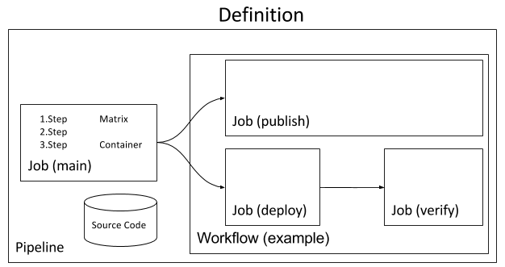

## Domain Model




### Source Code

Source Code is a specified SCM repository and branch that contains a `screwdriver.yaml` and the code required to build, test, and publish your application.

### Step

A step is a named action that needs to be performed, usually a single shell command. If the command finishes with a non-zero exit code, the step is considered a failure.

### Container

A container runs [steps] in an isolated environment. This is done in order to test the compatibility of code running in different environments with different versions, without affecting other [builds] that may be running at the same time. This is implemented using Docker containers.

### Job

A job consists of executing multiple sequential [steps] inside a specified [container]. If any step in the series fails, then the entire job is considered failed and subsequent steps will be skipped (unless configured otherwise).

Jobs work by checking out the [source code] to a specified commit, setting the desired environment variables, and executing the specified [steps].

During the job, the executing [steps] share three pieces of context:

 - Filesystem
 - [Container]
 - [Metadata]

Jobs can be started automatically by changes made in the [source code] or triggered through the [workflow]. Jobs can also be started manually through the UI.

#### Pull Requests

Pull requests are run separately from existing pipeline jobs. They will only execute steps from the `main` job in the Screwdriver configuration.

#### Parallelization

It is possible to parallelize a job by defining a matrix of environment variables. These are usually used for testing against multiple [containers] or test types.

In this example job definition, 4 [builds] will run in parallel:
```yaml
image: node:{{NODE_VERSION}}
steps:
    test: npm run test-${TEST_TYPE}
matrix:
    NODE_VERSION:
        - 4
        - 6
    TEST_TYPE:
        - unit
        - functional
```

 - `NODE_VERSION=4` and `TEST_TYPE=unit`
 - `NODE_VERSION=4` and `TEST_TYPE=functional`
 - `NODE_VERSION=6` and `TEST_TYPE=unit`
 - `NODE_VERSION=6` and `TEST_TYPE=functional`

### Build

A build is an instance of a running [job]. All builds are assigned a unique build number. Each build is associated with an [event]. With a basic job configuration, only one build of a job will be running at any given time. If a [job matrix] is configured, then there can be multiple builds running in parallel.

A build can be in one of five different states:

 - `QUEUED` - Build is waiting for available resources
 - `RUNNING` - Build is actively running on an executor
 - `SUCCESS` - All steps completed successfully
 - `FAILURE` - One of the steps failed
 - `ABORTED` - User canceled the running build

### Event

An event represents a commit or a manual restart of a [pipeline]. There are 2 types of events:

- `pipeline`: - Events created when a user manually restarts a pipeline or merges a pull request. This type of event triggers the same sequence of jobs as the pipeline's workflow. For example: `['main', 'publish', 'deploy']`
- `pr`:  - Events created by opening or updating a pull request. This type of event only triggers the `main` job.

### Metadata

Metadata is a structured key/value storage of relevant information about a [build]. This is automatically populated with basic information like git SHA1 and start/stop time. It can be updated throughout the job by using the built-in CLI (`meta`).

Example:
```bash
$ meta set meta.coverage 99.95
$ meta get meta.coverage
99.95
$ meta get --json meta
{"coverage":99.95}
```

### Workflow

Workflow is the order that [jobs] will execute in after a successful [build] of the `main` job on the default branch. Jobs can be executed in parallel, series, or a combination of the two to allow for all possibilities. Workflow must contain all defined jobs in the pipeline.

All jobs executed in a given workflow share:

 - Source code checked out from the same git commit
 - Access to [metadata] from a `main` build that triggered or was selected for this job's build

In the following example of a workflow section, this is the flow:
```yaml
workflow:
    - publish
    - parallel:
        - series:
            - deploy-west
            - validate-west
        - series:
            - deploy-east
            - validate-east
```

After the merge of a pull-request to master:

 - `main` will run and trigger `publish`
 - `publish` will trigger `deploy-west` and `deploy-east` in parallel
 - `deploy-west` will trigger `validate-west`
 - `deploy-east` will trigger `validate-east`

### Pipeline

A pipeline represents a collection of [jobs] that share the same [source code]. These jobs are executed in the order defined by the [workflow].

The `main` job is required to be defined in every pipeline as it is the one that builds for each change made to the source code (and proposed changes).

[steps]: #step
[job]: #job
[jobs]: #job
[metadata]: #metadata
[builds]: #builds
[build]: #build
[event]: #event
[pipeline]: #pipeline
[container]: #container
[containers]: #container
[workflow]: #workflow
[source code]: #source-code
[job matrix]: #parallelization
