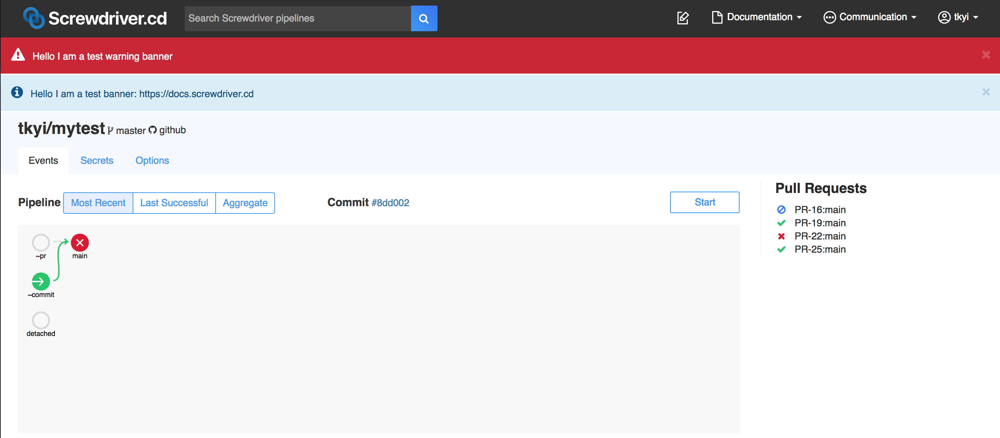

# Frequently Asked Questions

## How do I post announcements on the UI?

You might want to let Screwdriver users know about upcoming maintenance or downtime they might experience or let them know the cluster maintainers are investigating a problem if there's an issue with the cluster.

You can use banners to make these announcements through the [API](../user-guide/api). To create, update, or delete banners, you must be a Screwdriver admin (see `SECRET_ADMINS` environment variable in the [configuring the API docs](./configure-api)).
