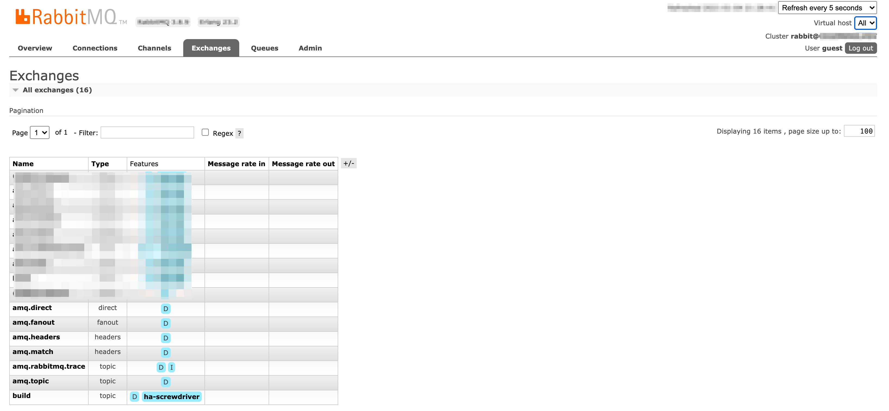
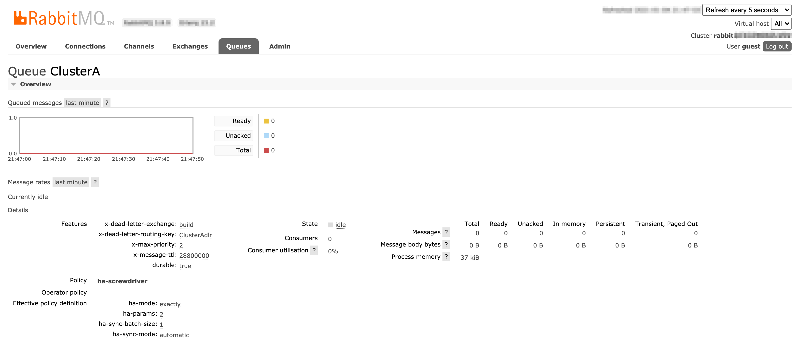

It is Cluster admins responsibility to setup and configure Rabbitmq Message Broker and Build Cluster Queue Worker.

# Managing the Build Cluster Queue Worker

This page will cover how to setup [RabbitMQ Message Broker](https://www.rabbitmq.com/#getstarted) and [Build Cluster Queue Worker](https://github.com/screwdriver-cd/buildcluster-queue-worker). 

## Setup Build Cluster

Cluster admin should create build cluster using [buildclusters API](https://api.screwdriver.cd/v4/documentation#/v4/postV4Buildclusters)

```json
{
  "name": "ClusterA",
  "description": "Build cluster to process ClusterA builds",
  "scmOrganizations": [
    "screwdriver-cd"
  ],
  "isActive": true,
  "managedByScrewdriver": true,
  "maintainer": "foo@bar.com",
  "weightage": 100
}
```

1. name should match the queue and routing key defined in rabbitmq configuration.
1. set `managedByScrewdriver` to `true`, if build cluster is managed by internal Screwdriver team.
1. set `isActive` to `true` or `false` to turn on/off a build cluster.
1. set weightage 100 if you have single build cluster and for more than one cluster, distribute weightage accordingly.

## Install RabbitMQ Message Broker

As a prerequisite go through [Downloading and Installing Rabbitmq](https://www.rabbitmq.com/download.html) and [Rabbitmq Tutorials](https://www.rabbitmq.com/getstarted.html) documentation.
Screwdriver uses [helm charts](https://github.com/helm/charts/tree/master/stable/rabbitmq-ha) to install Rabbitmq high availability `version: 3.7.28 Erlang: 22.3.4.7` in Kubernetes cluster. Please note that this helm chart is deprecated and for new installation refer [bitnami helm charts](https://github.com/bitnami/charts/tree/master/bitnami/rabbitmq).

Rabbitmq helm chart values.tmpl file for your reference. Update and use it per your environment specifications.

``` yaml
## RabbitMQ application credentials
## Ref: http://rabbitmq.com/access-control.html
## Assumption: CPU:1; Memory:2Gi
rabbitmqUsername: sdadmin
rabbitmqPassword: replace_password

## RabbitMQ Management user used for health checks
managementUsername: sdmgmt
managementPassword: replace_password

## Place any additional key/value configuration to add to rabbitmq.conf
## Ref: https://www.rabbitmq.com/configure.html#config-items
extraConfig:
  disk_free_limit.absolute = 5GB

## Place any additional plugins to enable in /etc/rabbitmq/enabled_plugins
## Ref: https://www.rabbitmq.com/plugins.html
extraPlugins: |
  rabbitmq_shovel,
  rabbitmq_shovel_management,
  rabbitmq_federation,
  rabbitmq_federation_management

definitions:
  users: |-
  vhosts: |-
  parameters: |-
  permissions: |-
  queues: |-
  exchanges: |-
  bindings: |-
  policies: |-

## RabbitMQ default VirtualHost
## Ref: https://www.rabbitmq.com/vhosts.html
##
rabbitmqVhost: "/"

## Erlang cookie to determine whether different nodes are allowed to communicate with each other
## Ref: https://www.rabbitmq.com/clustering.html
##
rabbitmqErlangCookie: replace_erlang_cookie

## RabbitMQ Memory high watermark
## Ref: http://www.rabbitmq.com/memory.html
##
rabbitmqMemoryHighWatermark: 1024MiB
rabbitmqMemoryHighWatermarkType: absolute

## EPMD port for peer discovery service used by RabbitMQ nodes and CLI tools
## Ref: https://www.rabbitmq.com/clustering.html
##
rabbitmqEpmdPort: 4369

## Node port
rabbitmqNodePort: 5672

## Manager port
rabbitmqManagerPort: 15672

## Set to true to precompile parts of RabbitMQ with HiPE, a just-in-time
## compiler for Erlang. This will increase server throughput at the cost of
## increased startup time. You might see 20-50% better performance at the cost
## of a few minutes delay at startup. ## Rabbitmq crashes when this settings
## is enabled
rabbitmqHipeCompile: false

## SSL certificates
## Red: http://www.rabbitmq.com/ssl.html
rabbitmqCert:
  enabled: true

  # Specifies an existing secret to be used for SSL Certs
  existingSecret: replace_tls_cert

  ## Create a new secret using these values
  cacertfile: |
  certfile: |
  keyfile: |

## Authentication mechanism
## Ref: http://www.rabbitmq.com/authentication.html
rabbitmqAuth:
  enabled: false

  config: |
    # auth_mechanisms.1 = PLAIN
    # auth_mechanisms.2 = AMQPLAIN
    # auth_mechanisms.3 = EXTERNAL

## Authentication backend
## Ref: https://github.com/rabbitmq/rabbitmq-auth-backend-http
rabbitmqAuthHTTP:
  enabled: false

  config: |
    # auth_backends.1 = http
    # auth_http.user_path     = http://some-server/auth/user
    # auth_http.vhost_path    = http://some-server/auth/vhost
    # auth_http.resource_path = http://some-server/auth/resource
    # auth_http.topic_path    = http://some-server/auth/topic

## LDAP Plugin
## Ref: http://www.rabbitmq.com/ldap.html
rabbitmqLDAPPlugin:
  enabled: false

  ## LDAP configuration:
  config: |
    # auth_backends.1 = ldap
    # auth_ldap.servers.1  = my-ldap-server
    # auth_ldap.user_dn_pattern = cn=${username},ou=People,dc=example,dc=com
    # auth_ldap.use_ssl    = false
    # auth_ldap.port       = 389
    # auth_ldap.log        = false

## MQTT Plugin
## Ref: http://www.rabbitmq.com/mqtt.html
rabbitmqMQTTPlugin:
  enabled: false

  ## MQTT configuration:
  config: |
    # mqtt.default_user     =
    # mqtt.default_pass     =
    # mqtt.allow_anonymous  = true

## Web MQTT Plugin
## Ref: http://www.rabbitmq.com/web-mqtt.html
rabbitmqWebMQTTPlugin:
  enabled: false

  ## Web MQTT configuration:
  config: |
    # web_mqtt.ssl.port       = 12345
    # web_mqtt.ssl.backlog    = 1024
    # web_mqtt.ssl.certfile   = /etc/cert/cacert.pem
    # web_mqtt.ssl.keyfile    = /etc/cert/cert.pem
    # web_mqtt.ssl.cacertfile = /etc/cert/key.pem
    # web_mqtt.ssl.password   =

## STOMP Plugin
## Ref: http://www.rabbitmq.com/stomp.html
rabbitmqSTOMPPlugin:
  enabled: false

  ## STOMP configuration:
  config: |
    # stomp.default_user =
    # stomp.default_pass =

## Web STOMP Plugin
## Ref: http://www.rabbitmq.com/web-stomp.html
rabbitmqWebSTOMPPlugin:
  enabled: false

  ## Web STOMP configuration:
  config: |
    # web_stomp.ws_frame = binary
    # web_stomp.cowboy_opts.max_keepalive = 10

## AMQPS support
## Ref: http://www.rabbitmq.com/ssl.html
rabbitmqAmqpsSupport:
  enabled: true

  # NodePort
  amqpsNodePort: 5671

  # SSL configuration
  config: |
    listeners.ssl.default             = 5671
    ssl_options.cacertfile            = /etc/cert/tls.crt
    ssl_options.certfile              = /etc/cert/tls.crt
    ssl_options.keyfile               = /etc/cert/tls.key
#   ssl_options.verify                = verify_peer
#   ssl_options.fail_if_no_peer_cert  = false

## Number of replicas
replicaCount: 2

image:
  repository: rabbitmq
  tag: 3.7-alpine
  pullPolicy: IfNotPresent
  ## Optionally specify an array of imagePullSecrets.
  ## Secrets must be manually created in the namespace.
  ## ref: https://kubernetes.io/docs/tasks/configure-pod-container/pull-image-private-registry/
  ##
  # pullSecrets:
  #   - myRegistrKeySecretName

## Duration in seconds the pod needs to terminate gracefully
terminationGracePeriodSeconds: 10

service:
  annotations: {}
  clusterIP: None

  ## List of IP addresses at which the service is available
  ## Ref: https://kubernetes.io/docs/user-guide/services/#external-ips
  ##
  externalIPs: []

  loadBalancerIP: ""
  loadBalancerSourceRanges: []
  type: ClusterIP

podManagementPolicy: OrderedReady

## Statefulsets rolling update update strategy
## Ref: https://kubernetes.io/docs/tutorials/stateful-application/basic-stateful-set/#rolling-update
##
updateStrategy: RollingUpdate

## Statefulsets Pod Priority
## Ref: https://kubernetes.io/docs/concepts/configuration/pod-priority-preemption/#priorityclass
## priorityClassName: ""

## We usually recommend not to specify default resources and to leave this as
## a conscious choice for the user. This also increases chances charts run on
## environments with little resources, such as Minikube. If you do want to
## specify resources, uncomment the following lines, adjust them as necessary,
## and remove the curly braces after 'resources:'.
## If you decide to set the memory limit, make sure to also change the
## rabbitmqMemoryHighWatermark following the formula:
##   rabbitmqMemoryHighWatermark = 0.4 * resources.limits.memory
##
resources:
   limits:
     cpu: 1
     memory: 2Gi
   requests:
     cpu: 1
     memory: 2Gi
initContainer:
  resources: {}
  #   limits:
  #     cpu: 100mm
  #     memory: 128Mi
  #   requests:
  #     cpu: 100mm
  #     memory: 128Mi

## Data Persistency
persistentVolume:
  enabled: true
  ## If defined, storageClassName: <storageClass>
  ## If set to "-", storageClassName: "", which disables dynamic provisioning
  ## If undefined (the default) or set to null, no storageClassName spec is
  ##   set, choosing the default provisioner.  (gp2 on AWS, standard on
  ##   GKE, AWS & OpenStack)
  ##
  storageClass: "enc-gp2"
  name: data
  accessModes:
    - ReadWriteOnce
  size: 100Gi
  annotations: {}

## Node labels for pod assignment
## Ref: https://kubernetes.io/docs/concepts/configuration/assign-pod-node/#nodeselector
##
nodeSelector: {}

## Node tolerations for pod assignment
## Ref: https://kubernetes.io/docs/concepts/configuration/assign-pod-node/#taints-and-tolerations-beta-feature
##
tolerations: []

## Extra Annotations to be added to pod
podAnnotations: {}

## Pod affinity
## Ref: https://kubernetes.io/docs/concepts/configuration/assign-pod-node/#affinity-and-anti-affinity
podAntiAffinity: soft

## Create default configMap
##
existingConfigMap: false

## Add additional labels to all resources
##
extraLabels: {}

## Role Based Access
## Ref: https://kubernetes.io/docs/admin/authorization/rbac/
##
rbac:
  create: false

## Service Account
## Ref: https://kubernetes.io/docs/admin/service-accounts-admin/
##
serviceAccount:
  create: false

  ## The name of the ServiceAccount to use.
  ## If not set and create is true, a name is generated using the fullname template
  # name:

ingress:
  ## Set to true to enable ingress record generation
  enabled: true

  path: /

  ## The list of hostnames to be covered with this ingress record.
  ## Most likely this will be just one host, but in the event more hosts are needed, this is an array
  hostName: replace_host_name

  ## Set this to true in order to enable TLS on the ingress record
  tls: true

  ## If TLS is set to true, you must declare what secret will store the key/certificate for TLS
  tlsSecret: replace_tls_cert

  ## Ingress annotations done as key:value pairs
  annotations:
    kubernetes.io/ingress.class: nginx

livenessProbe:
  initialDelaySeconds: 120
  periodSeconds: 10
  timeoutSeconds: 5
  failureThreshold: 6

readinessProbe:
  failureThreshold: 6
  initialDelaySeconds: 20
  timeoutSeconds: 3
  periodSeconds: 5

# Specifies an existing secret to be used for RMQ password and Erlang Cookie
existingSecret: ""

prometheus:
  ## Configures Prometheus Exporter to expose and scrape stats.
  exporter:
    enabled: true
    env: {}
    image:
      repository: kbudde/rabbitmq-exporter
      tag: v0.28.0
      pullPolicy: IfNotPresent

    ## Port Prometheus scrapes for metrics
    port: 9090
    ## Comma-separated list of extended scraping capabilities supported by the target RabbitMQ server
    capabilities: "bert,no_sort"

    ## Allow overriding of container resources
    resources: {}
     # limits:
     #   cpu: 200m
     #   memory: 1Gi
     # requests:
     #   cpu: 100m
     #   memory: 100Mi

  ## Prometheus is using Operator.  Setting to true will create Operator specific resources like ServiceMonitors and Alerts
  operator:
    ## Are you using Prometheus Operator? [Blog Post](https://coreos.com/blog/the-prometheus-operator.html)
    enabled: false

    ## Configures Alerts, which will be setup via Prometheus Operator / ConfigMaps.
    alerts:
      ## Prometheus exporter must be enabled as well
      enabled: false

      ## Selector must be configured to match Prometheus Install, defaulting to whats done by Prometheus Operator
      ## See [CoreOS Prometheus Chart](https://github.com/coreos/prometheus-operator/tree/master/helm)
      selector:
        role: alert-rules
      labels: {}

    serviceMonitor:
      ## Interval at which Prometheus scrapes RabbitMQ Exporter
      interval: 10s

      # Namespace Prometheus is installed in
      namespace: monitoring

      ## Defaults to whats used if you follow CoreOS [Prometheus Install Instructions](https://github.com/coreos/prometheus-operator/tree/master/helm#tldr)
      ## [Prometheus Selector Label](https://github.com/coreos/prometheus-operator/blob/master/helm/prometheus/templates/prometheus.yaml#L65)
      ## [Kube Prometheus Selector Label](https://github.com/coreos/prometheus-operator/blob/master/helm/kube-prometheus/values.yaml#L298)
      selector:
        prometheus: kube-prometheus
```

## Rabbitmq Configuration

Configure Rabbitmq definitions using Rabbitmq admin UI **manually** or use **Import definitions**.

```json
{
  "rabbit_version": "3.7.24",
  "users": [
    {
      "name": "sdrw",
      "password_hash": "",
      "hashing_algorithm": "rabbit_password_hashing_sha256",
      "tags": ""
    },
    {
      "name": "sdadmin",
      "password_hash": "",
      "hashing_algorithm": "rabbit_password_hashing_sha256",
      "tags": "administrator"
    },
    {
      "name": "sdro",
      "password_hash": "",
      "hashing_algorithm": "rabbit_password_hashing_sha256",
      "tags": ""
    }
  ],
  "vhosts": [
    {
      "name": "/"
    },
    {
      "name": "screwdriver"
    }
  ],
  "permissions": [
    {
      "user": "sdro",
      "vhost": "screwdriver",
      "configure": "",
      "write": "",
      "read": "^(build|clusterA|clusterB)$"
    },
    {
      "user": "sdrw",
      "vhost": "screwdriver",
      "configure": "^(build|clusterA|ClusterB)$",
      "write": "^(build|ClusterA|ClusterB)$",
      "read": "^(build|ClusterA|ClusterB)$"
    },
    {
      "user": "sdadmin",
      "vhost": "/",
      "configure": ".*",
      "write": ".*",
      "read": ".*"
    },
    {
      "user": "sdadmin",
      "vhost": "screwdriver",
      "configure": ".*",
      "write": ".*",
      "read": ".*"
    }
  ],
  "topic_permissions": [],
  "parameters": [
    {
      "value": {
        "max-connections": 50
      },
      "vhost": "screwdriver",
      "component": "vhost-limits",
      "name": "limits"
    }
  ],
  "global_parameters": [
    {
      "name": "cluster_name",
      "value": "rabbit@rabbitmq-ha-0.rabbitmq-ha-discovery.screwdriver.svc.cluster.local"
    }
  ],
  "policies": [
    {
      "vhost": "/",
      "name": "ha-root",
      "pattern": "",
      "apply-to": "all",
      "definition": {
        "ha-mode": "exactly",
        "ha-params": 2,
        "ha-sync-mode": "automatic"
      },
      "priority": 0
    },
    {
      "vhost": "screwdriver",
      "name": "ha-screwdriver",
      "pattern": "^(build|ClusterA|ClusterAdlr|ClusterB|ClusterBdlr|default)$",
      "apply-to": "all",
      "definition": {
        "ha-mode": "exactly",
        "ha-params": 2,
        "ha-sync-batch-size": 1,
        "ha-sync-mode": "automatic"
      },
      "priority": 0
    }
  ],
  "queues": [
    {
      "name": "ClusterB",
      "vhost": "screwdriver",
      "durable": true,
      "auto_delete": false,
      "arguments": {
        "x-dead-letter-exchange": "build",
        "x-dead-letter-routing-key": "ClusterBdlr",
        "x-max-priority": 2,
        "x-message-ttl": 28800000
      }
    },
    {
      "name": "ClusterAdlr",
      "vhost": "screwdriver",
      "durable": true,
      "auto_delete": false,
      "arguments": {
        "x-dead-letter-exchange": "build",
        "x-dead-letter-routing-key": "ClusterA",
        "x-max-priority": 2,
        "x-message-ttl": 5000
      }
    },
    {
      "name": "ClusterBdlr",
      "vhost": "screwdriver",
      "durable": true,
      "auto_delete": false,
      "arguments": {
        "x-dead-letter-exchange": "build",
        "x-dead-letter-routing-key": "ClusterB",
        "x-max-priority": 2,
        "x-message-ttl": 5000
      }
    },
    {
      "name": "default",
      "vhost": "screwdriver",
      "durable": true,
      "auto_delete": false,
      "arguments": {
        "x-message-ttl": 1800000,
        "x-queue-mode": "lazy"
      }
    },
    {
      "name": "ClusterA",
      "vhost": "screwdriver",
      "durable": true,
      "auto_delete": false,
      "arguments": {
        "x-dead-letter-exchange": "build",
        "x-dead-letter-routing-key": "ClusterAdlr",
        "x-max-priority": 2,
        "x-message-ttl": 28800000
      }
    }
  ],
  "exchanges": [
    {
      "name": "build",
      "vhost": "screwdriver",
      "type": "topic",
      "durable": true,
      "auto_delete": false,
      "internal": false,
      "arguments": {}
    }
  ],
  "bindings": [
    {
      "source": "build",
      "vhost": "screwdriver",
      "destination": "default",
      "destination_type": "queue",
      "routing_key": "",
      "arguments": {}
    },
    {
      "source": "build",
      "vhost": "screwdriver",
      "destination": "ClusterB",
      "destination_type": "queue",
      "routing_key": "ClusterB",
      "arguments": {}
    },
    {
      "source": "build",
      "vhost": "screwdriver",
      "destination": "ClusterBdlr",
      "destination_type": "queue",
      "routing_key": "ClusterBdlr",
      "arguments": {}
    },
    {
      "source": "build",
      "vhost": "screwdriver",
      "destination": "ClusterA",
      "destination_type": "queue",
      "routing_key": "ClusterA",
      "arguments": {}
    },
    {
      "source": "build",
      "vhost": "screwdriver",
      "destination": "ClusterAdlr",
      "destination_type": "queue",
      "routing_key": "ClusterAdlr",
      "arguments": {}
    }
  ]
}
```

Note: 
1. Queues suffixed with dlr are deadletter queues. We use rabbitmq in-built deadletter queue mechanism for a retry with delay in case of errors. 
   Deadletter queues are used in case of any [error](https://github.com/screwdriver-cd/buildcluster-queue-worker/blob/master/index.js#L118)
   in consuming the message and pushing to Kubernetes cluster for build processing. When a message is `nack'd` it goes to dlr queues via deadletter 
   routing key configuration and re-pushed to actual queue after a delay of 5s (per below configuration). 
1. `build` is exchange.
1. `ClusterA` and `ClusterB` are queues.
1. `ClusterAdlr` and `ClusterBdlr` are deadletter queues for `ClusterA` and `ClusterB` queues respectively. 

### User Interface

Screenshots of Exchanges, Queues page from Rabbitmq admin UI 

Exchanges:


Queues:


Exchange (build) configuration:


ClusterA queue configuration:


ClusterAdlr queue configuration:


Refer to `Connections` and `Channels` page to check connections with a username established by Screwdriver Queue Service (Producer) and Build Cluster Queue Worker (Consumer).

To get rabbitmq message delivery and acknowledgement rates refer to `Message rates` of each queue in `Queues` page.

## Setup Build Cluster Queue Worker

Please refer to
1. [Docker Image](https://hub.docker.com/r/screwdrivercd/buildcluster-queue-worker) for setup and installation. Our images are tagged with the version (eg. `v1.2.3`) as well as a floating tag `latest` and `stable`. Most installations should be using `stable` or the fixed version tags.
1. [Repository](https://github.com/screwdriver-cd/buildcluster-queue-worker) for implementation.

## Configure Build Cluster Queue Worker

Build Cluster Queue Worker already defaults all configuration in [rabbitmq section](https://github.com/screwdriver-cd/buildcluster-queue-worker/blob/master/config/default.yaml#L216-L236), but you can override defaults using environment variables in [rabbitmq section](https://github.com/screwdriver-cd/buildcluster-queue-worker/blob/master/config/custom-environment-variables.yaml#L328-L348).

| Key                   | environment variable | Description                                                                                           |
|:----------------------|:---------------------|:------------------------------------------------------------------------------------------------------|
| protocol | RABBITMQ_PROTOCOL | Protocol to connect to rabbitmq. Use amqp for non-ssl and amqps for ssl |
| username | RABBITMQ_USERNAME | User to connect and authorized to consume from rabbitmq queues |
| password | RABBITMQ_PASSWORD | password |
| host | RABBITMQ_HOST | Rabbitmq cluster hostname |
| port | RABBITMQ_PORT | Rabbitmq port (5672) |
| vhost | RABBITMQ_VIRTUAL_HOST | Virtual host for queues |
| connectOptions | RABBITMQ_CONNECT_OPTIONS | options to configure hearbeat check and reconnect in time in case of broken connections | 
| queue | RABBITMQ_QUEUE | queue to consume from |
| prefetchCount | RABBITMQ_PREFETCH_COUNT | used to specify how many messages are sent at the same time |
| messageReprocessLimit | RABBITMQ_MSG_REPROCESS_LIMIT | maximum number of retries in case of errors |


## Build Cluster Schema Definition

1. [Build cluster schema definitions are defined here](https://github.com/screwdriver-cd/data-schema/blob/master/migrations/20190919-initdb-buildClusters.js)

2. name and scmContext fields form a [unique constraint](https://github.com/screwdriver-cd/data-schema/blob/master/migrations/20191221-upd-buildClusters-uniqueconstraint.js) for a buildcluster. 