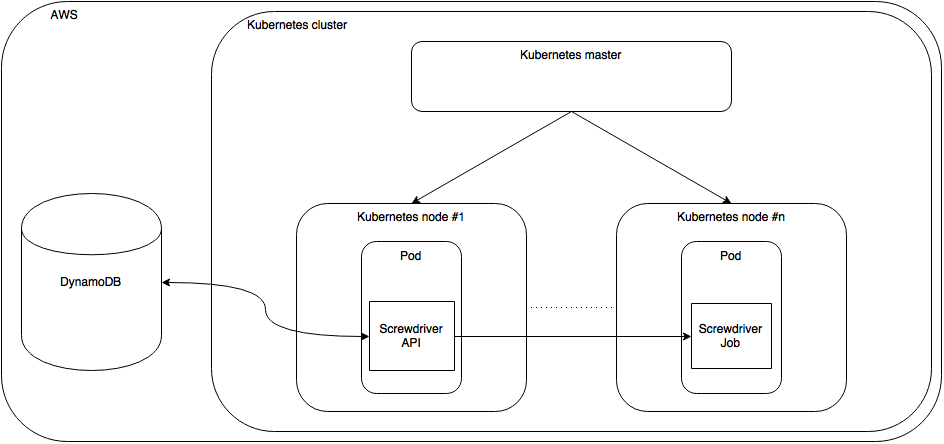
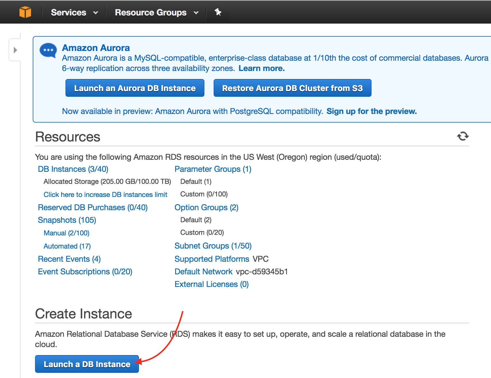
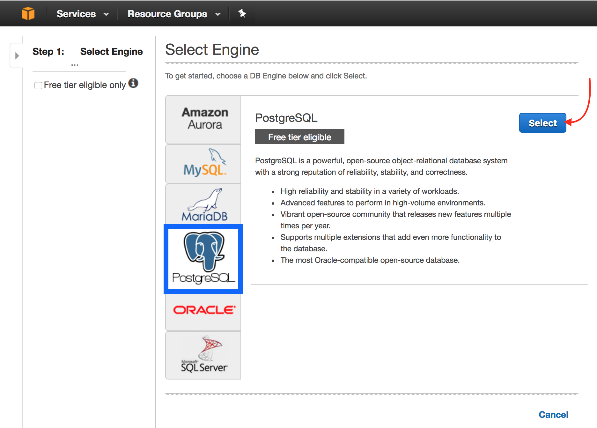
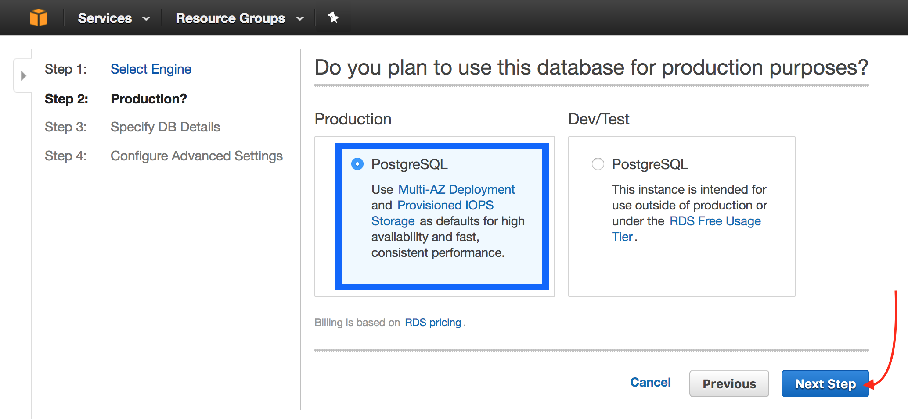
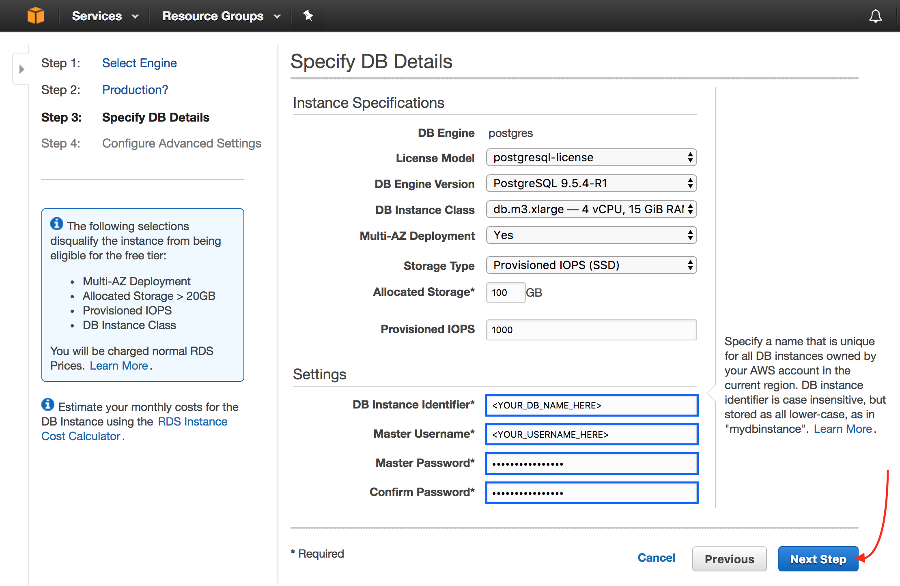
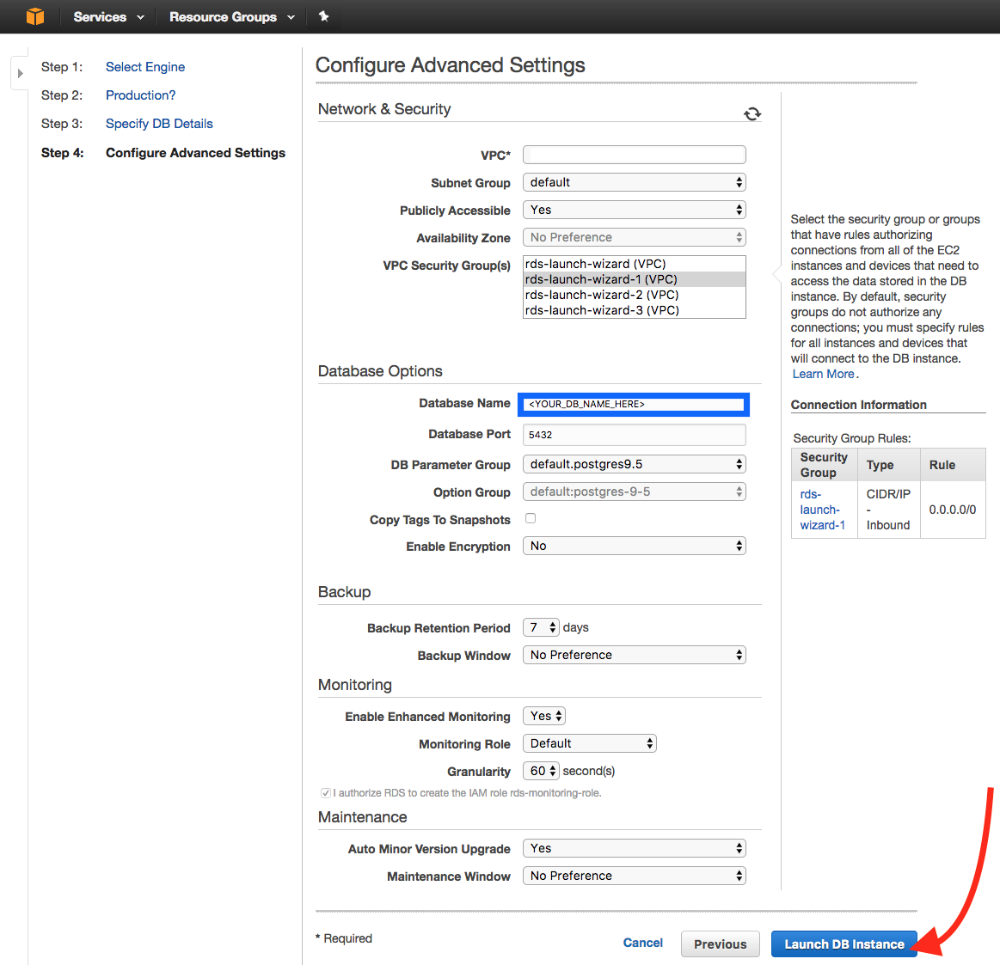
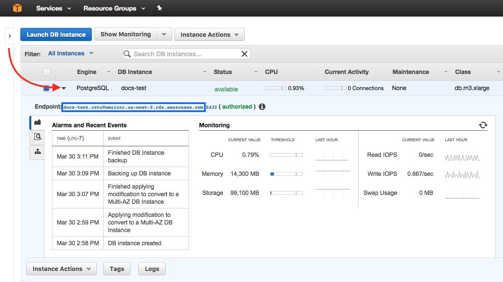

# Setting Up a Screwdriver Cluster on AWS using Kubernetes
We'll go over how to set up a Screwdriver cluster on AWS using Kubernetes, Github, and a Postgres database. You can setup a Screwdriver cluster using [Kubernetes](http://kubernetes.io/docs/whatisk8s/).

## Screwdriver cluster
A Screwdriver cluster consists of a Kubernetes cluster running the Screwdriver API. The Screwdriver API modifies Screwdriver tables in AWS RDS.



## Prerequisites
- [kubectl](http://kubernetes.io/docs/user-guide/prereqs/)
- an [AWS](http://aws.amazon.com) account
- [AWS CLI](https://aws.amazon.com/cli/)

## Create your Kubernetes cluster
Follow instructions at [Running Kubernetes on AWS EC2](http://kubernetes.io/docs/getting-started-guides/aws/).


## Setup Screwdriver secrets
After creating your Kubernetes cluster, you'll need to populate it with some secrets that will give you access to your database and Github.
A [Secret](http://kubernetes.io/docs/user-guide/secrets/) is an object that contains a small amount of sensitive data such as a password, token, or key.

Here's a list of secrets we will need:

| Secret Key            | Description |
| :-------------------- | :-------------|
| SECRET_JWT_PRIVATE_KEY | A private key used for signing JWT tokens |
| SECRET_JWT_PUBLIC_KEY | A public key used for signing JWT tokens |
| DATASTORE_SEQUELIZE_DATABASE | SQL database name |
| DATASTORE_SEQUELIZE_USERNAME | SQL database username |
| DATASTORE_SEQUELIZE_PASSWORD | SQL database password |
| SECRET_OAUTH_CLIENT_ID | The client ID used for [OAuth](https://developer.github.com/v3/oauth) with Github |
| SECRET_OAUTH_CLIENT_SECRET | The client secret used for OAuth with github |
| WEBHOOK_GITHUB_SECRET | Secret to add to GitHub webhooks so that we can validate them |
| SECRET_PASSWORD | A password used for encrypting session, and OAuth data. Can be anything. **Needs to be minimum 32 characters** |
| K8S_TOKEN | Your Kubernetes <DEFAULT_TOKEN_NAME> |

### Generate JWT keys
To generate a `jwtprivatekey`, run:

`$ openssl genrsa -out jwt.pem 2048`

To generate a `jwtpublickey`, run:

`$ openssl rsa -in jwt.pem -pubout -out jwt.pub`

### Get your OAuth Client ID and Secret

1. Navigate to the [OAuth applications](https://github.com/settings/developers) page.

2. Click Register a new application.

3. Fill out the information and click Register application.


You should see a `Client ID` and `Client Secret`, which will be used for your `oauthclientid` and `oauthclientsecret`, respectively.

### Create a datastore
To get your SQL datastore secrets, set up a datastore with [AWS RDS](https://us-west-2.console.aws.amazon.com/rds).

1. Navigate to [AWS RDS](https://us-west-2.console.aws.amazon.com/rds). Click on Launch a DB Instance.

    

2. Select the `PostgreSQL` tab. Click Select.

    

3. Choose an environment (Production or Dev/Test) and click Next Step.

    

4. Fill out the DB Instance Identifier (`DATASTORE_SEQUELIZE_DATABASE`), Master Username (`DATASTORE_SEQUELIZE_USERNAME`), Master Password (`DATASTORE_SEQUELIZE_PASSWORD`), and Confirm Password. Click Next Step.

    

4. Add a Database Name. Make sure the VPC Security Group chosen gives inbound access to all IPs. Click Launch DB Instance.

    

5. Click View Your DB Instances. Click on the small triangle next to the Engine column on your DB instance row to open up the details. Your endpoint will be your Database host name.

    


### Base64 encode your secrets
Each secret must be [base64 encoded](http://kubernetes.io/docs/user-guide/secrets/#creating-a-secret-manually). You must base64 encode each of your secrets:

```bash
$ echo -n "somejwtprivatekey" | base64
c29tZWp3dHByaXZhdGVrZXk=
$ echo -n "anypassword" | base64
YW55cGFzc3dvcmQ=
```

### Setting up secrets in Kubernetes
To create secrets in Kubernetes, create a `secret.yaml` file and populate it with your secrets. These secrets will be used in your Kubernetes `deployment.yaml` file.

It should look similar to the following:

```yaml
apiVersion: v1
kind: Secret
metadata:
  name: screwdriver-api-secrets
type: Opaque
data:
  # make sure the values are all base64 encoded
  dbhost: ZGJob3N0bmFtZWhlcmU=
  dbusername: bXlkYXRhYmFzZQ==
  dbpassword: c29tZXBhc3N3b3Jk
  password: YW55cGFzc3dvcmQ=
  oauthclientid: c29tZWNsaWVudGlk
  oauthclientsecret: c29tZWNsaWVudHNlY3JldA==
  jwtprivatekey: c29tZWp3dHByaXZhdGVrZXk=
  jwtpublickey: c29tZWp3dHB1YmxpY2tleQ==
  githubsecret: c29tZWdpdGh1YnNlY3JldA==
```

Create the secrets using `kubectl create`:

```bash
$ kubectl create -f ./secret.yaml
```

### Additional environment variables
Other environment variables can also be customized for Screwdriver. For a full list, see the [custom-environment-variables.yaml](https://github.com/screwdriver-cd/screwdriver/blob/master/config/custom-environment-variables.yaml) file.


## Deploy Screwdriver
You can check out the `api.yaml` in the [Screwdriver config examples repo](https://github.com/screwdriver-cd-test/config-examples) for example service and deployment definitions to run the Screwdriver API.

### Create a Service
A Kubernetes Service is an abstraction which defines a set of Pods and is assigned a unique IP address which persists.
Follow instructions in [Creating a Service](http://kubernetes.io/docs/user-guide/connecting-applications/#creating-a-service) to set up your `service.yaml`.

It should look like the Service in [api.yaml](https://github.com/screwdriver-cd-test/config-examples/blob/master/services/api.yaml).

To create your service, run the `kubectl create` command on your `service.yaml` file:
```bash
$ kubectl create -f service.yaml
```

### Get your Kubernetes token name
Kubernetes actually sets up your Kubernetes token by default. You will need this for your `deployment.yaml`.
You can use `kubectl` to see your [Kubernetes secrets](http://kubernetes.io/docs/user-guide/secrets/walkthrough/).

Get the `<DEFAULT_TOKEN_NAME>`, by running:

```bash
$ kubectl get secrets

NAME                      TYPE                                  DATA      AGE
default-token-abc55       kubernetes.io/service-account-token   3         50d
```

The `<DEFAULT_TOKEN_NAME>` will be listed under `Name` when the `Type` is `kubernetes.io/service-account-token`.

### Get your URI
You will need to get the Load Balancer Ingress to set your `URI` in your `deployment.yaml`.

Get the `LoadBalancer Ingress`, by running:

```bash
$ kubectl describe services sdapi
```


### Create a Deployment
A Deployment makes sure a specified number of pod “replicas” are running at any one time. If there are too many, it will kill some; if there are too few, it will start more. Follow instructions on the [Deploying Applications](http://kubernetes.io/docs/user-guide/deploying-applications/) page to create your `deployment.yaml`.

It should look like the Deployment in [api.yaml](https://github.com/screwdriver-cd-test/config-examples/blob/master/services/api.yaml).

### Deploy
For a fresh deployment, run the `kubectl create` command on your `deployment.yaml` file:

```bash
$ kubectl create -f deployment.yaml
```


## View your pods
A Kubernetes [pod](http://kubernetes.io/docs/user-guide/pods/) is a group of containers, tied together for the purposes of administration and networking.

To view the pod created by the deployment, run:

```bash
$ kubectl get pods
```

To view the stdout / stderr from a pod, run:

```bash
$ kubectl logs <POD-NAME>
```

## Update your OAuth Application
You will need to navigate back to your original OAuth Application that you used for your OAuth Client ID and Secret to update the URLs.

1. Navigate to the [OAuth applications](https://github.com/settings/developers) page.

2. Click on the application you created to get your OAuth Client ID and Secret.

3. Fill out the `Homepage URL` and `Authorization callback URL` with your `LoadBalancer Ingress`.
