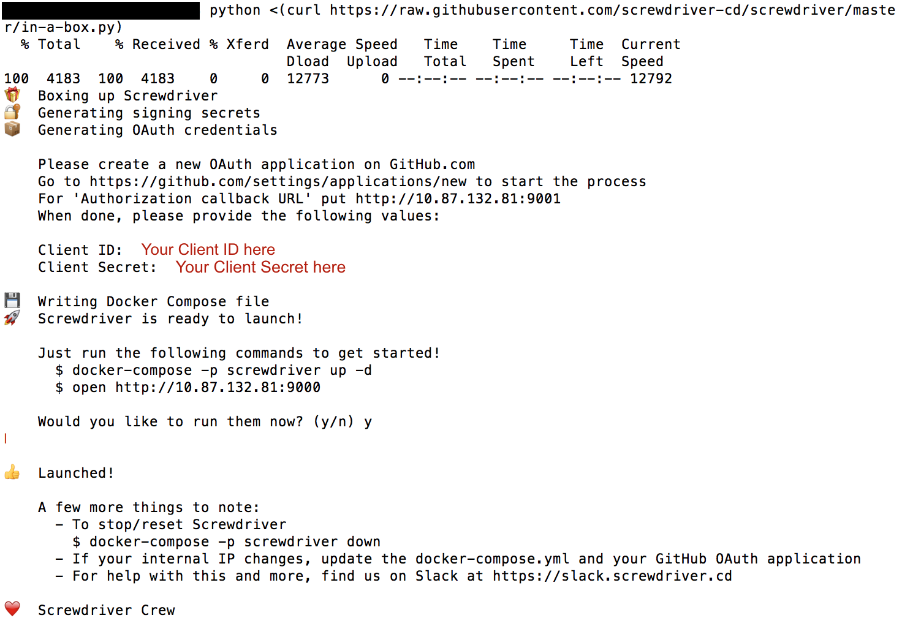

# Running Locally
You can run Screwdriver locally by using our Screwdriver-in-a-box tool.

## SD-in-a-Box
This handy feature will bring up an entire Screwdriver instance (UI, API, and log store) locally for you to play with.

### Requires:
 - Mac OSX 10.10+
 - [Docker for Mac][docker]
 - [Docker Compose 1.8.1+][docker-compose]
 - Python 2.6+

Run the below command in your terminal to bring up a Screwdriver cluster locally.

```bash
$ python <(curl https://raw.githubusercontent.com/screwdriver-cd/screwdriver/master/in-a-box.py)
```

You will be prompted to enter your Client ID and Client Secret. Afterwards, type `y` to launch Screwdriver!



[docker]: https://www.docker.com/products/docker
[docker-compose]: https://www.docker.com/products/docker-compose

## Configuring SD-in-a-Box

SD-in-a-box was intended to be an easy way to run a Screwdriver cluster locally on your development machine so you can demo its features first-hand.

### Custom Docker Images

Since it's powered by Docker, you can determine which images to use for it. SD-in-a-Box (and Screwdriver as a whole) uses the following Docker images:

* [screwdrivercd/screwdriver](https://hub.docker.com/r/screwdrivercd/screwdriver) - API. The main engine of the CI/CD cluster.
* [screwdrivercd/ui](https://hub.docker.com/r/screwdrivercd/ui) - UI. To pleasantly interact with Screwdriver.
* [screwdrivercd/store](https://hub.docker.com/r/screwdrivercd/store) - Artifact repository. Responsible for artifacts like build logs & templates
* [screwdrivercd/launcher](https://hub.docker.com/r/screwdrivercd/launcher/tags/) - Worker component that executes the build. You *cannot* change the image. You can only specify a specific tag to use.

Here is a snippet of the `docker-compose.yml` file

```
version: '2'
services:
  api:
    image: screwdrivercd/screwdriver:stable
    . . .
  ui:
    image: screwdrivercd/ui:stable
    . . .
  store:
    image: screwdrivercd/store:stable
    . . .
```

You can make a local Docker image to use instead of one of these.

To start up the SD-in-a-Box, execute the following command

```bash
$ docker-compose -p screwdriver up
```

### Volume-Mounted Source Code

You can choose to replace a component with a local copy. This is incredibly helpful if you're trying to implement an update to a service and want to see how it impacts the entire cluster.

Modify the `docker-compose.yaml`, targeting the component you would like to replace. In the following snippet, we replace the API with a local source.

```
services:
  api:
    # this "build" stanza replaces the default "image" setting
    build:
      context: ./relative/path/to/api_source
      dockerfile: Dockerfile.local
  ui:
    . . .
  store:
    . . .
```

To set your update, you'll need to rebuild the docker-compose services first.

```bash
$ docker-compose build
```

Restart the local cluster to have your changes take effect.

```bash
$ docker-compose -p screwdriver down
$ docker-compose -p screwdriver up
```

#### Caveats

This approach does very well with replacing complete services, and also carries some limitations:

* Unable to replace individual modules with this methodology.

### Local Development Instances

If you plan on making adjustments to a specific Screwdriver component, you can choose to replace a component with your development instance. This will give you a good idea on how it affects the other Screwdriver components before submitting it via Pull Request.

#### General configuration

One important thing to note is that your `docker-compose.yml` will have all the components configured by I.P. address (as opposed to `localhost`). The following features will cease to work if you choose to use `localhost` instead of an I.P. address:

* Builds will not start locally

#### Configuring the UI

You can choose to use a local development instance of the UI.

In development mode, the UI hosts itself on port `4200` and assumes the API is served locally on `8080` by default. You would need to modify the UI's `config/environment.js` file to point to your local Screwdriver cluster, specifcally the API. This can be done by modifying the value right before the `return ENV;` statement.

The following is a snippet that highlights the change you would make in the `config/environment.js`

```js
 . . .
 ENV.APP.SDAPI_HOSTNAME = 'http://11.22.33.44:8080';  // 8080 is the default. You can also change this
 return ENV;
```

The following snippet highlights the `docker-compose.yml` values that need to be modified to use your local UI instance along with the SD-in-a-box cluster.

```
version: '2'
services:
  api:
    . . .
    ports:
      - 8080:80    # UI default port for API is 8080. This can be changed according to the value you set in config/environment.js
    environment:
      URI: http://11.22.33.44:8080             # Tells the launcher where to communicate build updates to the API.
      ECOSYSTEM_UI: http://11.22.33.44:4200    # Tells the API where the UI is hosted. Related to OAuth mismatching-hostname issues
    . . .
```

Please note that you cannot use `localhost` for the `ECOSYSTEM_UI` value if the `URI` value is set to an I.P. address. You will receive an invalid token after log-in.

#### Configuring the API

You can choose to use a local development instance of the API.

Further customization can be done by setting the related environment variables. Learn more in [the API documentation](https://github.com/screwdriver-cd/screwdriver#environment)


#### Configuring the Store

You can choose to use a localhost development instance of the Store.

In development mode, the Store hosts itself on port `80` by default. You may change this value to whichever port you desire. For the purposes of this guide, we will assume it's hosted on `8888`.

The following snippet highlights the `docker-compose.yml` values that need to be modified to use your local store instance along with the SD-in-a-box cluster.

```
version: '2'
services:
  store:
    . . .
    ports:
      - 8888:80    # Port 8888 is arbitrary. You can choose another if you prefer
    environment:
      URI: http://11.22.33.44:9001
      ECOSYSTEM_STORE: http://10.73.202.183:8888    # Tells the API where the store is hosted
    . . .
```
