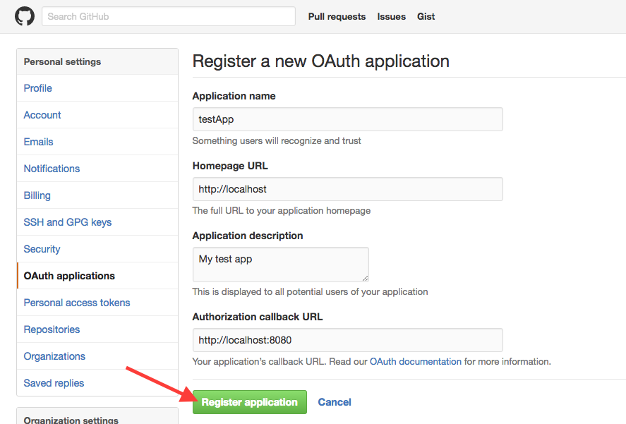

# Setting Up a Screwdriver Cluster on AWS using Kubernetes
You can setup a Screwdriver cluster using [Kubernetes](http://kubernetes.io/docs/whatisk8s/).

## Screwdriver cluster
A Screwdriver cluster consists of a Kubernetes cluster running the Screwdriver API. The Screwdriver API modifies Screwdriver tables in DynamoDB.


## Prerequisites
- [kubectl](http://kubernetes.io/docs/user-guide/prereqs/)
- an [AWS](http://aws.amazon.com) account
- [AWS CLI](https://aws.amazon.com/cli/)
- [Screwdriver tables on DynamoDB](datastore-setup/)

## Create your Kubernetes cluster
Follow instructions at [Getting Started with AWS](http://kubernetes.io/docs/getting-started-guides/aws/).


## Setup Kubernetes secrets
A [Secret](http://kubernetes.io/docs/user-guide/secrets/) is an object that contains a small amount of sensitive data such as a password, a token, or a key. You will need to setup secrets for Screwdriver for your cluster to work properly.

First, you will need to gather some secrets:

| Secret Key        | Description |
| :------------- |:-------------|
| DATASTORE_DYNAMODB_ID | AWS Access Key ID |
| DATASTORE_DYNAMODB_SECRET | AWS Secret Access Key |
| SECRET_OAUTH_CLIENT_ID | The client ID used for [OAuth](https://developer.github.com/v3/oauth/) with Github |
| SECRET_OAUTH_CLIENT_SECRET | The client secret used for OAuth with github |
| SECRET_JWT_PRIVATE_KEY | A private key used for signing JWT tokens. Can be anything |
| SECRET_PASSWORD | A password used for encrypting session, and OAuth data. **Needs to be minimum 32 characters** |

Here are some directions for getting your secrets:

### Get your DynamoDB secrets
To get your `accessKeyId` and `secretAccessKey`:

1. Navigate to [IAM](https://console.aws.amazon.com/iam) in your AWS console

2. Click on Users, and create a Screwdriver user. We recommend installing using an account which has read/write access to AWS DynamoDB. _For information on how to create an AWS DynamoDB policy, see [Policy Examples](http://docs.aws.amazon.com/amazondynamodb/latest/developerguide/using-identity-based-policies.html#access-policy-examples-for-sdk-cli.example1)._

3. Select the `Security Credentials` tab

4. Click `Create Access Key`

5. Download the file and keep note of those values for your `dynamodbid` and `dynamodbsecret`.

### Get your OAuth Client ID and Secret

1. Navigate to the [OAuth applications](https://github.com/settings/developers) page.

2. Click Register a new application.

3. Fill out the information and click Register application.



You should see a `Client ID` and `Client Secret`, which will be used for your `oauthclientid` and `oauthclientsecret`, respectively.

### Setting up secrets in Kubernetes
To create secrets in Kubernetes, create a `secret.yaml` file and populate it with your secrets. These secrets will be used in your Kubernetes `deployment.yaml` file.

It should look similar to the following:
```yaml
apiVersion: v1
kind: Secret
metadata:
  name: secrets
type: Opaque
data:
  dynamodbid: someid
  dynamodbsecret: somesecret
  password: somepassword
  oauthclientid: someclientid
  oauthclientsecret: someclientsecret
  jwtprivatekey: someprivatekey
```

Create the secrets using `kubectl create`:
```bash
$ kubectl create -f ./secret.yaml
```

### Additional environment variables
Other environment variables can also be customized for Screwdriver. For a full list, see the [custom-environment-variables.yaml](https://github.com/screwdriver-cd/screwdriver/blob/master/config/custom-environment-variables.yaml) file.


## Deploy Screwdriver
You can check out the [Screwdriver API repo](https://github.com/screwdriver-cd/screwdriver) and look in the `kubernetes` directory for service and deployment definitions for running the Screwdriver API. Both files are required to deploy Screwdriver.

### Create a Service
A Kubernetes Service is an abstraction which defines a set of Pods and is assigned a unique IP address which persists.
Follow instructions in [Creating a Service](http://kubernetes.io/docs/user-guide/connecting-applications/#creating-a-service) to set up your `service.yaml`.

It should look like the `service.yaml` here: https://github.com/screwdriver-cd/screwdriver/blob/master/kubernetes/api_service.yaml.

To create your service, run the `kubectl create` command on your `service.yaml` file:
```bash
$ kubectl create -f service.yaml
```

### Get your Kubernetes token name
Kubernetes actually sets up your Kubernetes token by default. You will need this for your `deployment.yaml`.
Kubectl can be used to see your [Kubernetes secrets](http://kubernetes.io/docs/user-guide/secrets/walkthrough/).

- Get the `<DEFAULT_TOKEN_NAME>`, by running:
```bash
$ kubectl get secrets

NAME                      TYPE                                  DATA      AGE
default-token-abc55       kubernetes.io/service-account-token   3         50d
```

The `<DEFAULT_TOKEN_NAME>` will be listed under `Name` when the `Type` is `kubernetes.io/service-account-token`.


### Create a Deployment
A Deployment makes sure a specified number of pod “replicas” are running at any one time. If there are too many, it will kill some; if there are too few, it will start more. Follow instructions on the [Deploying Applications](http://kubernetes.io/docs/user-guide/deploying-applications/) page to create your `deployment.yaml`.

It should look like the `deployment.yaml` here: https://github.com/screwdriver-cd/screwdriver/blob/master/kubernetes/api_deployment.yaml.

### Deploy
For a fresh deployment, run the `kubectl create` command on your `deployment.yaml` file:
```bash
$ kubectl create -f deployment.yaml
```

## View your pods
A Kubernetes [pod](http://kubernetes.io/docs/user-guide/pods/) is a group of containers, tied together for the purposes of administration and networking.

To view the pod created by the deployment, run:

```bash
$ kubectl get pods
```

To view the stdout / stderr from a pod, run:

```bash
$ kubectl logs <POD-NAME>
```
