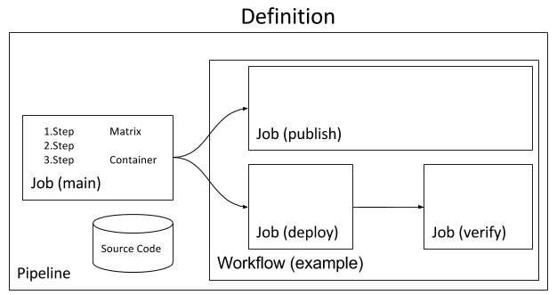

## ドメインモデル

_注意: `matrix` はまだ実装されていません。_




### ソースコード

ソースコードとは、ビルドやテスト、アプリケーションのパブリッシュに必要なコードと`screwdriver.yaml` を含む、指定されたSCMリポジトリとブランチのことです。

### ステップ

ステップは名称付けされた処理すべきふるまいで、通常は単一のシェルコマンドです。要するに、Screwdriverはターミナルで`/bin/sh`を起動し、全てのステップを実行します。レアケースですが、異なるターミナル/シェルでセットアップすると予期しない動作が発生することがあります。コマンドがゼロ以外の終了コードで終了した場合、そのステップは失敗とみなされます。環境変数は同じジョブの内であればステップ間で共有されます。

### コンテナ

コンテナは隔離された環境で[ステップ](#%E3%82%B9%E3%83%86%E3%83%83%E3%83%97)を実行します。異なる環境・バージョンで動作しているコードの互換性について、同時に実行されている他の[ビルド](#%E3%83%93%E3%83%AB%E3%83%89)に影響を与えずにテストするために行われます。これはDockerコンテナを利用して実装されています。

### ジョブ

ジョブとは、順番が設定された複数の[ステップ](#%E3%82%B9%E3%83%86%E3%83%83%E3%83%97)を指定された[コンテナ](#%E3%82%B3%E3%83%B3%E3%83%86%E3%83%8A)で実行することです。一連のステップのうちいずれかが失敗すると、ジョブ全体は失敗されたとみなされ、以降のステップはスキップされます。（そのように設定されていない場合を除く）

実際のジョブでは[ソースコード](#%E3%82%BD%E3%83%BC%E3%82%B9%E3%82%B3%E3%83%BC%E3%83%89) の特定のコミットをチェックアウトし、求められた環境変数を設定し、指定された[ステップ](#%E3%82%B9%E3%83%86%E3%83%83%E3%83%97)を実行するという処理が行われます。

ジョブの実行中、実行される[ステップ](#%E3%82%B9%E3%83%86%E3%83%83%E3%83%97)では次の3つのコンテキストが共有されます。

- ファイルシステム
- [コンテナ](#コンテナ)
- [メタデータ](#メタデータ)

ジョブは[ソースコード](#%E3%82%BD%E3%83%BC%E3%82%B9%E3%82%B3%E3%83%BC%E3%83%89)への変更や[ワークフロー](#workflow)からのトリガーで自動的に開始します。UIから手動で開始することも可能です。

#### プルリクエスト

プルリクエストは既存のパイプラインジョブとは別に実行されます。ジョブ名が`main`のステップのみが実行されます。

### ビルド

ビルドは実行中の[ジョブ](#%E3%82%B8%E3%83%A7%E3%83%96)ジョブのインスタンスのことを指します。すべてのビルドはユニークなビルド番号が振られています。また、各ビルドは[イベント](#%E3%82%A4%E3%83%99%E3%83%B3%E3%83%88)イベントに紐づいています。基本的なジョブ設定の場合、ジョブに対し一度に一つのビルドが実行されます。[ジョブマトリクス](#%E4%B8%A6%E5%88%97%E5%AE%9F%E8%A1%8C)が設定されていれば複数のビルドが並列に実行されます。

ビルドは次の5つのうちいずれかの状態を持ちます。

- `QUEUED` - ビルドはリソースの空きを待っています
- `RUNNING` - ビルドはexecutorで実行されています
- `SUCCESS` - 全てのステップが成功しました
- `FAILURE` - いずれかのステップが失敗しました
- `ABORTED` - ユーザーが実行中のビルドをキャンセルしました

### イベント

イベントはコミットや[パイプライン](#%E3%83%91%E3%82%A4%E3%83%97%E3%83%A9%E3%82%A4%E3%83%B3)の手動リスタートを表します。イベントには下記の2種類があります。

- `pipeline`: - パイプラインを手動で開始したりpull requestをマージしたりした場合に作られるイベントです。この種類のイベントは、パイプラインにおけるワークフローとしてのジョブと同じ順序でトリガーされます。(例: `['main', 'publish', 'deploy']`)
- `pr`:  - pull requestの作成や更新により作られるイベントです。この種類のイベントは初めのジョブのみトリガーします。

### メタデータ

メタデータは[ビルド](#%E3%83%93%E3%83%AB%E3%83%89)に関連する情報を構造的に格納するkey/valueストレージです。メタデータは同じ[ワークフロー](#workflow)内の後続のビルドと共有されます。[ステップ](#%E3%82%B9%E3%83%86%E3%83%83%E3%83%97)で利用できる[meta CLI](https://github.com/screwdriver-cd/meta-cli)を使用して、ビルド中に更新や取得することができます。

例:

```bash
$ meta set example.coverage 99.95
$ meta get example.coverage
99.95
$ meta get example
{"coverage":99.95}
```

詳しくは[metadata page](../../user-guide/metadata)をご覧ください。

### Workflow

[ワークフロー](../../user-guide/configuration/workflow)とは、初めのジョブの[ビルド](#%E3%83%93%E3%83%AB%E3%83%89)成功後に実行される[ジョブ](#%E3%82%B8%E3%83%A7%E3%83%96)の順番のことです。ジョブは並列や逐次、またはその組み合わせで実行することができます。順序は`requires`キーで決定されます。

ワークフロー内で実行されるジョブは次の内容を共有します。

- 同じgitコミットからチェックアウトされたソースコード
- 初めのジョブからトリガーされて実行されるジョブからアクセスされる[メタデータ](#%E3%83%A1%E3%82%BF%E3%83%87%E3%83%BC%E3%82%BF)

下記の(省略された)workflowセクションの例ではこのようなフローになっていて

```yaml
jobs:
  main:
    requires: [~pr]
  publish:
    requires: [main]
  deploy-west:
    requires: [publish]
  deploy-east:
    requires: [publish]
  validate-west:
    requires: [deploy-west]
  validate-east:
    requires: [deploy-east]                
```

pull-requestがベースブランチにマージされると次のように動作します。

- `main`が実行され、`publish`をトリガー
- `publish`は`deploy-west`と`deploy-east`を並列でトリガー
- `deploy-west`は`validate-west`をトリガー
- `deploy-east`は`validate-east`をトリガー

### パイプライン

パイプラインとは同じ[ソースコード](#%E3%82%BD%E3%83%BC%E3%82%B9%E3%82%B3%E3%83%BC%E3%83%89)を共有する[ジョブ](#%E3%82%B8%E3%83%A7%E3%83%96)ジョブの集合を表します。これらのジョブは[ワークフロー](#workflow)で定義された順で実行されます。
