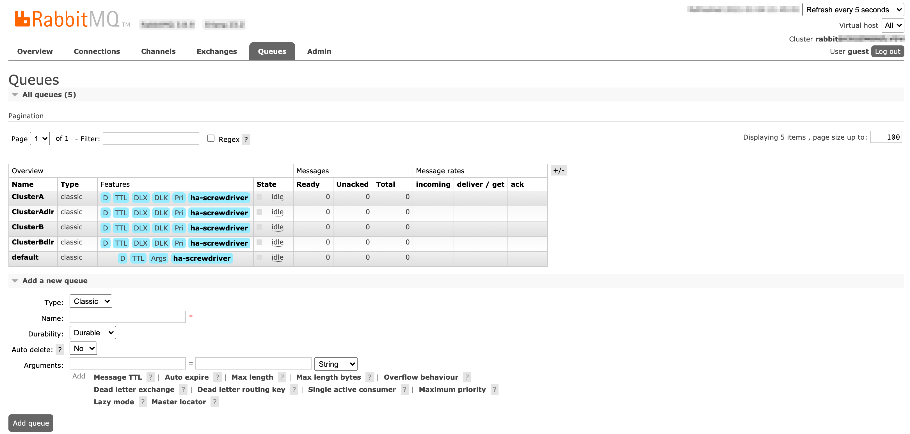

RabbitMQメッセージブローカーとビルドクラスターキューワーカーを構成してセットアップするのはクラスター管理者の仕事です。

# ビルドクラスターキューワーカーの管理

このページでは、[RabbitMQメッセージブローカー](https://www.rabbitmq.com/#getstarted)と[ビルドクラスターキューワーカー](https://github.com/screwdriver-cd/buildcluster-queue-worker)のセットアップ方法について説明します。

## Overview

ビルドクラスター機能は、[multiBuildClusterのフラグ](https://github.com/screwdriver-cd/screwdriver/blob/master/config/default.yaml#L302)または[環境変数](https://github.com/screwdriver-cd/screwdriver/blob/master/config/custom-environment-variables.yaml#L408)で有効/無効を切り替えることができます。
有効にすると、Screwdriverの[キューサービス](configure-queue-service)は、ビルドメッセージをRabbitMQにプッシュします。
ビルドメッセージのヘッダーには、buildClustersテーブルに設定されているisActiveフラグとweightageの重み付けに基づいて、ルーティングキー設定されます。
RabbitMQはメッセージのヘッダーに設定されたルーティングキーに基づいてビルドメッセージをキューにルーティングし、
ビルドメッセージはビルドクラスターキューワーカーによって消費・処理されます。
Stickinessについてですが、パイプラインの最初のビルドが実行されると、パイプラインのannotationsにビルドクラスターのルーティングキーを保存し、そのパイプラインでは毎回同じビルドクラスターが割り振られるようになります。
ビルドは自動的に利用可能な他のビルドクラスターにルーティングされるため、ビルドクラスターがメンテナンスのためにオフラインになったとしても影響はありません。

***注意**: ビルドクラスターのルーティングキーを作成する際には注意し、慎重に作成して、ルーティングキーの更新は控えて下さい。ルーティングキーは、ビルドクラスターのStickinessのためにパイプラインannotationsに保存されています。
そのためルーティングキーを更新すると、影響を受けるパイプラインのannotationsとRabbitMQの結びつきを正しく設定し直す必要があります。この更新がないと、影響を受けるパイプラインに関連するビルドはエラーになります。
別の方法は、新しいビルドクラスターを作成し、古いビルドクラスターを無効にすることです。この場合、ビルドは更新無しで新しいビルドクラスターに自動的にルーティングされますが、ビルドクラスターのStickinessは失われることに注意して下さい。*

### Retry queues
ビルドクラスタにリトライキューを設定することで、ポッドの状態を確認し、イメージPullエラーや設定エラーが発生した場合に不正なビルドを停止させることができます。
この機能を有効にするには、[active flag](https://github.com/screwdriver-cd/buildcluster-queue-worker/blob/master/config/custom-environment-variables.yaml#L363)を使用します。デフォルトは`true`です。
この機能を使用すると、最初の処理で成功(ポッドステータスが`Running`)とならなかったメッセージはリトライキューに送られ、成功するか[再送の上限](https://github.com/screwdriver-cd/buildcluster-queue-worker/blob/master/config/custom-environment-variables.yaml#L359)に達するまで、設定に基づいた間隔でリトライされます。

## ビルドクラスターのセットアップ

クラスター管理者は、[buildclusters API](https://api.screwdriver.cd/v4/documentation#/v4/postV4Buildclusters)を使用してビルドクラスターを作成する必要があります。

```json
{
  "name": "ClusterA",
  "description": "Build cluster to process ClusterA builds",
  "scmOrganizations": [
    "screwdriver-cd"
  ],
  "isActive": true,
  "managedByScrewdriver": true,
  "maintainer": "foo@bar.com",
  "weightage": 100
}
```

1. nameはRabbitMQの設定で定義しているqueueとrouting_keyに一致させる必要があります。
1. ビルドクラスターが組織内のScrewdriverチームによって管理されている場合、`managedByScrewdriver`を`true`に設定します。
1. `isActive`を`true`または`false`に設定することでビルドクラスターの有効/無効を切り替えられます。
1. `weightage`にはビルドクラスターが1つの場合は100を設定し、2つ以上のビルドクラスターがある場合は重みを配分して下さい。

***注意**: ビルドクラスターのscmContextは、scm毎のAPIトークンから派生します。
複数のscmに対して同名のビルドクラスターを作成するには、scmアカウント毎に[/v4/buildClusters](https://api.screwdriver.cd/v4/documentation#/v4/postV4Buildclusters)APIへのPOSTを繰り返して下さい*

## RabbitMQメッセージブローカーのインストール

前提条件として、[RabbitMQのダウンロードとインストール](https://www.rabbitmq.com/download.html)と[RabbitMQチュートリアル](https://www.rabbitmq.com/getstarted.html)を参照して下さい。
Screwdriverは[Helm Charts](https://github.com/helm/charts/tree/master/stable/rabbitmq-ha)を使用して、High-Availability構成のRabbitMQ `version: 3.7.28 Erlang: 22.3.4.7`をKubernetesクラスターにインストールします。
このHelm Chartは非推奨なので注意して下さい。新規でのインストールは[bitnami Helm Charts](https://github.com/bitnami/charts/tree/master/bitnami/rabbitmq)を参照して下さい。

参考に、RabbitMQのHelm Chartのvalues.tmplファイルを掲載します。環境仕様にあわせて変更して使用して下さい。

``` yaml
## RabbitMQ application credentials
## Ref: http://rabbitmq.com/access-control.html
## Assumption: CPU:1; Memory:2Gi
rabbitmqUsername: sdadmin
rabbitmqPassword: replace_password

## RabbitMQ Management user used for health checks
managementUsername: sdmgmt
managementPassword: replace_password

## Place any additional key/value configuration to add to rabbitmq.conf
## Ref: https://www.rabbitmq.com/configure.html#config-items
extraConfig:
  disk_free_limit.absolute = 5GB

## Place any additional plugins to enable in /etc/rabbitmq/enabled_plugins
## Ref: https://www.rabbitmq.com/plugins.html
extraPlugins: |
  rabbitmq_shovel,
  rabbitmq_shovel_management,
  rabbitmq_federation,
  rabbitmq_federation_management

definitions:
  users: |-
  vhosts: |-
  parameters: |-
  permissions: |-
  queues: |-
  exchanges: |-
  bindings: |-
  policies: |-

## RabbitMQ default VirtualHost
## Ref: https://www.rabbitmq.com/vhosts.html
##
rabbitmqVhost: "/"

## Erlang cookie to determine whether different nodes are allowed to communicate with each other
## Ref: https://www.rabbitmq.com/clustering.html
##
rabbitmqErlangCookie: replace_erlang_cookie

## RabbitMQ Memory high watermark
## Ref: http://www.rabbitmq.com/memory.html
##
rabbitmqMemoryHighWatermark: 1024MiB
rabbitmqMemoryHighWatermarkType: absolute

## EPMD port for peer discovery service used by RabbitMQ nodes and CLI tools
## Ref: https://www.rabbitmq.com/clustering.html
##
rabbitmqEpmdPort: 4369

## Node port
rabbitmqNodePort: 5672

## Manager port
rabbitmqManagerPort: 15672

## Set to true to precompile parts of RabbitMQ with HiPE, a just-in-time
## compiler for Erlang. This will increase server throughput at the cost of
## increased startup time. You might see 20-50% better performance at the cost
## of a few minutes delay at startup. ## Rabbitmq crashes when this settings
## is enabled
rabbitmqHipeCompile: false

## SSL certificates
## Red: http://www.rabbitmq.com/ssl.html
rabbitmqCert:
  enabled: true

  # Specifies an existing secret to be used for SSL Certs
  existingSecret: replace_tls_cert

  ## Create a new secret using these values
  cacertfile: |
  certfile: |
  keyfile: |

## Authentication mechanism
## Ref: http://www.rabbitmq.com/authentication.html
rabbitmqAuth:
  enabled: false

  config: |
    # auth_mechanisms.1 = PLAIN
    # auth_mechanisms.2 = AMQPLAIN
    # auth_mechanisms.3 = EXTERNAL

## Authentication backend
## Ref: https://github.com/rabbitmq/rabbitmq-auth-backend-http
rabbitmqAuthHTTP:
  enabled: false

  config: |
    # auth_backends.1 = http
    # auth_http.user_path     = http://some-server/auth/user
    # auth_http.vhost_path    = http://some-server/auth/vhost
    # auth_http.resource_path = http://some-server/auth/resource
    # auth_http.topic_path    = http://some-server/auth/topic

## LDAP Plugin
## Ref: http://www.rabbitmq.com/ldap.html
rabbitmqLDAPPlugin:
  enabled: false

  ## LDAP configuration:
  config: |
    # auth_backends.1 = ldap
    # auth_ldap.servers.1  = my-ldap-server
    # auth_ldap.user_dn_pattern = cn=${username},ou=People,dc=example,dc=com
    # auth_ldap.use_ssl    = false
    # auth_ldap.port       = 389
    # auth_ldap.log        = false

## MQTT Plugin
## Ref: http://www.rabbitmq.com/mqtt.html
rabbitmqMQTTPlugin:
  enabled: false

  ## MQTT configuration:
  config: |
    # mqtt.default_user     =
    # mqtt.default_pass     =
    # mqtt.allow_anonymous  = true

## Web MQTT Plugin
## Ref: http://www.rabbitmq.com/web-mqtt.html
rabbitmqWebMQTTPlugin:
  enabled: false

  ## Web MQTT configuration:
  config: |
    # web_mqtt.ssl.port       = 12345
    # web_mqtt.ssl.backlog    = 1024
    # web_mqtt.ssl.certfile   = /etc/cert/cacert.pem
    # web_mqtt.ssl.keyfile    = /etc/cert/cert.pem
    # web_mqtt.ssl.cacertfile = /etc/cert/key.pem
    # web_mqtt.ssl.password   =

## STOMP Plugin
## Ref: http://www.rabbitmq.com/stomp.html
rabbitmqSTOMPPlugin:
  enabled: false

  ## STOMP configuration:
  config: |
    # stomp.default_user =
    # stomp.default_pass =

## Web STOMP Plugin
## Ref: http://www.rabbitmq.com/web-stomp.html
rabbitmqWebSTOMPPlugin:
  enabled: false

  ## Web STOMP configuration:
  config: |
    # web_stomp.ws_frame = binary
    # web_stomp.cowboy_opts.max_keepalive = 10

## AMQPS support
## Ref: http://www.rabbitmq.com/ssl.html
rabbitmqAmqpsSupport:
  enabled: true

  # NodePort
  amqpsNodePort: 5671

  # SSL configuration
  config: |
    listeners.ssl.default             = 5671
    ssl_options.cacertfile            = /etc/cert/tls.crt
    ssl_options.certfile              = /etc/cert/tls.crt
    ssl_options.keyfile               = /etc/cert/tls.key
#   ssl_options.verify                = verify_peer
#   ssl_options.fail_if_no_peer_cert  = false

## Number of replicas
replicaCount: 2

image:
  repository: rabbitmq
  tag: 3.7-alpine
  pullPolicy: IfNotPresent
  ## Optionally specify an array of imagePullSecrets.
  ## Secrets must be manually created in the namespace.
  ## ref: https://kubernetes.io/docs/tasks/configure-pod-container/pull-image-private-registry/
  ##
  # pullSecrets:
  #   - myRegistrKeySecretName

## Duration in seconds the pod needs to terminate gracefully
terminationGracePeriodSeconds: 10

service:
  annotations: {}
  clusterIP: None

  ## List of IP addresses at which the service is available
  ## Ref: https://kubernetes.io/docs/user-guide/services/#external-ips
  ##
  externalIPs: []

  loadBalancerIP: ""
  loadBalancerSourceRanges: []
  type: ClusterIP

podManagementPolicy: OrderedReady

## Statefulsets rolling update update strategy
## Ref: https://kubernetes.io/docs/tutorials/stateful-application/basic-stateful-set/#rolling-update
##
updateStrategy: RollingUpdate

## Statefulsets Pod Priority
## Ref: https://kubernetes.io/docs/concepts/configuration/pod-priority-preemption/#priorityclass
## priorityClassName: ""

## We usually recommend not to specify default resources and to leave this as
## a conscious choice for the user. This also increases chances charts run on
## environments with little resources, such as Minikube. If you do want to
## specify resources, uncomment the following lines, adjust them as necessary,
## and remove the curly braces after 'resources:'.
## If you decide to set the memory limit, make sure to also change the
## rabbitmqMemoryHighWatermark following the formula:
##   rabbitmqMemoryHighWatermark = 0.4 * resources.limits.memory
##
resources:
   limits:
     cpu: 1
     memory: 2Gi
   requests:
     cpu: 1
     memory: 2Gi
initContainer:
  resources: {}
  #   limits:
  #     cpu: 100mm
  #     memory: 128Mi
  #   requests:
  #     cpu: 100mm
  #     memory: 128Mi

## Data Persistency
persistentVolume:
  enabled: true
  ## If defined, storageClassName: <storageClass>
  ## If set to "-", storageClassName: "", which disables dynamic provisioning
  ## If undefined (the default) or set to null, no storageClassName spec is
  ##   set, choosing the default provisioner.  (gp2 on AWS, standard on
  ##   GKE, AWS & OpenStack)
  ##
  storageClass: "enc-gp2"
  name: data
  accessModes:
    - ReadWriteOnce
  size: 100Gi
  annotations: {}

## Node labels for pod assignment
## Ref: https://kubernetes.io/docs/concepts/configuration/assign-pod-node/#nodeselector
##
nodeSelector: {}

## Node tolerations for pod assignment
## Ref: https://kubernetes.io/docs/concepts/configuration/assign-pod-node/#taints-and-tolerations-beta-feature
##
tolerations: []

## Extra Annotations to be added to pod
podAnnotations: {}

## Pod affinity
## Ref: https://kubernetes.io/docs/concepts/configuration/assign-pod-node/#affinity-and-anti-affinity
podAntiAffinity: soft

## Create default configMap
##
existingConfigMap: false

## Add additional labels to all resources
##
extraLabels: {}

## Role Based Access
## Ref: https://kubernetes.io/docs/admin/authorization/rbac/
##
rbac:
  create: false

## Service Account
## Ref: https://kubernetes.io/docs/admin/service-accounts-admin/
##
serviceAccount:
  create: false

  ## The name of the ServiceAccount to use.
  ## If not set and create is true, a name is generated using the fullname template
  # name:

ingress:
  ## Set to true to enable ingress record generation
  enabled: true

  path: /

  ## The list of hostnames to be covered with this ingress record.
  ## Most likely this will be just one host, but in the event more hosts are needed, this is an array
  hostName: replace_host_name

  ## Set this to true in order to enable TLS on the ingress record
  tls: true

  ## If TLS is set to true, you must declare what secret will store the key/certificate for TLS
  tlsSecret: replace_tls_cert

  ## Ingress annotations done as key:value pairs
  annotations:
    kubernetes.io/ingress.class: nginx

livenessProbe:
  initialDelaySeconds: 120
  periodSeconds: 10
  timeoutSeconds: 5
  failureThreshold: 6

readinessProbe:
  failureThreshold: 6
  initialDelaySeconds: 20
  timeoutSeconds: 3
  periodSeconds: 5

# Specifies an existing secret to be used for RMQ password and Erlang Cookie
existingSecret: ""

prometheus:
  ## Configures Prometheus Exporter to expose and scrape stats.
  exporter:
    enabled: true
    env: {}
    image:
      repository: kbudde/rabbitmq-exporter
      tag: v0.28.0
      pullPolicy: IfNotPresent

    ## Port Prometheus scrapes for metrics
    port: 9090
    ## Comma-separated list of extended scraping capabilities supported by the target RabbitMQ server
    capabilities: "bert,no_sort"

    ## Allow overriding of container resources
    resources: {}
     # limits:
     #   cpu: 200m
     #   memory: 1Gi
     # requests:
     #   cpu: 100m
     #   memory: 100Mi

  ## Prometheus is using Operator.  Setting to true will create Operator specific resources like ServiceMonitors and Alerts
  operator:
    ## Are you using Prometheus Operator? [Blog Post](https://coreos.com/blog/the-prometheus-operator.html)
    enabled: false

    ## Configures Alerts, which will be setup via Prometheus Operator / ConfigMaps.
    alerts:
      ## Prometheus exporter must be enabled as well
      enabled: false

      ## Selector must be configured to match Prometheus Install, defaulting to whats done by Prometheus Operator
      ## See [CoreOS Prometheus Chart](https://github.com/coreos/prometheus-operator/tree/master/helm)
      selector:
        role: alert-rules
      labels: {}

    serviceMonitor:
      ## Interval at which Prometheus scrapes RabbitMQ Exporter
      interval: 10s

      # Namespace Prometheus is installed in
      namespace: monitoring

      ## Defaults to whats used if you follow CoreOS [Prometheus Install Instructions](https://github.com/coreos/prometheus-operator/tree/master/helm#tldr)
      ## [Prometheus Selector Label](https://github.com/coreos/prometheus-operator/blob/master/helm/prometheus/templates/prometheus.yaml#L65)
      ## [Kube Prometheus Selector Label](https://github.com/coreos/prometheus-operator/blob/master/helm/kube-prometheus/values.yaml#L298)
      selector:
        prometheus: kube-prometheus
```

## RabbitMQの設定

RabbitMQのdefinitionsを設定するには、RabbitMQの管理UIを使って**手動で**するか、**definitionsのインポート**を使用します。

```json
{
  "rabbit_version": "3.7.24",
  "users": [
    {
      "name": "sdrw",
      "password_hash": "",
      "hashing_algorithm": "rabbit_password_hashing_sha256",
      "tags": ""
    },
    {
      "name": "sdadmin",
      "password_hash": "",
      "hashing_algorithm": "rabbit_password_hashing_sha256",
      "tags": "administrator"
    },
    {
      "name": "sdro",
      "password_hash": "",
      "hashing_algorithm": "rabbit_password_hashing_sha256",
      "tags": ""
    }
  ],
  "vhosts": [
    {
      "name": "/"
    },
    {
      "name": "screwdriver"
    }
  ],
  "permissions": [
    {
      "user": "sdro",
      "vhost": "screwdriver",
      "configure": "",
      "write": "",
      "read": "^(build|clusterA|clusterB)$"
    },
    {
      "user": "sdrw",
      "vhost": "screwdriver",
      "configure": "^(build|clusterA|ClusterARetry|ClusterB|ClusterBRetry)$",
      "write": "^(build|ClusterA|ClusterARetry|ClusterB|ClusterBRetry)$",
      "read": "^(build|ClusterA|ClusterARetry|ClusterB|ClusterBRetry)$"
    },
    {
      "user": "sdadmin",
      "vhost": "/",
      "configure": ".*",
      "write": ".*",
      "read": ".*"
    },
    {
      "user": "sdadmin",
      "vhost": "screwdriver",
      "configure": ".*",
      "write": ".*",
      "read": ".*"
    }
  ],
  "topic_permissions": [],
  "parameters": [
    {
      "value": {
        "max-connections": 50
      },
      "vhost": "screwdriver",
      "component": "vhost-limits",
      "name": "limits"
    }
  ],
  "global_parameters": [
    {
      "name": "cluster_name",
      "value": "rabbit@rabbitmq-ha-0.rabbitmq-ha-discovery.screwdriver.svc.cluster.local"
    }
  ],
  "policies": [
    {
      "vhost": "/",
      "name": "ha-root",
      "pattern": "",
      "apply-to": "all",
      "definition": {
        "ha-mode": "exactly",
        "ha-params": 2,
        "ha-sync-mode": "automatic"
      },
      "priority": 0
    },
    {
      "vhost": "screwdriver",
      "name": "ha-screwdriver",
      "pattern": "^(build|ClusterA|ClusterAdlr|ClusterARetry|ClusterARetrydlr|ClusterB|ClusterBdlr|ClusterBRetry|ClusterBRetrydlr|default)$",
      "apply-to": "all",
      "definition": {
        "ha-mode": "exactly",
        "ha-params": 2,
        "ha-sync-batch-size": 1,
        "ha-sync-mode": "automatic"
      },
      "priority": 0
    },
    {
      "vhost": "screwdriver",
      "name": "message-delay",
      "pattern": "^(ClusterARetrydlr|ClusterBRetrydlr)$",
      "apply-to": "queues",
      "definition": {
        "message-ttl": 60000
      },
      "priority": 1
    }
  ],
  "queues": [
    {
      "name": "ClusterB",
      "vhost": "screwdriver",
      "durable": true,
      "auto_delete": false,
      "arguments": {
        "x-dead-letter-exchange": "build",
        "x-dead-letter-routing-key": "ClusterBdlr",
        "x-max-priority": 2,
        "x-message-ttl": 28800000
      }
    },
    {
      "name": "ClusterAdlr",
      "vhost": "screwdriver",
      "durable": true,
      "auto_delete": false,
      "arguments": {
        "x-dead-letter-exchange": "build",
        "x-dead-letter-routing-key": "ClusterA",
        "x-max-priority": 2,
        "x-message-ttl": 5000
      }
    },
    {
      "name": "ClusterBdlr",
      "vhost": "screwdriver",
      "durable": true,
      "auto_delete": false,
      "arguments": {
        "x-dead-letter-exchange": "build",
        "x-dead-letter-routing-key": "ClusterB",
        "x-max-priority": 2,
        "x-message-ttl": 5000
      }
    },
    {
      "name": "default",
      "vhost": "screwdriver",
      "durable": true,
      "auto_delete": false,
      "arguments": {
        "x-message-ttl": 1800000,
        "x-queue-mode": "lazy"
      }
    },
    {
      "name": "ClusterA",
      "vhost": "screwdriver",
      "durable": true,
      "auto_delete": false,
      "arguments": {
        "x-dead-letter-exchange": "build",
        "x-dead-letter-routing-key": "ClusterAdlr",
        "x-max-priority": 2,
        "x-message-ttl": 28800000
      }
    },
    {
      "name": "ClusterARetry",
      "vhost": "screwdriver",
      "durable": true,
      "auto_delete": false,
      "arguments": {
        "x-dead-letter-exchange": "build",
        "x-dead-letter-routing-key": "ClusterARetrydlr",
        "x-max-priority": 2,
        "x-message-ttl": 28800000
      }
    },
    {
      "name": "ClusterARetrydlr",
      "vhost": "screwdriver",
      "durable": true,
      "auto_delete": false,
      "arguments": {
        "x-dead-letter-exchange": "build",
        "x-dead-letter-routing-key": "ClusterARetry",
        "x-max-priority": 2
      }
    },
    {
      "name": "ClusterBRetry",
      "vhost": "screwdriver",
      "durable": true,
      "auto_delete": false,
      "arguments": {
        "x-dead-letter-exchange": "build",
        "x-dead-letter-routing-key": "ClusterBRetrydlr",
        "x-max-priority": 2,
        "x-message-ttl": 28800000
      }
    },
    {
      "name": "ClusterBRetrydlr",
      "vhost": "screwdriver",
      "durable": true,
      "auto_delete": false,
      "arguments": {
        "x-dead-letter-exchange": "build",
        "x-dead-letter-routing-key": "ClusterBRetry",
        "x-max-priority": 2
      }
    }
  ],
  "exchanges": [
    {
      "name": "build",
      "vhost": "screwdriver",
      "type": "topic",
      "durable": true,
      "auto_delete": false,
      "internal": false,
      "arguments": {}
    }
  ],
  "bindings": [
    {
      "source": "build",
      "vhost": "screwdriver",
      "destination": "default",
      "destination_type": "queue",
      "routing_key": "",
      "arguments": {}
    },
    {
      "source": "build",
      "vhost": "screwdriver",
      "destination": "ClusterB",
      "destination_type": "queue",
      "routing_key": "ClusterB",
      "arguments": {}
    },
    {
      "source": "build",
      "vhost": "screwdriver",
      "destination": "ClusterBdlr",
      "destination_type": "queue",
      "routing_key": "ClusterBdlr",
      "arguments": {}
    },
    {
      "source": "build",
      "vhost": "screwdriver",
      "destination": "ClusterA",
      "destination_type": "queue",
      "routing_key": "ClusterA",
      "arguments": {}
    },
    {
      "source": "build",
      "vhost": "screwdriver",
      "destination": "ClusterAdlr",
      "destination_type": "queue",
      "routing_key": "ClusterAdlr",
      "arguments": {}
    },
    {
      "source": "build",
      "vhost": "screwdriver",
      "destination": "ClusterARetry",
      "destination_type": "queue",
      "routing_key": "ClusterARetry",
      "arguments": {}
    },
    {
      "source": "build",
      "vhost": "screwdriver",
      "destination": "ClusterBRetry",
      "destination_type": "queue",
      "routing_key": "ClusterBRetry",
      "arguments": {}
    },
    {
      "source": "build",
      "vhost": "screwdriver",
      "destination": "ClusterARetrydlr",
      "destination_type": "queue",
      "routing_key": "ClusterARetrydlr",
      "arguments": {}
    },
     {
      "source": "build",
      "vhost": "screwdriver",
      "destination": "ClusterBRetrydlr",
      "destination_type": "queue",
      "routing_key": "ClusterBRetrydlr",
      "arguments": {}
    }
  ]
}
```

メモ:
1. `dlr`で終わる名称のキューはデッドレターキューです。エラーが発生した場合のリトライには、RabbitMQに内蔵されているデッドレターキューの仕組みを利用しています。デッドレターキューは、メッセージを消費してビルド処理をKubernetesクラスタにプッシュする際に[エラー](https://github.com/screwdriver-cd/buildcluster-queue-worker/blob/master/receiver.js#L117)が発生すると利用されます。メッセージは`nack`されると、デッドレタールーティングキューの設定に従いdlrキューに移動し、5秒（後述の設定による）遅延した後に元のキューに再プッシュされます。
1. `build`はExchangeです。
1. `ClusterA`と`ClusterB`はキューです
1. `ClusterAdlr`と`ClusterBdlr`はそれぞれ`ClusterA`と`ClusterB`のデッドレターキューです。
1. `ClusterARetry`と`ClusterBRetry`は、それぞれ`ClusterA`と`ClusterB`のリトライキューで、開始ジョブのビルドポッドのステータスが成功しなかった場合にメッセージを受け取ります。
1. `ClusterARetrydlr`と`ClusterBRetrydlr`は、それぞれ`ClusterARetry`と`ClusterBRetry`のデッドレターキューで、メッセージを60秒間遅延させてから処理のために再度エンキューします。

### ユーザーインターフェース

RabbitMQ管理UIのExchangesページとQueuesページのスクリーンショット

#### Exchangesページ:


#### Queuesページ:


#### Exchange (build)の設定ページ:


#### ClusterA キューの設定ページ:


#### ClusterAdlr キューの設定ページ:


#### ClusterARetry キューの設定ページ:

#### ClusterARetrydlr キューの設定ページ:


Screwdriverのキューサービス(Producer)とビルドクラスターキューワーカー(Consumer)で確立している接続を確認するには、`Connections`と`Channels`ページを参照して下さい。

RabbitMQのメッセージのdelivery率とacknowledgement率については、`Queues`ページの各キューの`Message rates`を確認して下さい。

## ビルドクラスターキューワーカーのセットアップ

以下を参考にしてください。
1. セットアップとインストールのための[Docker Image](https://hub.docker.com/r/screwdrivercd/buildcluster-queue-worker)には、バージョン（例: `v1.2.3`）及び、`latest`と`stable`のフローティングタグが付けられています。ほとんどの場合、`stable`か固定のバージョンを使用すべきです。
1. 実装のための[Repository](https://github.com/screwdriver-cd/buildcluster-queue-worker)。

## ビルドクラスターキューワーカーの設定

### RabbitMQ

ビルドクラスターキューワーカーは、すでに[RabbitMQセクション](https://github.com/screwdriver-cd/buildcluster-queue-worker/blob/master/config/default.yaml#L223-L249)ですべての設定をデフォルトにしていますが、[RabbitMQセクション](https://github.com/screwdriver-cd/buildcluster-queue-worker/blob/master/config/custom-environment-variables.yaml#L339-L365)の環境変数を使ってオーバーライドすることができます。

| Key                   | environment variable | Description                                                                                           |
|:----------------------|:---------------------|:------------------------------------------------------------------------------------------------------|
| protocol | RABBITMQ_PROTOCOL | RabbitMQに接続するためのプロトコル。非SSLにはamqpを使用し、SSLにはamqpsを使用します。デフォルト: amqp |
| username | RABBITMQ_USERNAME | RabbitMQに接続してキューの消化を許可されたユーザー |
| password | RABBITMQ_PASSWORD | パスワード |
| host | RABBITMQ_HOST | RabbitMQ cluster hostname. Default: 127.0.0.1 |
| port | RABBITMQ_PORT | RabbitMQのポート。デフォルト: 5672 |
| vhost | RABBITMQ_VIRTUAL_HOST | キューのVirtual host。デフォルト: /screwdriver |
| connectOptions | RABBITMQ_CONNECT_OPTIONS | オプションを使用し、接続が切れた場合に時間内にハートビートチェックと再接続を行う設定。デフォルト: '{ "json": true, "heartbeatIntervalInSeconds": 20, "reconnectTimeInSeconds": 30 }' |
| queue | RABBITMQ_QUEUE | 使用するキュー |
| prefetchCount | RABBITMQ_PREFETCH_COUNT | 同時に取得するメッセージ数。デフォルト: "20" |
| messageReprocessLimit | RABBITMQ_MSG_REPROCESS_LIMIT | エラーが発生した場合の最大試行回数。デフォルト: "3"。これが0より大きい値に設定されている場合、ビルドクラスターキューワーカーはデッドレターキューによりリトライされる事を期待します。 |
| retryQueue | RABBITMQ_RETRYQUEUE | リトライキューのキュー名 |
| retryQueueEnabled | RABBITMQ_RETRYQUEUE_ENABLED | リトライキュー機能のenable/disableフラグ |
| exchange | RABBITMQ_EXCHANGE | rabbitmqがメッセージをpublishするためのExchange/Router名 |

### Executors

エクゼキュータの設定内容は、APIの[設定内容](./configure-api#executorプラグイン)と全く同じです。

### Ecosystem

キャッシュ設定は、ディスクベースのキャッシュのクリーンアップを扱うキューメッセージに使用されます。

| キー              | デフォルト                                                     | 説明                                  |
|:-----------------|:------------------------------------------------------------|:---------------------------------------------|
| ECOSYSTEM_UI     | https://cd.screwdriver.cd                                   | UIのURL                     |
| ECOSYSTEM_STORE  | https://store.screwdriver.cd                                | Artifact StoreのURL                     |
| ECOSYSTEM_API    | https://api.screwdriver.cd | APIのURL |
| ECOSYSTEM_PUSHGATEWAY_URL| "" | Prometheus Push GatewayのURL |
| CACHE_STRATEGY | "s3" | キャッシュ戦略の構築 |
| CACHE_PATH | "/" | ディスクベースのキャッシュ設定|
| CACHE_COMPRESS | false | ディスクベースのキャッシュ設定 |
| CACHE_MD5CHECK | false | ディスクベースのキャッシュ設定 |
| CACHE_MAX_SIZE_MB | 0 | ディスクベースのキャッシュ設定 |
| CACHE_MAX_GO_THREADS | 10000 | ディスクベースのキャッシュ設定 |

### HTTP
これはlivenessチェックに使用されます。[参照](https://github.com/screwdriver-cd/buildcluster-queue-worker/blob/master/config/custom-environment-variables.yaml#L366-L372)

## ビルドクラスターのスキーマ定義

1. [ビルドクラスターのスキーマ定義はここに定義してあります。](https://github.com/screwdriver-cd/data-schema/blob/master/migrations/20190919-initdb-buildClusters.js)

2. nameとscmContextのフィールドはビルドクラスターのために[ユニーク制約](https://github.com/screwdriver-cd/data-schema/blob/master/migrations/20191221-upd-buildClusters-uniqueconstraint.js)となります。
