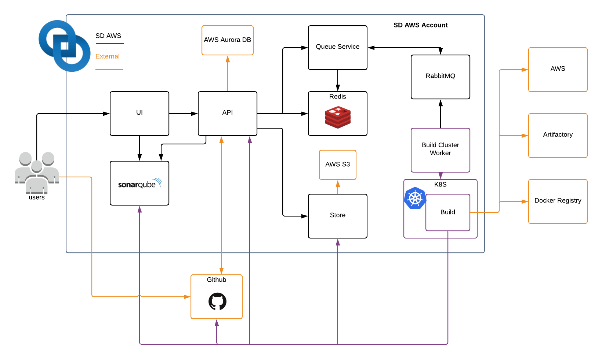

# 全体の構成

Screwdriverは継続的デリバリーパイプラインのためのワークフローを簡単にするサービス群です。

## Workflow

1. **新しいコードのコミット**下記のいずれかの操作により新しいビルドが開始されます。

- SCMにコードをpush
- SCM上で新しいpull requestを作成
- pull request上に新しいコードをpush
- ScrewdriverのAPIやUI上で、利用者がコミットのリビルドを指示

1. **Screwdriverへ通知**

    署名された[webhooks](https://developer.github.com/webhooks/) がScrewdriverのAPIに対して変更を通知します。

2. **ビルド実行エンジンが動作**

    Screwdriverに渡されたユーザーの設定やgitの情報を元に、指定されたビルド実行エンジンでビルドを開始します。

3. **ソフトウェアのビルド**

    要求されたビルドコンテナ内でgitからソースコードをチェックアウトし、ユーザーの設定を元にScrewdriverのLauncherがコマンドを実行します。

4. **アーティファクトのパブリッシュ** *(任意)*

    生成されたアーティファクトを各自のリポジトリに任意で送信できます。（RPM、Dockerイメージ、Nodeモジュールなど）

5. **パイプラインの続行**

    ジョブの完了後にScrewdriverのLauncherがAPIに通知し、後続のジョブがあればAPIにより次のジョブがビルド実行エンジンで開始されます(`3へ`)。

## コンポーネント

Screwdriverには5つの主要コンポーネントがあり、最初の3つはScrewdriverによりビルド・メンテナンスされています。

- **REST API**
    パイプラインの生成、監視、操作のためのRESTfulインターフェース
- **Web UI**
    人が扱いやすい**REST API**へのインターフェース
- **Launcher**
    ソースコードの取得や環境のセットアップ、各ジョブで定義されたコマンドの実行を行う自己完結のツール
- **実行エンジン**
    コンテナの中でコマンドを実行するための挿し替え可能なビルド実行エンジン(Jenkins, Kubernetes, Nomad や Dockerなど)
- **データストア**
    パイプラインについての情報を保存する挿し替え可能なストレージ(Postgres, MySQLやSqliteなど)

## executor-queue と k8s のアーキテクチャ

