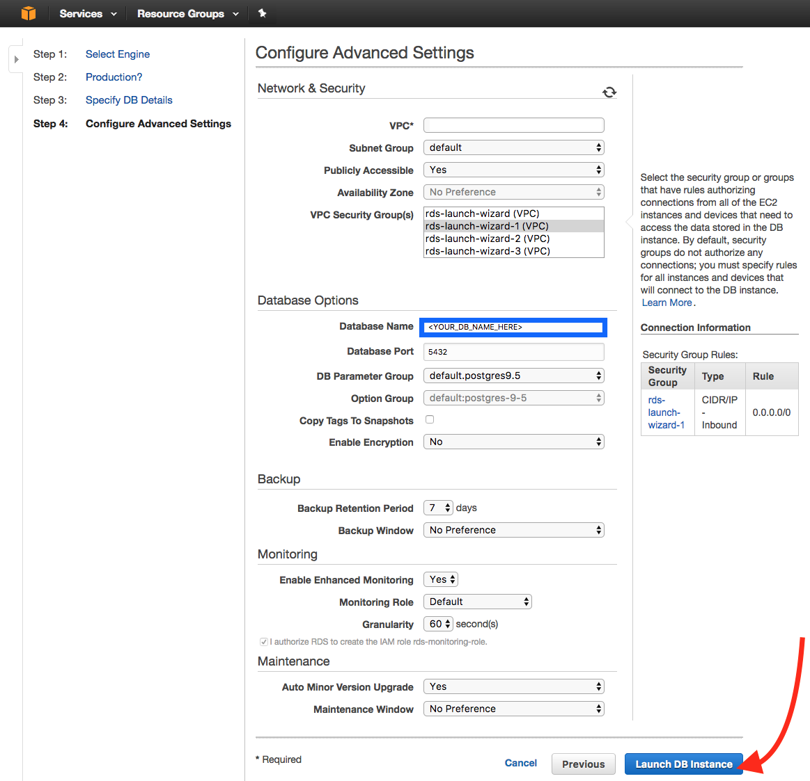

# Kubernetesを利用してAWS上にScrewdriverのクラスタを構築

Kubernetes, Github, Postgres データベースを利用して AWS 上に Screwdriver クラスタをセットアップする方法について説明します。[Kubernetes](http://kubernetes.io/docs/whatisk8s/) を利用して Screwdriver クラスタをセットアップできます。

## Screwdriverクラスタ

Screwdriver クラスタは、Screwdrive API が実行されている Kubernetes クラスタによって構成されています。Screwdriver API は AWS RDS の Screwdriver のテーブルを変更します。


## 必要なもの

- [kubectl](http://kubernetes.io/docs/user-guide/prereqs/)
- [AWS](http://aws.amazon.com)アカウント
- [AWS CLI](https://aws.amazon.com/cli/)

## Kubernetesクラスタの作成

[Running Kubernetes on AWS EC2](http://kubernetes.io/docs/getting-started-guides/aws/) の通りにします。

## Setup Screwdriver secrets

Kubernetes クラスタの作成が完了したら、データベースと Github へアクセスできるようにするためいくつか secrets を追加する必要があります。
[Secret](http://kubernetes.io/docs/user-guide/secrets/) はパスワード、トークン、キーなどの少量の機密データを含むオブジェクトです。

必要な secrets の一覧は以下です。

Secret Key | 説明
--- | ---
SECRET_JWT_PRIVATE_KEY | JWT トークンの署名に使用する秘密鍵
SECRET_JWT_PUBLIC_KEY | JWT トークンの署名に使用する公開鍵
DATASTORE_SEQUELIZE_DATABASE | SQL のデータベース名
DATASTORE_SEQUELIZE_USERNAME | SQL のデータベースユーザ
DATASTORE_SEQUELIZE_PASSWORD | SQL のデータベースパスワード
SECRET_OAUTH_CLIENT_ID | Githubの[OAuth](https://developer.github.com/v3/oauth)で使用するClient ID
SECRET_OAUTH_CLIENT_SECRET | GithubのOAuthで使用するClient Secret
WEBHOOK_GITHUB_SECRET | GitHub webhookに設定して正当性を検証するためのパスワード
SECRET_PASSWORD | セッションとOAuthデータを暗号化するためのパスワード。中身は何でもよいですが**32文字以上である必要があります。**
K8S_TOKEN | 用意したKubernetesの<default_token_name></default_token_name>

### Generate JWT keys

`jwtprivatekey`を生成するには次のコマンドを実行します。

`$ openssl genrsa -out jwt.pem 2048`

`jwtpublickey`を生成するには次のコマンドを実行します。

`$ openssl rsa -in jwt.pem -pubout -out jwt.pub`

### OAuth Client IDとSecretの取得

1. [OAuth applications](https://github.com/settings/developers)ページを開きます。
2. Register a new applicationをクリックします。
3. 情報を入力しRegister applicationをクリックします。


`Client ID`と`Client Secret`が表示され、それぞれ`oauthclientid`、`oauthclientsecret`となります。

### Create a datastore

SQL データストアの secrets を取得するためにデータストアを [AWS RDS](https://us-west-2.console.aws.amazon.com/rds) でセットアップします。

1. [AWS RDS](https://us-west-2.console.aws.amazon.com/rds) へいき、Launch a DB Instance をクリックします。
2. `PostgreSQL` タブを選びクリックします。
3. 環境 (Production or Dev/Test) を選択し、Next Step をクリックします。
4. DB Instance Identifier (`DATASTORE_SEQUELIZE_DATABASE`), Master Username (`DATASTORE_SEQUELIZE_USERNAME`), Master Password (`DATASTORE_SEQUELIZE_PASSWORD`) を埋め、パスワードを確認します。Next Step をクリックします。
5. データベース名を追加します。選択したVPCセキュリティグループがすべてのIPへのインバウンドアクセスを許可していることを確認してください。Launch DB Instance をクリックします。
6. View Your DB Instances をクリックします。詳細を開くには、DBインスタンス行の Engine 列の横にある小さな三角形をクリックします。エンドポイントはデータベースのホスト名になります。

### 秘密情報のBase64エンコード

各秘密情報は[base64エンコード](http://kubernetes.io/docs/user-guide/secrets/#creating-a-secret-manually)されている必要があるので、それぞれをbase64エンコードします。

```bash
$ echo -n "somejwtprivatekey" | base64
c29tZWp3dHByaXZhdGVrZXk=
$ echo -n "anypassword" | base64
YW55cGFzc3dvcmQ=
```

### Kubernetesにsecretを設定

Kubernetesにsecretを作成するには、秘密情報を入力した`secret.yaml`を作成します。入力した情報はKubernetesの`deployment.yaml`ファイルで使用されます。

下記のような内容になるはずです。

```yaml
apiVersion: v1
kind: Secret
metadata:
  name: screwdriver-api-secrets
type: Opaque
data:
  # make sure the values are all base64 encoded
  dbhost: ZGJob3N0bmFtZWhlcmU=
  dbusername: bXlkYXRhYmFzZQ==
  dbpassword: c29tZXBhc3N3b3Jk
  password: YW55cGFzc3dvcmQ=
  oauthclientid: c29tZWNsaWVudGlk
  oauthclientsecret: c29tZWNsaWVudHNlY3JldA==
  jwtprivatekey: c29tZWp3dHByaXZhdGVrZXk=
  jwtpublickey: c29tZWp3dHB1YmxpY2tleQ==
  githubsecret: c29tZWdpdGh1YnNlY3JldA==
```

`kubectl create`を使用してsecretを作成します。

```bash
$ kubectl create -f ./secret.yaml
```

### 追加の環境変数

Screwdriver向けに他の環境変数もカスタマイズできます。全てのリストについては[custom-environment-variables.yaml](https://github.com/screwdriver-cd/screwdriver/blob/master/config/custom-environment-variables.yaml)ファイルをご覧ください。

## Screwdriverのデプロイ

Screwdriver API を実行するための service と deployment の定義の例は、[Screwdriver config examples repo](https://github.com/screwdriver-cd-test/config-examples) の `api.yaml` を参考にできます。

### Serviceの作成

KubernetesのServiceは一連のPodやユニークなIP割り振りなどが定義されたものという概念です。
[Creating a Service](http://kubernetes.io/docs/user-guide/connecting-applications/#creating-a-service)ページの手順で`service.yaml`を準備します。

[api.yaml](https://github.com/screwdriver-cd-test/config-examples/blob/master/kubernetes/api.yaml)のような構成になるはずです。

Serviceを作成するには`service.yaml`ファイルに対して`kubectl create`を実行します。

```bash
$ kubectl create -f service.yaml
```

### Kubernetesトークン名の取得

Kubernetes はデフォルトで Kubernetes トークンを設定しています。これが `deployment.yaml` に必要です。
`kubectl` を利用して [Kubernetes secrets](http://kubernetes.io/docs/user-guide/secrets/walkthrough/) を見ることが出来ます。

以下を実行することで `<DEFAULT_TOKEN_NAME>` を取得できます。

```bash
$ kubectl get secrets
NAME                      TYPE                                  DATA      AGE
default-token-abc55       kubernetes.io/service-account-token   3         50d
```

`<DEFAULT_TOKEN_NAME>` は `Name` の欄にあり、`Type` は `kubernetes.io/service-account-token` です。

### URIの取得

`deployment.yaml`内の`URI`を設定するためにLoad Balancer Ingressを取得する必要があります。

次を実行することで`LoadBalancer Ingress`が取得できます。

```bash
$ kubectl describe services sdapi
```

### Deploymentの作成

Deployment によって常に指定した数の pod の “replicas” が実行されます。多すぎる場合には数を減らし、少なすぎる場合には追加でスタートされます。`deployment.yaml` を作成するには [Deploying Applications](http://kubernetes.io/docs/user-guide/deploying-applications/) のページに従ってください。

[api.yaml] のようになるでしょう。

### デプロイ

新たにデプロイする時は、`kubectl create` コマンドを `deployment.yaml` に実行します。

```bash
$ kubectl create -f deployment.yaml
```

## Podsの確認

Kubernetesの[pod](http://kubernetes.io/docs/user-guide/pods/)はコンテナの集まりで、管理とネットワークの目的でお互いに結びついています。

deploymentによって作成されたpodを確認するには、以下を実行します。

```bash
$ kubectl get pods
```

Podからの標準出力とエラーを確認するには以下を実行します。

```bash
$ kubectl logs <POD-NAME>
```

## OAuth Applicationの更新

URLを更新するには、OAuthクライアントIDとシークレットに使用した元のOAuthアプリケーションに戻る必要があります

1. [OAuth applications](https://github.com/settings/developers)ページを開きます。
2. 作成したアプリケーションをクリックし、OAuth Client IDとSecretを取得します。
3. `Homepage URL`と`Authorization callback URL`をご使用の`LoadBalancer Ingress`で埋めてください。
