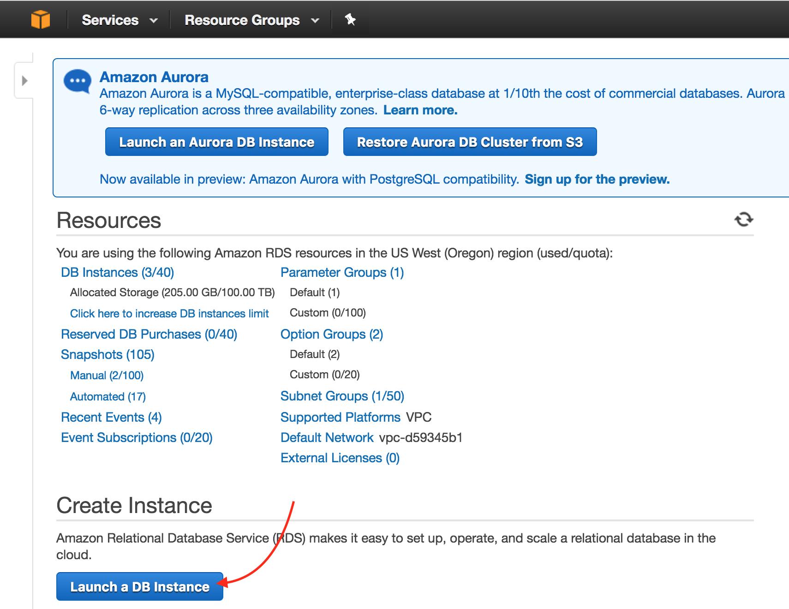
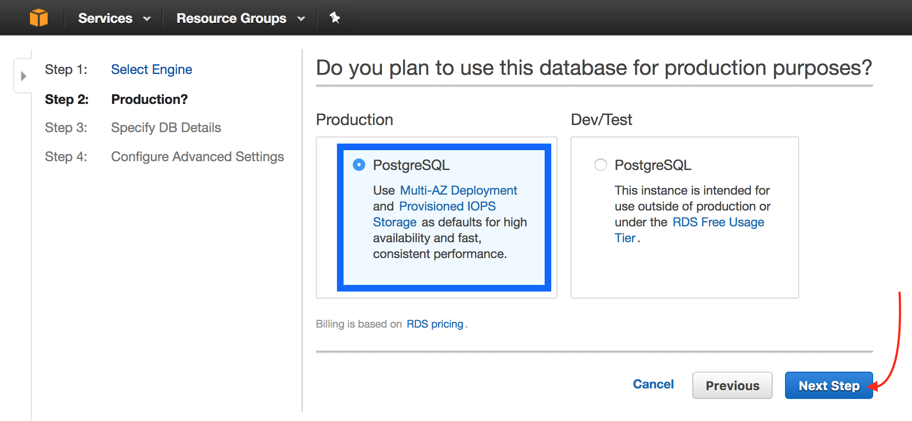
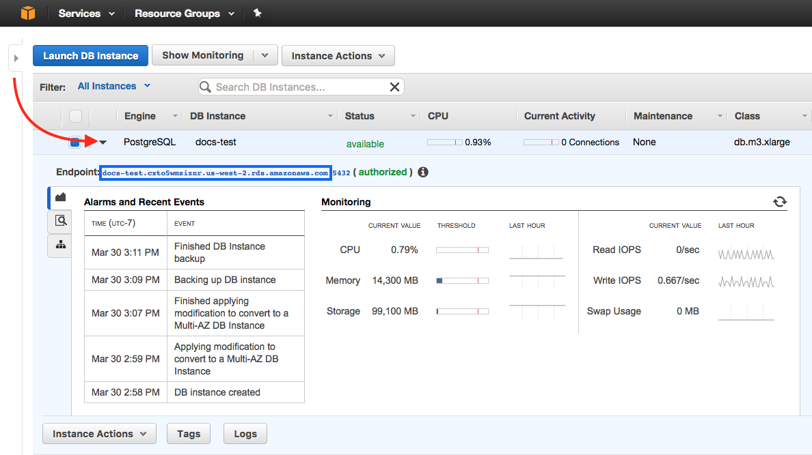

# Kubernetesを利用してAWS上にScrewdriverのクラスタを構築

We'll go over how to set up a Screwdriver cluster on AWS using Kubernetes, Github, and a Postgres database. You can setup a Screwdriver cluster using [Kubernetes](http://kubernetes.io/docs/whatisk8s/).

## Screwdriverクラスタ

A Screwdriver cluster consists of a Kubernetes cluster running the Screwdriver API. The Screwdriver API modifies Screwdriver tables in AWS RDS.


## 必要なもの

- [kubectl](http://kubernetes.io/docs/user-guide/prereqs/)
- [AWS](http://aws.amazon.com)アカウント
- [AWS CLI](https://aws.amazon.com/cli/)

## Kubernetesクラスタの作成

Follow instructions at [Running Kubernetes on AWS EC2](http://kubernetes.io/docs/getting-started-guides/aws/).

## Setup Screwdriver secrets

After creating your Kubernetes cluster, you'll need to populate it with some secrets that will give you access to your database and Github.
A [Secret](http://kubernetes.io/docs/user-guide/secrets/) is an object that contains a small amount of sensitive data such as a password, token, or key.

Here's a list of secrets we will need:

Secret Key | 説明
--- | ---
SECRET_JWT_PRIVATE_KEY | A private key used for signing JWT tokens
SECRET_JWT_PUBLIC_KEY | A public key used for signing JWT tokens
DATASTORE_SEQUELIZE_DATABASE | SQL database name
DATASTORE_SEQUELIZE_USERNAME | SQL database username
DATASTORE_SEQUELIZE_PASSWORD | SQL database password
SECRET_OAUTH_CLIENT_ID | Githubの[OAuth](https://developer.github.com/v3/oauth)で使用するClient ID
SECRET_OAUTH_CLIENT_SECRET | GithubのOAuthで使用するClient Secret
WEBHOOK_GITHUB_SECRET | GitHub webhookに設定して正当性を検証するためのパスワード
SECRET_PASSWORD | セッションとOAuthデータを暗号化するためのパスワード。中身は何でもよいですが**32文字以上である必要があります。**
K8S_TOKEN | 用意したKubernetesの<default_token_name></default_token_name>

### Generate JWT keys

`jwtprivatekey`を生成するには次のコマンドを実行します。

`$ openssl genrsa -out jwt.pem 2048`

`jwtpublickey`を生成するには次のコマンドを実行します。

`$ openssl rsa -in jwt.pem -pubout -out jwt.pub`

### OAuth Client IDとSecretの取得

1. [OAuth applications](https://github.com/settings/developers)ページを開きます。
2. Register a new applicationをクリックします。
3. 情報を入力しRegister applicationをクリックします。


`Client ID`と`Client Secret`が表示され、それぞれ`oauthclientid`、`oauthclientsecret`となります。

### Create a datastore

To get your SQL datastore secrets, set up a datastore with [AWS RDS](https://us-west-2.console.aws.amazon.com/rds).

1. Navigate to [AWS RDS](https://us-west-2.console.aws.amazon.com/rds). Click on Launch a DB Instance.
2. Select the `PostgreSQL` tab. Click Select.
3. Choose an environment (Production or Dev/Test) and click Next Step.
4. Fill out the DB Instance Identifier (`DATASTORE_SEQUELIZE_DATABASE`), Master Username (`DATASTORE_SEQUELIZE_USERNAME`), Master Password (`DATASTORE_SEQUELIZE_PASSWORD`), and Confirm Password. Click Next Step.
5. Add a Database Name. Make sure the VPC Security Group chosen gives inbound access to all IPs. Click Launch DB Instance.
6. Click View Your DB Instances. Click on the small triangle next to the Engine column on your DB instance row to open up the details. Your endpoint will be your Database host name.

### 秘密情報のBase64エンコード

各秘密情報は[base64エンコード](http://kubernetes.io/docs/user-guide/secrets/#creating-a-secret-manually)されている必要があるので、それぞれをbase64エンコードします。

```bash
$ echo -n "somejwtprivatekey" | base64
c29tZWp3dHByaXZhdGVrZXk=
$ echo -n "anypassword" | base64
YW55cGFzc3dvcmQ=
```

### Kubernetesにsecretを設定

Kubernetesにsecretを作成するには、秘密情報を入力した`secret.yaml`を作成します。入力した情報はKubernetesの`deployment.yaml`ファイルで使用されます。

下記のような内容になるはずです。

```yaml
apiVersion: v1
kind: Secret
metadata:
  name: screwdriver-api-secrets
type: Opaque
data:
  # make sure the values are all base64 encoded
  dbhost: ZGJob3N0bmFtZWhlcmU=
  dbusername: bXlkYXRhYmFzZQ==
  dbpassword: c29tZXBhc3N3b3Jk
  password: YW55cGFzc3dvcmQ=
  oauthclientid: c29tZWNsaWVudGlk
  oauthclientsecret: c29tZWNsaWVudHNlY3JldA==
  jwtprivatekey: c29tZWp3dHByaXZhdGVrZXk=
  jwtpublickey: c29tZWp3dHB1YmxpY2tleQ==
  githubsecret: c29tZWdpdGh1YnNlY3JldA==
```

`kubectl create`を使用してsecretを作成します。

```bash
$ kubectl create -f ./secret.yaml
```

### 追加の環境変数

Screwdriver向けに他の環境変数もカスタマイズできます。全てのリストについては[custom-environment-variables.yaml](https://github.com/screwdriver-cd/screwdriver/blob/master/config/custom-environment-variables.yaml)ファイルをご覧ください。

## Screwdriverのデプロイ

You can check out the `api.yaml` in the [Screwdriver config examples repo](https://github.com/screwdriver-cd-test/config-examples) for example service and deployment definitions to run the Screwdriver API.

### Serviceの作成

KubernetesのServiceは一連のPodやユニークなIP割り振りなどが定義されたものという概念です。
[Creating a Service](http://kubernetes.io/docs/user-guide/connecting-applications/#creating-a-service)ページの手順で`service.yaml`を準備します。

[api.yaml](https://github.com/screwdriver-cd-test/config-examples/blob/master/kubernetes/api.yaml)のような構成になるはずです。

Serviceを作成するには`service.yaml`ファイルに対して`kubectl create`を実行します。

```bash
$ kubectl create -f service.yaml
```

### Kubernetesトークン名の取得

Kubernetes actually sets up your Kubernetes token by default. You will need this for your `deployment.yaml`.
You can use `kubectl` to see your [Kubernetes secrets](http://kubernetes.io/docs/user-guide/secrets/walkthrough/).

Get the `<DEFAULT_TOKEN_NAME>`, by running:

```bash
$ kubectl get secrets
NAME                      TYPE                                  DATA      AGE
default-token-abc55       kubernetes.io/service-account-token   3         50d
```

The `<DEFAULT_TOKEN_NAME>` will be listed under `Name` when the `Type` is `kubernetes.io/service-account-token`.

### URIの取得

`deployment.yaml`内の`URI`を設定するためにLoad Balancer Ingressを取得する必要があります。

次を実行することで`LoadBalancer Ingress`が取得できます。

```bash
$ kubectl describe services sdapi
```

### Deploymentの作成

A Deployment makes sure a specified number of pod “replicas” are running at any one time. If there are too many, it will kill some; if there are too few, it will start more. Follow instructions on the [Deploying Applications](http://kubernetes.io/docs/user-guide/deploying-applications/) page to create your `deployment.yaml`.

It should look like the Deployment in [api.yaml](https://github.com/screwdriver-cd-test/config-examples/blob/master/kubernetes/api.yaml).

### デプロイ

For a fresh deployment, run the `kubectl create` command on your `deployment.yaml` file:

```bash
$ kubectl create -f deployment.yaml
```

## Podsの確認

Kubernetesの[pod](http://kubernetes.io/docs/user-guide/pods/)はコンテナの集まりで、管理とネットワークの目的でお互いに結びついています。

deploymentによって作成されたpodを確認するには、以下を実行します。

```bash
$ kubectl get pods
```

Podからの標準出力とエラーを確認するには以下を実行します。

```bash
$ kubectl logs <POD-NAME>
```

## OAuth Applicationの更新

You will need to navigate back to your original OAuth Application that you used for your OAuth Client ID and Secret to update the URLs.

1. [OAuth applications](https://github.com/settings/developers)ページを開きます。
2. 作成したアプリケーションをクリックし、OAuth Client IDとSecretを取得します。
3. `Homepage URL`と`Authorization callback URL`をご使用の`LoadBalancer Ingress`で埋めてください。
