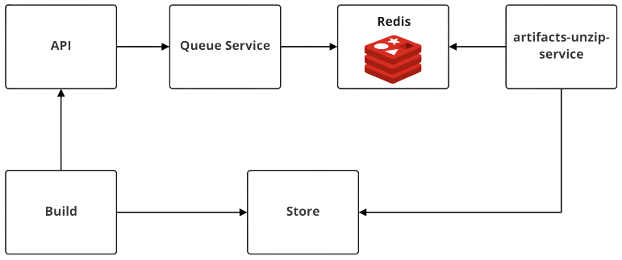

# Zip Artifacts機能

`screwdriver-artifact-bookend`を利用して、ビルド成果物をStoreアップロードする場合、それらのファイルをZip化して送ることができます。  
この機能を有効化することで大量のファイルをアップロードする場合に`screwdriver-artifact-bookend`の実行時間を短縮することができます。  
Zip化されたファイルをアップロード後に解凍するため、アップロードされたファイルがUIのArtifactsタブに表示されるまで時間がかかる場合があります。  

## 構成

  

1. build(`screwdriver-artifact-bookend`)からZip化されたビルド成果物をアップロードします。
1. buildはAPIに先程アップロードしたZipをUnzipするリクエストをAPIに投げます。
1. APIはUnzipのリクエストが来たら、Redis Queueにメッセージを送信します。
1. Unzip ServiceがQueueからメッセージを取得し、Zip化されたビルド成果物をStoreから取得し、解凍してから再度Storeにアップロードします。

## 構築

### artifacts-unzip-serviceの構築

[artifacts-unzip-serviceの設定](./configure-artifacts-unzip-service.md)を参考にartifacts-unzip-serviceを構築してください。

### APIのfeature flagを設定

APIの設定でartifacts-unzip-serviceのfeature flagをonにする必要があります。  
この機能をOnにすることで、APIからqueue-serviceに解凍するためのmessageが飛ぶようになります。  

キー | デフォルト | 説明
--- | --- | ---
UNZIP_ARTIFACTS_ENABLED | false | artifacts-unzip-service機能のサポートの有無

```yaml
# config/local.yaml
unzipArtifacts:
  enabled: true
```

## unzipに失敗した場合

artifacts-unzip-serviceが解凍に失敗した場合、UIのArtifactsタブにファイルの一覧が表示されなくなります。  
解凍に失敗した場合、管理者側で再度APIにリクエストを送る必要があります。

1. [APIドキュメント](../user-guide/api.md)の`RESTクライアント経由で実行する`を参考に認証トークンの取得
1. /builds/{id}/artifacts/unzipにリクエストを送る。

    ```bash
    # 例
    curl -I -X POST -H "Authorization: Bearer {Token}" https://api.screwdriver.cd/v4/builds/{ID}/artifacts/unzip
    ```

1. 解凍したビルドIDのページに行きArtifactsタブにファイルが表示されていることを確認
