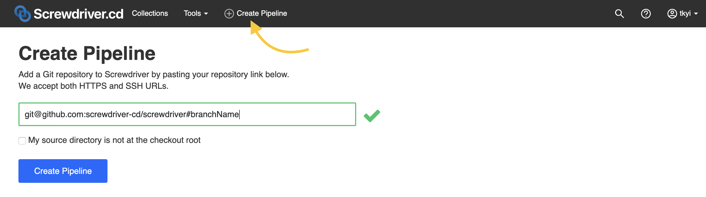
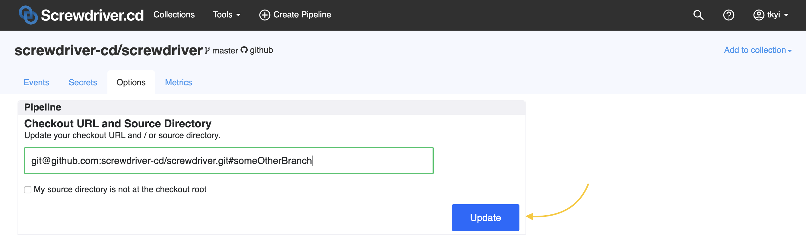
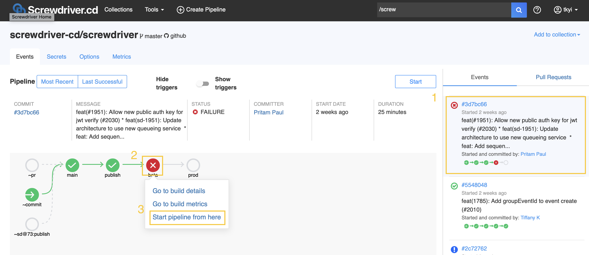

# よくある質問と回答

## ステップをスキップする方法は？

1つのステップを除いた形であるテンプレートを利用したいということが有るかもしれません。

それを行うには、不要なステップを成功ステータスを返す任意のシェルコマンドに取り替えてください。`echo`や、`true`、`:`のようなものが該当します。コマンドは文字列でなくてはならないので、`true`や`:`はクオートで囲んでください。バッククォートで囲われたコマンドもクォートで囲んでください。成功以外のステータスを返すコマンドはビルドを中止させます。

Screwdriver.yamlの例（一部）:

```yaml
steps:
  - first: echo I am skipping step first
  - second: 'true'
  - third: ":"
  - WRONG: "`exit 22`"
```

## ビルドをスキップする方法は？

README等ちょっとしたドキュメント修正のみの時など、screwdriverのビルドをスキップさせたい場合があると思います。

ベースブランチにpushする際にビルドをスキップさせたい場合は、プルリクエストのcommitメッセージのいずれかに`[ci skip]` または `[skip ci]`の文字列を追加してください。

注意: プルリクエストビルドはスキップ出来ません。
commitメッセージに `[skip ci]` や `[ci skip]` を含めても、プルリクエスト時のビルドはスキップされません。（プルリクエストビルドは常に実行されます）

## パイプラインの作り方は？

新しいパイプラインを作成するには、画面右上の作成アイコンをクリックし、gitリポジトリのURLをフォームに入力してください。ベースブランチ以外のブランチを指定する場合は、`#`の後にブランチ名を指定してください。



## パイプラインを手動で開始するには？

ビルドを手動で開始させたい場合は、パイプラインページにある「Start」ボタンをクリックします。
または、ビルドを選択後ドロップダウンメニューで「Start pipeline from here」を選択します、次に「Yes」をクリックするとビルドが起動します。
パイプラインを開始すると`~commit`をトリガーにもつ全てのジョブのビルドが開始します。

スタートボタンをクリック：


2番目のオプションについては、*ビルドを再実行、Detached Jobをスタートするには？*を参照してください。

## パイプラインのリポジトリやブランチを変更したい場合は？

パイプラインのリポジトリやブランチを変更したい場合は、「Options」タブをクリックして、Checkout URLの入力欄を更新し、「Update」ボタンをクリックしてください。



リポジトリを転送したりリネームした場合は、[パイプラインを同期](#パイプラインがソースコードと正しく同期しているか確かめるには)して、ページをリロードしてください。

## ジョブの disable/enable を一時的に切り替えるには？

一時的にジョブの disable/enable を切り替えるには、「Options」タブの画面で、切り替えたいジョブの横にあるトグルボタンをクリックして切り替えを行ってください。
オプションで、ジョブをdisable/enableにする理由を指定することもできます。


## パイプラインがソースコードと正しく同期しているか確かめるには？

もしソースコードで何か変更を加えてもパイプラインが同期されない場合は、「Options」タブの「Sync」欄にあるアイコンをクリックして同期してください。
同期は「SCM webhook」、「Pull Request」、「Pipeline」とそれぞれ別々に同期できます。


## パイプラインを削除するには？

パイプラインを削除するには、「Options」タブ内にある削除アイコンをクリックします。一度削除したパイプラインは戻すことは出来ませんのでご注意ください。


## パイプラインメトリクスを表示するには？
[メトリクスページ](https://blog.screwdriver.cd/post/184117350247/build-metrics)にアクセスするには、
ビルドをクリックして「Go to build metrics」を選択するか、パイプラインページのタブの「Metric」を選択してください。


## ビルドログの時間形式を切り替えるには？
ビルドログの左上の文字列をクリックすると、_Since build started_, _Since step started_, _Local TimeStamp_, _UTC TimeStamp_ などの時間形式に切り替えることができます。


## 「Build failed to start」のエラーを修正するには？

このエラーは（VMのexecutorを使用している場合は）hyperdのプロセスがダウンしているなどクラスタセットアップ時の問題や、ビルドを行うDocker imageの問題など、様々な理由で起こります。
従ってどのレイヤーでエラーが起きているかによって修正する方法も変わってきます。

1. `/opt/sd/launch: not found`
このエラーが出る場合はAlpineベースのimageを利用していることが原因となります。glibcの代わりにmuslが使われているためです。回避策としてはDocker imageの作成時に下記のシンボリックリンクを作成します。
`mkdir /lib64 && ln -s /lib/ld-musl-x86_64.so.1 /lib64/ld-linux-x86-64.so.2`
1. [hyperdのバグ](https://github.com/screwdriver-cd/screwdriver/issues/1081)が時々発生し、`VOLUME`の定義されたイメージが継続的に起動に失敗します。そういったイメージの一つに`gradle:jdk8`が上げられます。現時点でのワークアラウンドは他のdocker imageを利用するか、[ このDockerfile](https://github.com/keeganwitt/docker-gradle/blob/64a348e79cbe0bc8acb9da9062f75aca02bf3023/jdk8/Dockerfile)から`VOLUME`の行を除いてリビルドすることです。

## ビルドのロールバックを行うには？

ビルドのロールバックを行うには下記の２パターンの方法があります。
- パイプラインの過去の成功時のビルドを再実行する
- ロールバック用のジョブ（通常のパイプラインからは独立したジョブ）を作成して実行

### 過去のビルドを再実行、Detached Jobを実行するには？

過去のイベントから再ビルドを行う手順は下記の通りとなります。
1. イベントリストから目的のイベントをクリックすると、詳細なイベントグラフが表示されます。
1. ビルドを再実行したいジョブをクリックします。
1. ポップアップから「Start pipeline from here」のリンクをクリックします。
1. 最後に「YES」を押してジョブを実行させます。



ロールバックするには[detached build](./configuration/workflow#分離されたジョブ-detached-jobs-とパイプライン)で行います。
[Metadata](./metadata)を使って最後のジョブ（下記の例ではジョブD）で`meta set`コマンドでイメージ名やバージョン情報のメタを設定し、ロールバック用のジョブ（下記の例ではdetached）で`meta get` コマンドを使用して設定されたメタ情報を取得します。detachedジョブはジョブDで設定されたメタ情報にアクセスできます。


### ビルドをUNSTABLEの状態にするには？

ビルド中に[API](./api)を呼び出すことで、ビルドのステータスを`UNSTABLE`にすることができます。Screwdriver.cdは、このステータスで表示されたビルドを成功ではないものとみなし後続のジョブを実行しません。
詳しくは[UNSTABLEビルドのサンプルリポジトリ](https://github.com/screwdriver-cd-test/unstable-build-example)を参照してください。

### Screwdriverが使用しているシェルは？

ステップに記述した処理はデフォルトでBourne shell (`/bin/sh`)で実行されます。他のシェル（bashなど）で実行したい場合は`USER_SHELL_BIN`[環境変数](./environment-variables#ユーザ設定)で指定することができます。

### Artifactsをアップロードする時間を短縮するには？

管理者が予め使用できるように設定していれば、[`SD_ZIP_ARTIFACTS`](./environment-variables#ユーザ設定)の環境変数を`true`にすることで、Artifactsをアップロードする前にzip化します。

### パイプラインのジョブやArtifactsへのPermalinkは？

パイプラインのジョブやArtifactsを指定された[ステータス](./configuration/settings)でパーマリンクするには、以下の形式で指定できます。

```
/pipelines/{PIPELINE_ID}/jobs/{JOB_NAME}/latest
/pipelines/{PIPELINE_ID}/jobs/{JOB_NAME}/latest?status={STATUS}
/pipelines/{PIPELINE_ID}/jobs/{JOB_NAME}/artifacts?status={STATUS}
/pipelines/{PIPELINE_ID}/jobs/{JOB_NAME}/artifacts/file-path?status={STATUS}
```


例:

```
https://cd.screwdriver.cd/pipelines/1/jobs/main/latest
https://cd.screwdriver.cd/pipelines/1/jobs/main/latest?status=SUCCESS
https://cd.screwdriver.cd/pipelines/1/jobs/main/latest?status=FAILURE
https://cd.screwdriver.cd/pipelines/1/jobs/main/artifacts?status=SUCCESS
https://cd.screwdriver.cd/pipelines/1/jobs/main/artifacts/meta.json?status=SUCCESS
```

### shallow cloningを無効にするには？

shallow cloningを無効にするには、[`GIT_SHALLOW_CLONE`](./environment-variables#ユーザ設定)の環境変数を`false`にセットします。

デフォルトではScrewdriverはdepth 50でソースリポジトリをshallow cloneします。また、`--no-single-branch`のフラグもデフォルトで有効にしています。

shallow cloningを有効のままにしてgitリポジトリへpushを行うのであれば、使用するイメージに含まれるgitのバージョンが1.9かそれ以上である必要があります。あるいは、`sd-step exec core / git" GIT COMMAND "`を呼び出して、Screwdriverにバンドルされているバージョンのgitを使用することもできます。

### ビルドイメージの最小ソフトウェア要件は？

Screwdriverはビルドコンテナイメージに制限がありません。しかし、最低でも`curl`と`openssh`がインストールされている必要があります。さらに、コンテナのデフォルトユーザは`root`もしくはsudo NOPASSWDが有効になっている必要があります。

また、`image`がAlpineベースの場合は、追加で次のシンボリックリンクのような回避策が必要です。 `mkdir -p /lib64 && ln -s /lib/ld-musl-x86_64.so.1 /lib64/ld-linux-x86-64.so.2`

### Saucelabsとの連携は？

ブログ記事を参考にしてください。 <https://blog.screwdriver.cd/post/161515128762/sauce-labs-testing-with-screwdriver>

サンプルリポジトリはこちらです。 <https://github.com/screwdriver-cd-test/saucelabs-example>

## ビルド内からGitリポジトリにpushされたときにパイプラインを実行するには？

Screwdriverはデフォルトで[gitユーザー](https://github.com/screwdriver-cd/screwdriver/blob/ec959e1590909259479fe34f2f26d91f227025aa/config/custom-environment-variables.yaml#L284)に`sd-buildbot`を使用します。したがって、ビルド内で`git`コミットを行うと、コミットユーザーは`sd-buildbot`になります。

これは、webhook処理に影響を及ぼします。 ヘッドレスユーザーがパイプラインを無期限に実行することを防ぐために、ヘッドレスユーザーによるコミットを無視するようにScrewdriverクラスター管理者はwebhookプロセッサの設定を行えます。これを行うには、[IGNORE_COMMITS_BY]（https://github.com/screwdriver-cd/screwdriver/blob/ec959e1590909259479fe34f2f26d91f227025aa/config/custom-environment-variables.yaml#L323-L325）環境変数を設定します。通常、デフォルトgitユーザーの`sd-buildbot`がこのリストに追加されます。

ユーザーは、別のgitユーザーを使用することでこの動作を上書きできます。例えば、`git config --global user.name my-buildbot` と `git config --global user.email my-buildbot-email` を行うことで、Screwdriverのビルドからの`git`コミットは`my-buildbot`ユーザーによって行われ、webhookプロセッサに無視されることなく、Screwdriverパイプラインが実行されます。

## sd-setup-scmステップで、プルリクエストのビルドが `fatal: refusing to merge unrelated histories`エラーで終了するのはなぜ？

プルリクエストを出しているブランチに、 `$GIT_SHALLOW_CLONE_DEPTH`コミット (デフォルト:50)以上のコミットがある場合エラーで失敗することがあります。
このメッセージは、gitがfeatureブランチとmainブランチの間に共通の祖先が見つけられないことを示しています。
この問題を解決するには、`$GIT_SHALLOW_CLONE`を無効にする、大きな数に調整するまたは、featureブランチのコミット数を減らしてください。
(例: rebase, squashなど)
詳しくは[こちら](./environment-variables#ユーザ設定)のドキュメントをご確認ください。

## パイプラインをスタートまたは削除した時に`Not found`となるのはなぜ？

Screwdriverのパイプラインは利用しているSCMのリポジトリと1対1の関係があり、この関係はSCMのリポジトリ名だけでなくリポジトリのユニークIDによって関係付けられています。`Not Found`エラーはSCMのリポジトリを削除して同じ名前で再作成した際に発生します（削除後に再度forkした場合も同じです）。この操作により新しいSCMのリポジトリは新しいIDで作成されるのでScrewdriverの検証で失敗します。もしパイプラインがこの状態になってしまったら、パイプラインを再作成してScrewdriverのクラスタ管理者へ連絡して古いパイプラインを削除してもらうしかありません。

## 凍結したジョブを開始するには？

一時的に[ジョブの凍結（freeze windows）](./configuration/workflow#ジョブの凍結)設定を上書きして手動でビルドを開始するには、UI、commit、APIを使用することができます。

UIを使用する場合:
1. 凍結しているビルドのアイコンをクリック
1. "Start pipeline from here"をクリック
1. 確認ウィンドウのReasonの部分に、開始する理由を記載
1. Yesをクリック


commitを使用する場合:
開始したいビルドのコミットメッセージを `[force start]` という文字列を含んだものにして、それをマージしてください。

APIを使用する場合:
開始したいビルドの `causeMessage` を `[force start]` という文字列を含んだものにして、 `POST SCREWDRIVER_API/v4/events` のAPIを使って開始してください。

## 凍結したジョブをキャンセルして予定されたビルドが行われないようにするには？

凍結したジョブは、[freeze windows](./configuration/workflow#ジョブの凍結)の期間の終わりに実行されるようにスケジュールされます。場合によっては、ユーザーは screwdriver.yaml の設定を変更せずにスケジュールをキャンセルして、今後予定されているスケジュールビルドが実行されないようにしたいことがあります。その場合は、以下の手順でキャンセルすることができます。

UIでは
1. フリーズしたビルドアイコンをクリックします。
1. "Stop frozen build"をクリックします。

これにより、ビルドのステータスが「FROZEN」から「ABORTED」に設定され、今後予定されている実行のための設定が削除されます。


