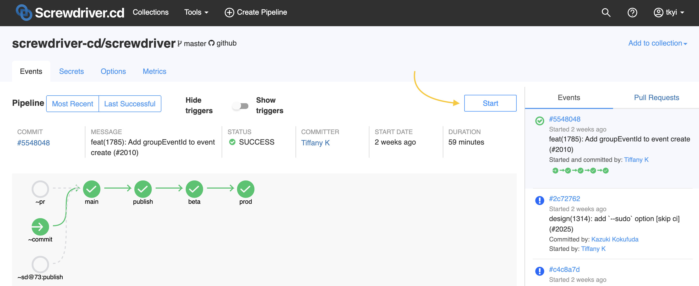
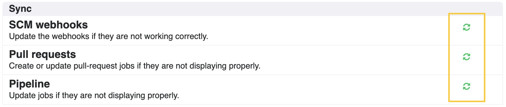

# よくある質問と回答

## ビルドをスキップする方法は？

README等ちょっとしたドキュメント修正のみの時など、screwdriverのビルドをスキップさせたい場合があると思います。

masterにpushする際にビルドをスキップさせたい場合は、commitメッセージの中に`[ci skip]` または `[skip ci]`の文字列を追加してください。
また、プルリクエストのマージ時にビルドをスキップさせたい場合は、プルリクエストのタイトル欄に `[ci skip]` または `[skip ci]`の文字列を追加してください。

注意: プルリクエストビルドはスキップ出来ません。
commitメッセージに `[skip ci]` や `[ci skip]` を含めても、プルリクエスト時のビルドはスキップされません。（プルリクエストビルドは常に実行されます）

## パイプラインの作り方は？

新しいパイプラインを作成するには、画面右上の作成アイコンをクリックし、gitリポジトリのURLをフォームに入力してください。master以外のブランチを指定する場合は、`#`の後にブランチ名を指定してください。

## ビルドを手動で開始するには？

ビルドを手動で開始させたい場合は、パイプラインページにある「Start」ボタンをクリックしてください。

## パイプラインのリポジトリやブランチを変更したい場合は？

パイプラインのリポジトリやブランチを変更したい場合は、「Options」タブをクリックして、Checkout URLの入力欄を更新し、「Update」ボタンをクリックしてください。

## ジョブの disable/enable を一時的に切り替えるには？

一時的にジョブの disable/enable を切り替えるには、「Options」タブの画面で、切り替えたいジョブの横にあるトグルボタンをクリックして切り替えを行ってください。

## パイプラインがソースコードと正しく同期しているか確かめるには？

もしソースコードで何か変更を加えてもパイプラインが同期されない場合は、「Options」タブの「Sync」欄にあるアイコンをクリックして同期してください。
同期は「SCM webhook」、「Pull Request」、「Pipeline」とそれぞれ別々に同期できます。

## パイプラインを削除するには？

パイプラインを削除するには、「Options」タブ内にある削除アイコンをクリックします。一度削除したパイプラインは戻すことは出来ませんのでご注意ください。

