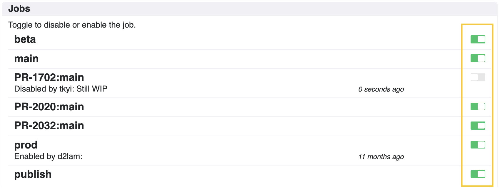
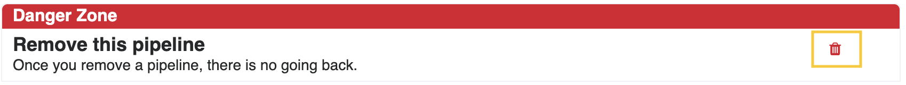

# よくある質問と回答

## ビルドをスキップする方法は？

README等ちょっとしたドキュメント修正のみの時など、screwdriverのビルドをスキップさせたい場合があると思います。

masterにpushする際にビルドをスキップさせたい場合は、commitメッセージの中に`[ci skip]` または `[skip ci]`の文字列を追加してください。
また、プルリクエストのマージ時にビルドをスキップさせたい場合は、プルリクエストのタイトル欄に `[ci skip]` または `[skip ci]`の文字列を追加してください。

注意: プルリクエストビルドはスキップ出来ません。
commitメッセージに `[skip ci]` や `[ci skip]` を含めても、プルリクエスト時のビルドはスキップされません。（プルリクエストビルドは常に実行されます）

## パイプラインの作り方は？

新しいパイプラインを作成するには、画面右上の作成アイコンをクリックし、gitリポジトリのURLをフォームに入力してください。master以外のブランチを指定する場合は、`#`の後にブランチ名を指定してください。

## ビルドを手動で開始するには？

ビルドを手動で開始させたい場合は、パイプラインページにある「Start」ボタンをクリックしてください。

## パイプラインのリポジトリやブランチを変更したい場合は？

パイプラインのリポジトリやブランチを変更したい場合は、「Options」タブをクリックして、Checkout URLの入力欄を更新し、「Update」ボタンをクリックしてください。

## ジョブの disable/enable を一時的に切り替えるには？

一時的にジョブの disable/enable を切り替えるには、「Options」タブの画面で、切り替えたいジョブの横にあるトグルボタンをクリックして切り替えを行ってください。

## パイプラインがソースコードと正しく同期しているか確かめるには？

もしソースコードで何か変更を加えてもパイプラインが同期されない場合は、「Options」タブの「Sync」欄にあるアイコンをクリックして同期してください。
同期は「SCM webhook」、「Pull Request」、「Pipeline」とそれぞれ別々に同期できます。

## パイプラインを削除するには？

パイプラインを削除するには、「Options」タブ内にある削除アイコンをクリックします。一度削除したパイプラインは戻すことは出来ませんのでご注意ください。

## 「Build failed to start」のエラーを修正するには？

このエラーは（VMのexecutorを使用している場合は）hyperdのプロセスがダウンしているなどクラスタセットアップ時の問題や、ビルドを行うDocker imageの問題など、様々な理由で起こります。
従ってどのレイヤーでエラーが起きているかによって修正する方法も変わってきます。

1.`/opt/sd/launch: not found` 
このエラーが出る場合はAlpineベースのimageを利用していることが原因となります。glibcの代わりにmuslが使われているためです。回避策としてはDocker imageの作成時に下記のシンボリックリンクを作成します。
`mkdir /lib64 && ln -s /lib/libc.musl-x86_64.so.1 /lib64/ld-linux-x86-64.so.2`

## ビルドのロールバックを行うには？

ビルドのロールバックを行うには下記の２パターンの方法があります。
・パイプラインの過去の成功時のビルドを再実行する
・ロールバック用のジョブ（通常のパイプラインからは独立したジョブ）を作成して実行

### 過去の成功時のビルドを再実行するには？

過去のイベントから再ビルドを行う手順は下記の通りとなります。

1. ログインする
2. 過去のイベント一覧から再ビルドを行いたいイベントをクリックして、画面上部にワークフローの詳細を表示させます。
3. 再ビルドを行いたいジョブをクリックして、ポップアップから「Start pipeline from here」のリンクをクリックしてジョブを実行させます。

### ロールバック用のジョブ（通常のパイプラインからは独立したジョブ）を実行させるには？

通常のパイプラインから独立したジョブ（detachedジョブ）を作成してロールバックを行う手順は下記の通りとなります。通常のパイプラインの最後のジョブ（下記の例ではジョブD）に`meta set`コマンドでイメージ名やバージョン情報のメタを設定し、ロールバック用のジョブ（下記の例ではdetach）で`meta get` コマンドを使用して設定されたメタ情報を取得します。

1. ログインする
2. 過去のイベント一覧から再ビルドを行いたいイベントをクリックして、画面上部にワークフローの詳細を表示させます。
3. スタートさせたいdetachedジョブをクリックして、ポップアップから「Start pipeline from here」のリンクをクリックしてジョブを実行させます。
4. 「Yes」をクリックしてビルドを開始します。 
