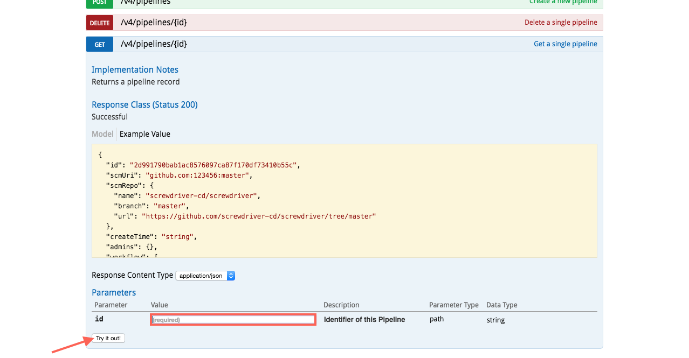
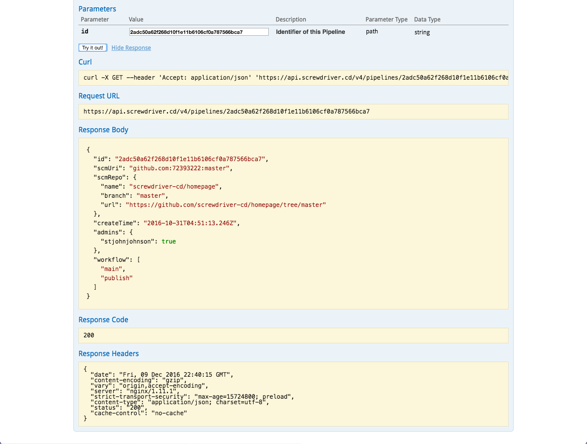
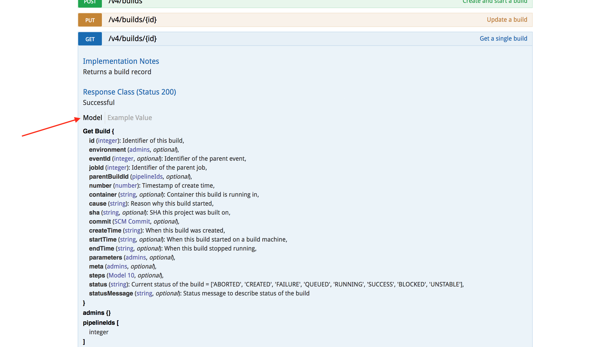
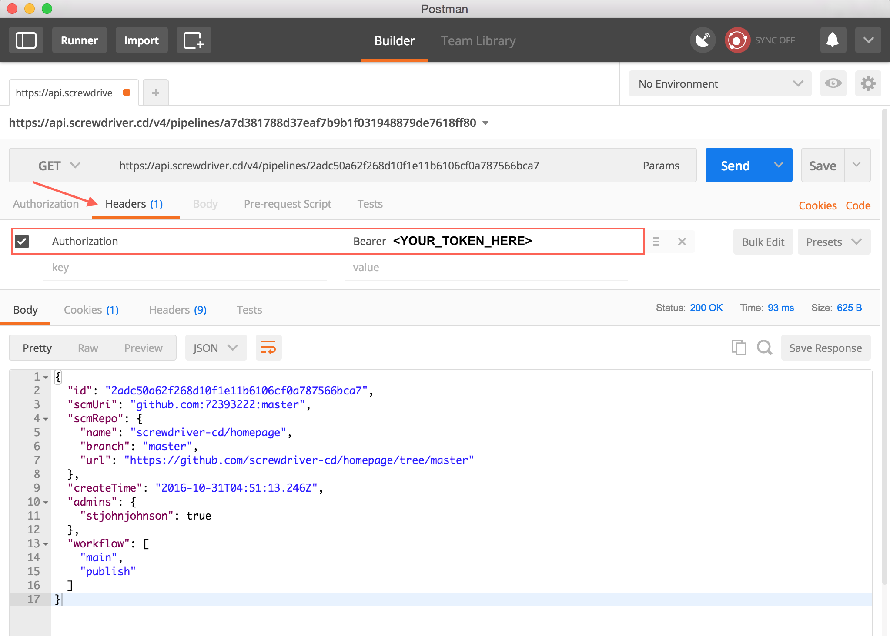

# API

ScrewdriverのAPIとデータモデルは[Swagger](http://swagger.io/)を使ってドキュメント化されています。ドキュメントが古くなることを防ぐため、自動生成され、人が読みやすいインタフェースになっています。

> 現在のAPIは**Version 4**で、全てのAPIは`/v4`で始まります。

APIのドキュメントは次のURLで確認できます: [api.screwdriver.cd/v4/documentation](https://api.screwdriver.cd/v4/documentation)

各自のScrewdriver.cdインスタンスでは、`<API URL>/v4/documentation`にアクセスしてください。

## APIを使用する

### Swagger経由で使用する

Swaggerのドキュメントは例とお試しのための編集可能なパラメータを含んでいます。`/v4/documentation`にアクセスし、APIを呼び出すための`Try it out!`ボタンをお試しください。 

Swaggerページ:


レスポンス:


より詳細なドキュメントは、`Model`のリンクをクリックしてください。

Swaggerモデル:


### RESTクライアント経由で実行する

[Postman](https://www.getpostman.com/)のようなRESTクライアントをAPIリクエストに使用します。その際、認証トークンが必要です。認証トークンを取得するためには、`/v4/auth/login`からログインし、リダイレクト先の`/v4/auth/token`からトークンをコピーしてください。詳しくは[認証と認可](#認証と認可)をご覧ください。

APIリクエストの際のヘッダは以下のようになります。

```yaml
Content-Type: application/json
Authorization: Bearer <YOUR_TOKEN_HERE>
```

リクエストの例:


### ユーザまたはパイプラインAPIトークンを利用して実行する

APIを利用した簡単なスクリプトのためには、APIトークンを利用することを推奨します。

#### トークンを使用して認証する

新しく作成したトークンで認証するには、`https://${API_URL}/v4/auth/token?api_token=${YOUR_TOKEN_VALUE}`へGETリクエストを送ります。するとtokenのフィールドを持ったJSONオブジェクトが返ってきます。tokenフィールドの値がJSON Web Tokenになっていて、ScrewdriverのAPIへリクエストを送る際にこのJSON Web TokenをAuthorizationヘッダーに付けて使用します。このJWTは12時間の有効期限があるので、期限が切れた後には再度認証を行う必要があります。

#### 例：パイプラインをスタートさせる

以下に、パイプランをスタートさせるためにAPIトークンを使用するやり方をPythonで記述した例があります。この例では直接APIを呼び出しています。
```python
# トークンを使用して認証
auth_request = get('https://api.screwdriver.cd/v4/auth/token?api_token=%s' % environ['SD_KEY'])
jwt = auth_request.json()['token']

# ヘッダーをセット
headers = { 'Authorization': 'Bearer %s' % jwt }

# パイプラインのジョブを取得
jobs_request = get('https://api.screwdriver.cd/v4/pipelines/%s/jobs' % pipeline_id, headers=headers)
jobId = jobs_request.json()[0]['id']

# 最初のジョブを開始する
start_request = post('https://api.screwdriver.cd/v4/builds', headers=headers, data=dict(jobId=jobId))
```

詳しい情報と例についてはAPIドキュメントをご覧ください。

## 認証と認可

認証のために、[JSON Web Tokens (JWT)](http://jwt.io) を使用しています。JWTは`Authorization`ヘッダを必要とします。
* Oauthを利用してJWTを生成するには、`/v4/auth/login` にアクセスします。こちらのエンドポイントにアクセスすると、`/v4/auth/token` に自動でリダイレクトされます。
* ScrewdriverのAPIトークンを利用してJWTを生成するには、APIトークンをクエリパラメータの`api_token`に設定して`/v4/auth/token`へ`GET`リクエストを送信します。

ScrewdriverのユーザAPIトークンは [Screwdriver's user settings page](https://cd.screwdriver.cd/user-settings) にて管理できます。パイプラインAPIトークンは、ScrewdriverのパイプラインのSecretsタブから管理できます。

認可はSCMにより行われます。ScrewdriverはSCMトークンで以下を識別します。

- レポジトリへのread, write, adminアクセスを識別します。
    - read権限でpipelineを見ることができます。
    - write権限でjobの開始と停止ができます。
    - admin権限でpipelineの作成、編集、削除ができます。
- リポジトリの`screwdriver.yaml`の読み込み
- リポジトリに対するオープン中のpull-requestのリストを取得
- ビルドの成功・失敗情報でpull-requestを更新
- Screwdriverが変更の通知を受け取れるよう、リポジトリに対しwebhookを追加・削除

より詳しい情報については[GitHub OAuth](https://developer.github.com/v3/oauth/)のドキュメントをご覧ください。

## バッジ

`<your_UI_URL>/pipelines/<your_pipelineId>/badge`のURLを利用して、特定のパイプラインに対する現在のビルドステータスを表す画像を取得できます。  
ジョブのステータスを表す画像は`<your_UI_URL>/pipelines/<your_pipelineId>/<jobName>/badge`を利用することで取得できます。

[](https://cd.screwdriver.cd/pipelines/1) [](https://cd.screwdriver.cd/pipelines/1/main)

例えば、このMarkdown形式で書かれたコードを利用することで上のようなバッジを表示できます。`status-image` URLはバッジの画像で、`status-url` はパイプラインへのリンクです。

```markdown
[![Pipeline Status][status-image]][status-url] [![Job Status][job-status-image]][status-url]

[status-image]: https://cd.screwdriver.cd/pipelines/1/badge
[job-status-image]: https://cd.screwdriver.cd/pipelines/1/main/badge
[status-url]: https://cd.screwdriver.cd/pipelines/1
```

## 設計思想

ScrewdriverのAPIは次の三原則を念頭に設計されました。

1. CLIやWebUIなど各ツールで一貫したインターフェースとするため、全てのユーザーデータへの操作をAPI経由にすべき
2. 意図がわかりやすく、人間が読みやすくするため、リソースはREST-fulであるべきで、操作は小さく区切るべき
3. クライアントのコード自動生成を可能にするため、APIにはバージョンがあり自己文書化されているべき

## Make Your Own

Swaggerドキュメントを作成したい場合は、次のJSONを参考にしてください:
 [https://api.screwdriver.cd/v4/swagger.json](https://api.screwdriver.cd/v4/swagger.json)

各自のScrewdriver.cdインスタンスでは、`/v4/swagger.json` にアクセスしてください。
