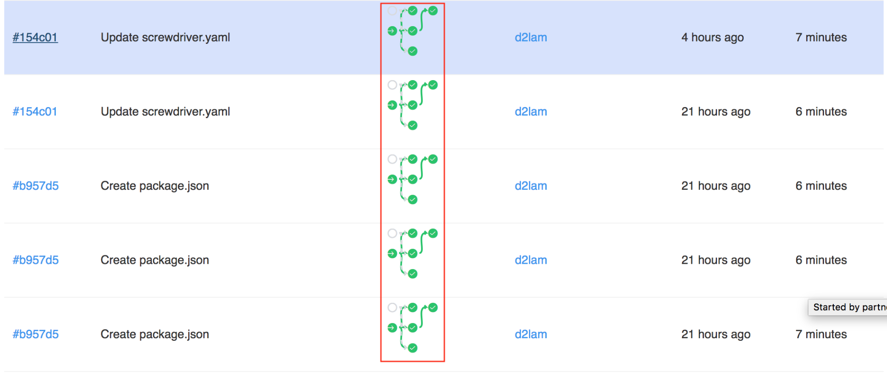

# ビルドキャッシュ
ビルドにおいてキャッシュしたいファイルのパスを含めて一番上の階層で設定します。キャッシュはビルドの teardown bookend でキャッシュされ、setup bookend でリストアされます。キャッシュへのアクセスは、パイプライン、イベント、ジョブのスコープで制限することができます。

| スコープ  | アクセス範囲 |
|---|---|
| pipeline  | 同じパイプラインの全てのビルド  |
| event  | 同じイベントの全てのビルド  |
| job  | 同じジョブについての全てのビルド  |

## 例

```yaml
cache:
   pipeline: [~/.gradle]
   event: [$SD_SOURCE_DIR/node_modules]
   job:
       usejobcache: [/tmp/test]

jobs:
    setnpmcache:
        image: node:6
        steps:
            - install: npm install
        requires: [~commit, ~pr]
    usenpmcache:
        image: node:6
        steps:
            - ls: ls
            - install: npm install
        requires: [setnpmcache]
    usegradlecache:
        image: java:7
        steps:
            - ls: ls ~/
            - install: git clone https://github.com/gradle-guides/gradle-site-plugin.git && cd gradle-site-plugin && ./gradlew build
        requires: [~commit, ~pr]
    usejobcache:
        image: node:6
        steps:
            - ls-tmp: ls /tmp
            - echo: echo hi > /tmp/test
        requires: [~commit, ~pr]
```

上記の例では、パイプラインスコープの `.gradle` のキャッシュがパイプラインの全てのビルドから `gradle install` の時間を短縮するためにアクセスできます。イベントスコープのキャッシュでは、 `setnpmcache`ビルドのイベントスコープの下で `node_modules` フォルダーをキャッシュして、下流の `usenpmcache` ビルドが `npm install` の時間を節約できるようにします。ジョブスコープのキャッシュでは、`/tmp/test` ファイルをキャッシュして、同じジョブのその後のビルドで使用できるようにします。

サンプルリポジトリ: https://github.com/screwdriver-cd-test/cache-example

## Notes
- もしキャッシュが大きくてキャッシュ bookend がメモリオーバーとなるようでしたら、`screwdriver.cd/ram` [アノテーション]((./annotations))に `HIGH` を設定するとより多くのメモリがビルドで使用できるようになります。

## 特定のジョブでキャッシュを無効にする
特定のジョブでキャッシュを利用したくない場合には、`cache` の設定を特定のジョブに設定します。
`cache` の値が `false` のときには、トップレベルのキャッシュの設定がされていてもそのジョブではキャッシュのキャッシュもリストアも行いません。

例:
```
cache:
   event: [$SD_SOURCE_DIR/node_modules]

jobs:
    setnpmcache:
        image: node:12
        steps:
            - install: npm install
        requires: [~commit, ~pr]
    usenpmcache:
        image: node:12
        steps:
            - ls: ls
            - install: npm install
        requires: [setnpmcache]
    no-usenpmcache:
        image: node:12
        steps:
            - ls: ls
            - run-command: echo 'run command which not uses npmcache.'
        requires: [usenpmcache]
        cache: false
```

## キャッシュの削除
キャッシュを削除するには、 Screwdriver の UI からパイプラインのオプションタブへ行き、キャッシュのセクションのゴミ箱アイコンをクリックします。


