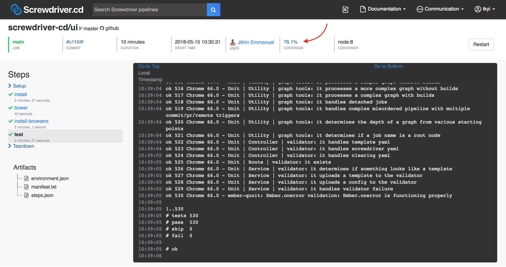

# コードカバレッジ

ビルド完了後、コードカバレッジ率がUI上に表示されるようになり、コードカバレッジデータがアップロードされます。



現在、カバレッジ bookend では [SonarQube](https://github.com/screwdriver-cd/coverage-sonar) をサポートしています。どのカバレッジプラグインがサポートされているかは Screwdriver クラスタ管理者に確認してください。

## SonarQube

Sonar properties を `sonar-project.properties` ファイルや、screwdriver.yaml 内に `$SD_SONAR_OPTS` の環境変数として設定することができます。`sonar.sources` のプロパティは必須で、ソースのパスを指定します。

### sonar-project.properties

SonarQube を使用するために、`sonar-project.properties` ファイルをソースコードのルートに追加して、そこに設定を追加していきます。

以下は [Javascript example](https://github.com/screwdriver-cd-test/sonar-coverage-example-javascript) の `sonar-project.properties` の例です:
```
sonar.sources=index.js
sonar.javascript.lcov.reportPaths=artifacts/coverage/lcov.info
```

`reportPath` プロパティは使用する言語によって変わります。正しい指定の仕方は [SonarQube documentation](https://docs.sonarqube.org/display/PLUG) を確認してください。

### $SD_SONAR_OPTS

設定を `$SD_SONAR_OPTS` の環境変数で指定することも出来ます。

`screwdriver.yaml` の例:

```yaml
shared:
  environment:
    SD_SONAR_OPTS: '-Dsonar.sources=lib -Dsonar.javascript.lcov.reportPaths=artifacts/coverage/lcov.info'
jobs:
  main:
    requires: [~pr, ~commit]
    image: node:8
    steps:
      - install: npm install
      - test: npm test
```

#### 注意

- `sonar-project.properties` と `$SD_SONAR_OPTS` で同じプロパティを設定していた場合、`$SD_SONAR_OPTS` の設定が優先されます。
- Screwdriver は次のプロパティ(`sonar.host.url`, `sonar.login`, `sonar.projectKey`, `sonar.projectName`, `sonar.projectVersion`, `sonar.links.scm`, `sonar.links.ci`)を自動で設定します。**`sonar.sources` は自分で設定する必要があります。**

#### 関連リンク
- [SonarQube properties](https://docs.sonarqube.org/display/SONAR/Analysis+Parameters)
- [Java example](https://github.com/screwdriver-cd-test/sonar-coverage-example-java)
- [Javascript example](https://github.com/screwdriver-cd-test/sonar-coverage-example-javascript)
- [Examples from the SonarQube website](https://github.com/SonarSource/sonar-scanning-examples)
- [SonarQube docs](https://docs.sonarqube.org/display/SCAN)
- [SonarQube environment variables](../environment-variables#カバレッジsonar)

### GitHub pull request decoration
ScrewdriverのクラスタがSonar Enterpriseを利用している場合、GitHubでのチェックに[Pull Request decoration](https://docs.sonarqube.org/7.8/analysis/pull-request/)を利用することができます。この機能が有効な場合、リポジトリにSonar PR Checks用のGitHub appを追加することで利用することが出来ます。サポート状況の詳細はScrewdriverクラスタ管理者に確認してください。
