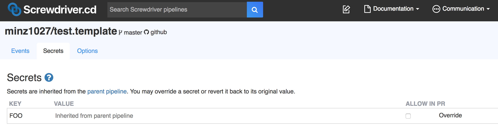

# パイプラインの親子設定(External config)

パイプラインの親子設定を利用することで１つの親パイプラインが、１つの`screwdriver.yaml`で複数の子パイプラインのビルド構成を作成・管理できます。それぞれの子パイプラインのソースコードはそれぞれの子リポジトリから取得してきます。

この機能により、同じワークフローで複数のリポジトリを簡単に管理できます。

## 親パイプラインでのパイプラインの親子設定方法

親レポジトリの`screwdriver.yaml`では、`childPipelines`というキーワードを使うことで、子パイプラインの定義をできます。
Screwdriverは`scmUrls`リストに基づいて子パイプラインを作成、削除します。また、子リポジトリに対し**admin**権限を持っていることを確認してください。子パイプラインを管理するために必要となります。

```yaml
childPipelines:
  scmUrls:
    - git@github.com:minz1027/test.template.git
    - git@github.com:minz1027/quickstart-generic.git#main

jobs:
  main:
    image: node:8
    steps:
      - install: npm install
      - publish: npm publish
```

## 親子関係

パイプライン | 権限
--- | ---
親 | 自身のパイプラインに対する全てのアクションと、子パイプラインへのcreate/delete/update/startアクション
子 | 自身のパイプラインに対するdelete/update以外の全てのアクション<br>また、デフォルトでは親から継承されたSecretsが利用されるが、そのSecretsへの上書き

子パイプラインのビルドは、[`$SD_CONFIG_DIR`](../environment-variables#directories)にある親パイプラインのリポジトリにアクセスすることができます。

## ユーザーインタフェース

親パイプライン UI:


子パイプライン UI:


サンプルリポジトリ: <https://github.com/screwdriver-cd-test/external-config-example>
