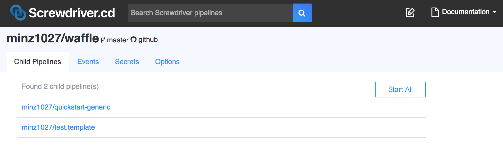

# 外部設定

External config は１つの親パイプラインが、一つの`screwdriver.yaml`で複数の子パイプラインのビルド構成を作成・管理できます。 それぞれの子パイプラインのソースコードはそれぞれの子リポジトリから取得してきます。

この機能により、同じワークフローで複数のリポジトリを簡単に管理できます。

## 親パイプラインでの外部設定方法

親レポジトリの`screwdriver.yaml`では、`childPipelines`というキーワードを使うことで、子パイプラインの定義をできます。
Screwdriverは`scmUrls`リストに基づいて子パイプラインを作成、削除します。また、子リポジトリに対し**admin**権限を持っていることを確認してください。子パイプラインを管理するために必要となります。

```yaml
childPipelines:
   scmUrls:
      - git@github.com:minz1027/test.template.git
      - git@github.com:minz1027/quickstart-generic.git#master

jobs:
    main:
        image: node:8
        steps:
            - install: npm install
            - publish: npm publish
```

## 親子関係

パイプライン | アクセス権
--- | ---
親 | 自身のパイプラインに対する全てのアクションと、子パイプラインにへのcreate/delete/update/startアクション
子 | 自身にパイプラインに対するdelete/update以外の全てのアクション
また、親から継承するシークレットの上書きが可能

## ユーザーインタフェース

親パイプライン UI:


子パイプライン UI:

