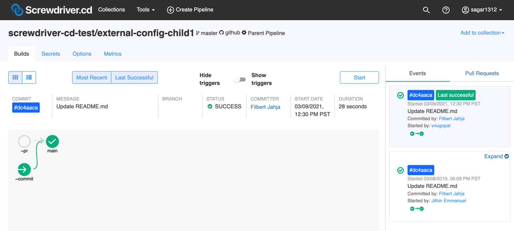

# パイプラインの親子設定(External config)

パイプラインの親子設定を利用することで１つの親パイプラインが、１つの`screwdriver.yaml`で複数の子パイプラインのビルド構成を作成・管理できます。それぞれの子パイプラインのソースコードはそれぞれの子リポジトリから取得してきます。

この機能により、同じワークフローで複数のリポジトリを簡単に管理できます。

## 親パイプラインでのパイプラインの親子設定方法

親レポジトリの`screwdriver.yaml`では、`childPipelines`というキーワードを使うことで、子パイプラインの定義をできます。
Screwdriverは`scmUrls`リストに基づいて子パイプラインを作成、削除します。また、子リポジトリに対し**admin**権限を持っていることを確認してください。子パイプラインを管理するために必要となります。

```yaml
childPipelines:
  scmUrls:
    - git@github.com:minz1027/test.template.git
    - git@github.com:minz1027/quickstart-generic.git#main
    # ソースディレクトリがルートでないパイプラインもURLの後に:<ソースディレクトリ>を追加することで子パイプラインにできます
    - git@github.com:minz1027/quickstart-generic.git#main:path/to/subdir
    # read-only SCM。このオプションが利用可能かどうかは、クラスタ管理者に問い合わせてください。
    - https://sd.gitlab.com/screwdriver-cd/data-schema.git

jobs:
  main:
    image: node:8
    steps:
      - install: npm install
      - publish: npm publish
```

## 親子関係

パイプライン | 権限
--- | ---
親 | 自身のパイプラインに対する全てのアクションと、子パイプラインへのcreate/delete/update/startアクション
子 | 自身のパイプラインに対するdelete/update以外の全てのアクション<br>また、デフォルトでは親から継承されたSecretsが利用されるが、そのSecretsへの上書き

子パイプラインのビルドは、[`$SD_CONFIG_DIR`](../environment-variables#ディレクトリ)にある親パイプラインのリポジトリにアクセスすることができます。

## 子パイプラインの管理
親パイプラインの `screwdriver.yaml` に子パイプラインの SCM URL を追加すると、子パイプラインはアクティブ状態で作成されます。

親パイプラインの `screwdriver.yaml` から子パイプラインの SCM URL を削除すると、子パイプラインの状態はインアクティブに設定されます。

親パイプラインの管理者は、インアクティブな子パイプラインを以下のように管理できます。
* 親パイプラインの `screwdriver.yaml` の SCM URL を元に戻すと子パイプラインは再びアクティブになります。
* UI や API からインアクティブな子パイプラインを明示的に削除すると子パイプラインは完全に消えます。


## ユーザーインタフェース
### 親パイプライン UI:


### 子パイプライン UI:
#### アクティブな子パイプライン:


#### インアクティブな子パイプライン:
インアクティブな子パイプラインにはできる操作が限られています。
* 新しいイベントやビルドの作成ができません。


#### 子パイプラインは親パイプラインのシークレットを継承:
 

サンプルリポジトリ: <https://github.com/screwdriver-cd-test/external-config-example>
