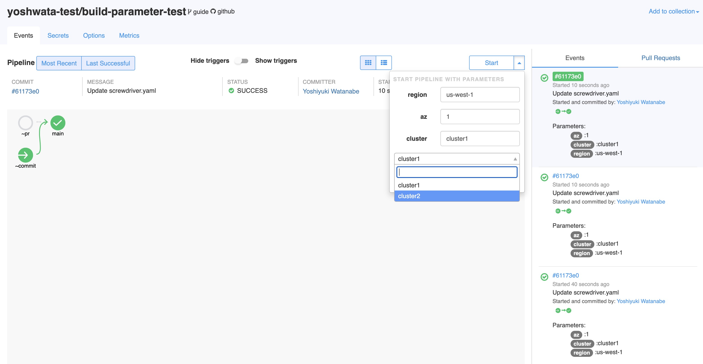

## パラメーター定義
パラメータを定義するには、以下の例のように3つの方法があります。

```yaml
parameters:
    nameA: "value1"
    nameB:
        value: "value2"
        description: "description of nameB"
    nameC: ["value1", "value2"]
```

**パラメーター**とは`key:value`のペアで定義できるものです。

```yaml
parameters:
    nameA: "value1"
```

`key: string` (上記の例を参照) は`key:value` (下記の例を参照)を簡潔に記述したものです。

```yaml
parameters:
    nameA:
        value: "value1"
        description: ""
```

上記の2つの例は同等のものです。

ドロップダウンから選択するために、パラメーターを配列で定義することもできます。配列の先頭要素がデフォルトとして使われます。例えば、以下の例では`value1`がデフォルトとして選択されます。

```yaml
parameters:
    nameA: ["value1", "value2"]
```

## 例
screwdriver.yamlの全容は以下の通り:
```yaml
shared:
    image: node:8

parameters:
    region: "us-west-1"
    az:
        value: "1"
        description: "default availability zone"
    cluster: ["cluster1", "cluster2"]

jobs:
    main:
        requires: [~pr, ~commit]
        steps:
            - step1: 'echo "Region: $(meta get parameters.region.value)"'
            - step2: 'echo "AZ: $(meta get parameters.az.value)"'
            - step3: 'echo "Cluster: $(meta get parameters.cluster.value)"'
```

ビルドで利用されるパラメーターは`Setup` -> `sd-setup-init`ステップで確認することができます。

パイプラインの動作イメージ:





サンプルは[parameters-build-sample](https://github.com/screwdriver-cd-test/parameters-build-sample)をご覧ください。
