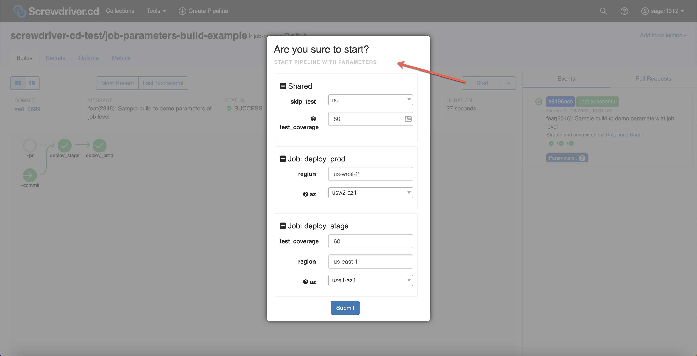
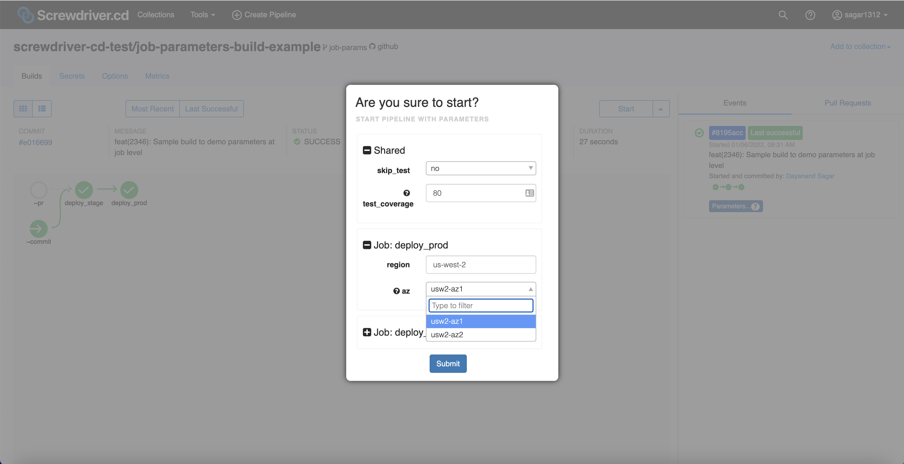

## パラメーター定義
パラメータを定義するには、以下の例のように3つの方法があります。

```yaml
parameters:
    nameA: "value1"
    nameB:
        value: "value2"
        description: "description of nameB"
    nameC: ["value1", "value2"]
```

**パラメーター**とは`key:value`のペアで定義できるものです。

```yaml
parameters:
    nameA: "value1"
```

`key: string` (上記の例を参照) は`key:value` (下記の例を参照)を簡潔に記述したものです。

```yaml
parameters:
    nameA:
        value: "value1"
        description: ""
```

上記の2つの例は同等のものです。

ドロップダウンから選択するために、パラメーターを配列で定義することもできます。配列の先頭要素がデフォルトとして使われます。例えば、以下の例では`value1`がデフォルトとして選択されます。

```yaml
parameters:
    nameA: ["value1", "value2"]
```

## 例
screwdriver.yamlの全容は以下の通り:
```yaml
shared:
  image: node:8

parameters:
  skip_test: ["no", "yes"]
  test_coverage:
    value: "80"
    description: "test coverage threshold percentage"

jobs:
  deploy_stage:
    requires: [~pr, ~commit]
    parameters:
      test_coverage: "60"
      region: "us-east-1"
      az:
        value: ["use1-az1", "use1-az2"]
        description: "availability zone"
    steps:
      - step_print_pramaeters: |
          echo skip_test = $(meta get parameters.skip_test)
          echo test_coverage = $(meta get parameters.test_coverage)
          echo region = $(meta get parameters.region)
          echo az = $(meta get parameters.az)

  deploy_prod:
    requires: deploy_stage
    parameters:
      region: "us-west-2"
      az:
        value: ["usw2-az1", "usw2-az2"]
        description: "availability zone"
    steps:
      - step_print_pramaeters: |
          echo skip_test = $(meta get parameters.skip_test)
          echo test_coverage = $(meta get parameters.test_coverage)
          echo region = $(meta get parameters.region)
          echo az = $(meta get parameters.az)
```

ビルドで利用されるパラメーターは`Setup` -> `sd-setup-init`ステップで確認することができます。

パイプラインの動作イメージ:






サンプルは[parameters-build-sample](https://github.com/screwdriver-cd-test/parameters-build-sample)をご覧ください。
