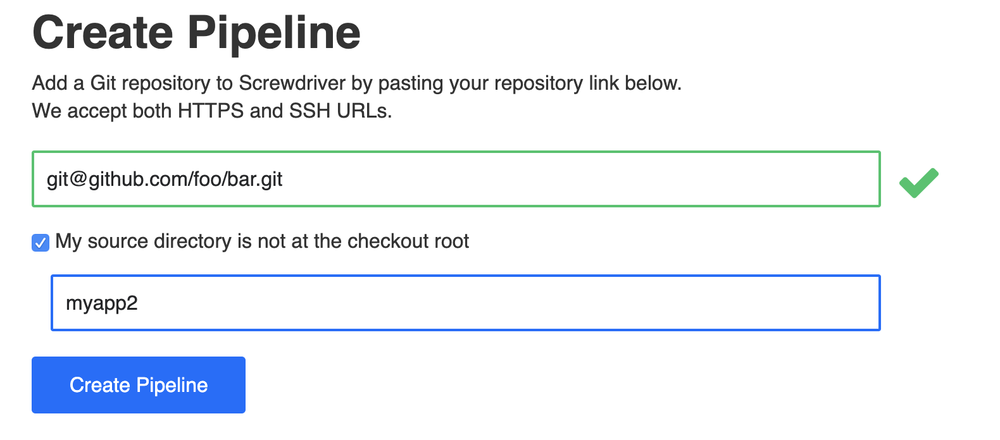
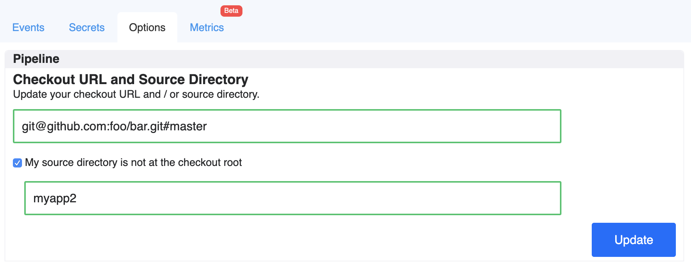

---
layout: main
title: ソースディレクトリ
category: User Guide
menu: menu_ja
toc:
    - title: ソースディレクトリ
      url: "#ソースディレクトリ"

 ---
# ソースディレクトリ
ソースディレクトリはパイプラインが配置されているカスタムディレクトリを指定できます。ScrewdriverのUIでパイプラインを作成したときや、ディレクトリを追加するために現在のパイプラインをを更新するときに指定可能です。これは[monorepo](https://developer.atlassian.com/blog/2015/10/monorepos-in-git)のサブディレクトリに基づいてワークフローが動作している際に有用です。カスタムソースディレクトリを使えば、単一のリポジトリで複数パイプラインを作成することが可能です。

 ### ソースディレクトリのフォーマット
ディレクトリパスはリポジトリのルートからの相対パスとなります。ソースディレクトリの下には`screwdriver.yaml`が一つ有る必要があります。

 #### Example

 リポジトリのファイル構成を表すと以下のようになります:

 ```
┌── README.md
├── screwdriver.yaml
├── myapp1/
│   └── ...
├── myapp2/
│   ├── app/
│   │   ├── main.js
│   │   ├── ...
│   │   └── package.json
│   └── screwdriver.yaml
│
...
```

 ##### ソースディレクトリを利用してパイプラインを作成


 ##### ソースディレクトリを利用してパイプラインを更新


 この例では、`requires: [~commit, ~pr]`としているジョブは、`myapp2`ディレクトリ以下のファイルに変更が発生した場合にトリガーされます。

 ### 注意点
- この機能は現在は[Github SCM](https://github.com/screwdriver-cd/scm-github)を利用の場合のみ利用可能です。
- `ソースパス`とカスタムソースディレクトリを同時に使う場合には、`ソースパス`のスコープをソースディレクトリに限定してください。***Note*** `ソースパス`のパスはリポジトリのルートからの相対パスであり、ソースディレクトリではありません。
   - 例えば、`main.js`と`screwdriver.yaml`の変更を検知するためにソースパスを追加する場合以下のように設定します:
```
sourcePaths: [myapp2/app/main.js, myapp2/screwdriver.yaml]
```
`sourcePaths: [app/main.js]`と設定した場合、動作しません。ソースディレクトリに`myapp2`が欠けており、相対的にソースパスを設定できません。`sourcePaths: [myapp1/test.js]`と設定した場合、動作しません。これはソースディレクトリである`myapp2`のスコープの外であるためです。

 - `screwdriver.yaml`はカスタムソースディレクトリのルートに配置されている必要があります。
