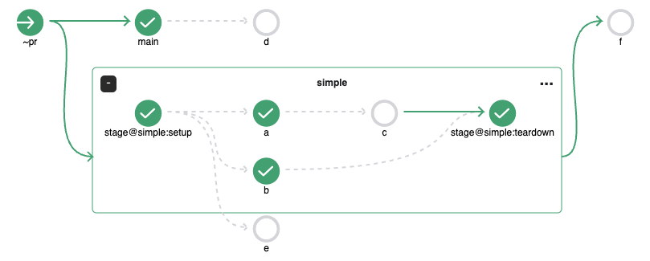
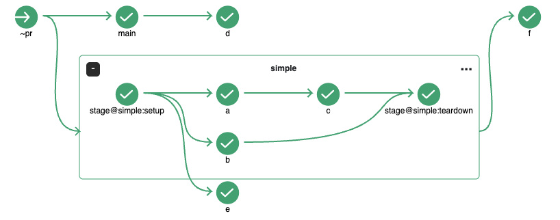

# ステージ

ステージ機能は1つ以上のジョブを、類似した目的ごとにグループ化する事が可能です。例えば、`ci-deploy`、`ci-test`、`ci-certify` というジョブは `integration` という名前のステージにまとめることができます。

#### 例

```
jobs:
  ci-deploy:
    requires: []
  ci-test:
    requires: [ci-deploy]
  ci-certify:
    requires: [ci-test]
  triggered-by-stage:
    requires: [~stage@integration]
stages:
  integration:
    requires: [~commit]
    jobs: [ci-deploy, ci-test, ci-certify]
    description: "This stage will deploy the latest application to the CI environment and certify it after the tests have passed."
```

上記の例では、`integration`ステージ内の `ci-deploy` ジョブは `requires` フィールドに何も設定されていませんが、`integration`ステージの`commit`トリガーによって、ステージの起動と同時にジョブの実行が開始されます。逆に、`triggered-by-stage`ジョブは`integration`ステージがトリガーとなり、ステージ内の最後のジョブが完了した後に実行が開始されます。ステージの終了をトリガーとするジョブを設定するには、`~stage@stageName`という構文を使用します。

以下のスクリーンショットは上記設定の場合に予想されるワークフローグラフのレイアウトです。


#### SetupとTeardown

<br>各ステージには、設定されたジョブの前に実行される**setup**ジョブと、ステージ内のすべてのジョブが終了した後に実行される**teardown**ジョブが存在します。以下の設定に示すように、ユーザーはsetupジョブとteardownジョブの定義を変更することができます。ステージの**teardown**ジョブは、ステージ内の他のジョブが失敗した場合でも実行されます。

```
stages:
  integration:
    requires: [~commit]
    jobs: [ci-deploy, ci-test, ci-certify]
    description: "This stage will deploy the latest application to the CI environment and certify it after the tests have passed."
    setup:
      image: node:lts
      steps:
        - init: echo 'integration setup'
    teardown:
      image: node:lts
      steps:
        - init: echo 'integration teardown'
```

#### PRワークフローでのステージ

`~pr` ワークフローでもステージを利用できます。その場合は、setupジョブとその次のジョブ、teardownジョブのみがトリガーされます。  
setupジョブ以外のジョブから先にはトリガーされません。



`chainPR` が有効になっている場合は、通常ビルドと同じように動作します。



#### 注意

- 各ジョブは1つのステージにだけ属します。
