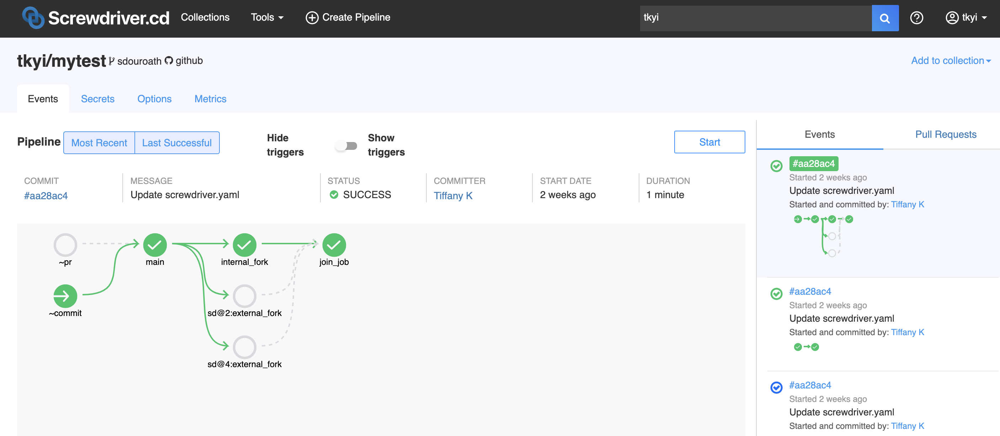

# ワークフロー

ワークフローは個々のジョブをパイプラインという形で紐づけてまとめる方法です。ジョブ定義の中で `requires` というキーに、ジョブ実行のトリガーとなるジョブやイベントのリストを指定することで実現しています。  
Screwdriver は全てのパイプラインに対し、SCM のイベントに対応する `~pr`, `~commit`, `~tag`, `~release` の4つのイベントを定義しています。  
`~pr`イベントはプルリクエストがオープン・再オープン・更新された場合に、`~commit`イベントはパイプラインのブランチに対してコミットが行われた場合に発生します。  
パイプラインを手動で開始した場合、`~commit`トリガーを持つ全てのジョブのビルドが開始します。

|keyword|description|
|:--|:--|
| ~pr | プルリクエストがオープン・再オープン・更新された場合にイベントが発生します。|
| ~commit | パイプラインのブランチに対してコミットが行われた場合にイベントが発生します。パイプラインを手動で開始した場合、`~commit`トリガーを持つ全てのジョブのビルドが発生します。|
| ~tag | タグが作成された際にイベントが発生します。scmとしてGitHubを利用している場合のみこのトリガーを使うことができます。|
| ~release | リリースされたときにイベントが発生します。scmとしてGitHubを利用している場合のみこのトリガーを使うことができます。|

[タグとリリーストリガーのサンプルリポジトリ](https://github.com/screwdriver-cd-test/tag-trigger-example)も参考にしてください。

## ワークフローの順序を定義する

ワークフローの順序を示すために、ジョブ設定で `requires` をジョブ名の配列で定義します。ジョブ名にチルダのプレフィックスを付けることで、[論理式を用いたワークフロー定義 (Advanced Logic)](#論理式を用いたワークフロー定義)を定義することができます。

#### 例

以下の例では、`main` ジョブは SCM のプルリクエスト、*または*コミットイベントをトリガーに開始されます。`second` ジョブは `main` ジョブが成功した後に開始されます。

>プルリクエストによって開始されたジョブは、chainPRのアノテーションが使用されていないと後続のジョブをトリガーしないことに注意してください。たとえば、プルリクエストが開かれた結果として `main`が開始し成功した場合、` second`はその後に開始しません。

```
jobs:
    main:
        image: node:6
        requires: [~pr, ~commit]
        steps:
            - echo: echo hi

    second:
        image: node:6
        requires: [main]
        steps:
            - echo: echo bye
```

プルリクエストがオープンもしくは更新された時にジョブを実行したい場合は、 `requires: [~pr]` を使用してください。コードがマージされたりパイプラインを作成しているブランチに直接プッシュされた後にジョブを実行したい場合は `requires: [~commit]` を使用してください。

サンプルリポジトリ: https://github.com/screwdriver-cd-test/workflow-sequential-example

## 論理式を用いたワークフロー定義 (Advanced Logic)

### AND 条件 (Advanced Logic [*AND*])

`requires` に含まれるジョブが全て成功した場合に開始するジョブを定義することができます。これはしばしば結合 (join) やファン・イン (fan-in) とも呼ばれます。

### 例

以下の例では、`last`ジョブは同一のイベントにトリガーされた `first` ジョブ *と* `second` ジョブの両方が成功した場合のみ実行されます。

```
shared:
    image: node:6
    steps:
        - greet: echo hello

jobs:
    main:
        requires: [~pr, ~commit]

    first:
        requires: [main]

    second:
        requires: [main]

    last:
        requires: [first, second]
```

### OR 条件 (Advanced Logic [*OR*])

チルダ (`~`) をジョブ名の前に付けることで、 `requires` に含まれるジョブのいずれかが成功した場合に開始するジョブを定義することができます。`~sd@pipelineID:jobName` のようなフォーマットである必要があります。

### 例

以下の例では、`last`ジョブは `first` *または* `second` ジョブのどちらかが成功した場合に実行されます。

```
shared:
    image: node:6
    steps:
        - greet: echo hello

jobs:
    main:
        requires: [~pr, ~commit]

    first:
        requires: [main]

    second:
        requires: [main]

    last:
        requires: [~sd@123:first, ~sd@123:second]
```

### AND 条件と OR 条件の併用 (Advanced Logic [*Combined*])

以下の例のような複数のパイプラインをまたいだケースを実現するために、*AND* と *OR* のロジックを併用することができます。
この例では、`first` ジョブ *と* `second` ジョブが成功した、*または* `third` ジョブが成功した場合にジョブが実行されます。

```
    last:
        requires: [first, second, ~sd@123:third]
```

`requires` のジョブ名の前にチルダがついていた場合、チルダのついているジョブのいずれかが成功した場合 *または* チルダのついていないジョブの全てが成功した場合にジョブが実行されます。例えば、以下のようなちょっと変な例を考えてみます:

```
    main:
        requires: [~sd@123:A, B, ~sd@123:C, D, ~sd@123:E, F]
```

これは `A OR C OR E OR (B AND D AND F)` という論理式と等価になります。このような複雑な `requires` は実際のワークフローではコードスメルとみなされるでしょう。

## ブランチフィルター
ブランチフィルターは、パイプラインの特定のブランチのイベントをトリガーにすることができます。特定のブランチに対してコミットされた後にパイプラインでジョブをトリガーするには、 `[ ~commit：branchName ]` を使用します。特定のブランチに対してプルリクエストが作成された後にパイプラインでジョブをトリガーするには、`[ ~pr：branchName] `を使用します。ブランチは([JavaScript仕様の](https://developer.mozilla.org/en-US/docs/Web/JavaScript/Guide/Regular_Expressions))正規表現を用いて指定することもできます（例: `~commit：/^feature-/`）。正規表現のフラグはサポートしていません。

### 例

以下の例では、`staging`ブランチに対してコミットされると、`staging-commit`と `all-commit`がトリガーされます。また、`master`ブランチに対してコミットされると、` main`と `all-commit`がトリガーされます。プルリクエストが`staging`ブランチに対してオープンされると、` staging-pr`がトリガーされます。
```
shared:
    image: node:8

jobs:
    main:
        requires: [~commit]
        steps:
            - echo: echo commit
    staging-commit:
        requires: [~commit:staging]
        steps:
            - echo: echo staging
    all-commit:
        requires: [~commit:/./]
        # /./は任意のブランチ名にマッチします
        # ここでは説明のために使用していますが、実際のワークフローでは使用しないでください
        steps:
            - echo: echo all
    staging-pr:
        requires: [~pr:staging]
        steps:
            - echo: echo staging pr
```

_注意: ブランチに対するPRのワークフローは、そのブランチのscrewdriver.yamlに従います。_

[ブランチフィルターのサンプルリポジトリ](https://github.com/screwdriver-cd-test/branch-filtering-example)を参考にしてください。ブランチフィルターがプルリクエストに対してどう動作するのかを見るのなら、[プルリクエストの例](https://github.com/screwdriver-cd-test/branch-filtering-example/pull/2)を参考にしてください。

## タグフィルターとリリースフィルター
タグフィルター/リリースフィルターを使用して、特定の名称の`~tag`/`~release`イベントをトリガーにすることができます。特定の名称のタグが作成された後にパイプラインでジョブをトリガーするには、`requires: [~tag:tagName]`を使用します。特定の名称のリリースがされた後にパイプラインでジョブをトリガーするには、`requires: [~release:releaseName]`を使用します。`tagName`と`releaseName`は([JavaScript仕様の](https://developer.mozilla.org/en-US/docs/Web/JavaScript/Guide/Regular_Expressions))正規表現を用いて指定することもできます（例: `~release：/^feature-/`）。正規表現のフラグはサポートしていません。

### 例
以下の例では、`stable`という名称のリリースがされると、`stable-release`がトリガーされます。また、`v1.0`という名称のタグが作成されると、`v1-tag`がトリガーされます。`v2.0`という名称のタグが作成されると、`all-tag-and-release`がトリガーされます。

```
shared:
    image: node:12

jobs:
    all-tag-and-release:
        requires: [~tag, ~release]
        steps:
            - echo: echo all
    v1-tag:
        requires: [~tag:/^v1\.*/]
        steps:
            - echo: echo v1 tag
    stable-release:
        requires: [~release:stable]
        steps:
            - echo: echo stable release
```

## 並列実行と結合 (Parallel and Join)

1つの require から2つ以上のジョブを並列に実行することができます。並列に実行したジョブを1つのジョブに結合するには、複数のジョブを `requires` に設定します。

#### 例

以下の例では、`A` と `B` は `main` を requires に含んでいます。これは、`A` と `B` は `main` が成功した後に並列に実行されるということです。
また、`C` は 同一のイベントにトリガーされた `A` *と* `B` の両方が成功した場合にのみ実行されます。

```
shared:
    image: node:6

jobs:
    main:
        requires: [~pr, ~commit]
        steps:
            - echo: echo hi
    A:
        requires: [main]
        steps:
            - echo: echo in parallel
    B:
        requires: [main]
        steps:
            - echo: echo in parallel
    C:
        requires: [A, B]
        steps:
            - echo: echo join after A and B
```

サンプルリポジトリ: https://github.com/screwdriver-cd-test/workflow-parallel-join-example

## 他のパイプラインからのトリガー

他のパイプラインの実行完了をトリガーに、パイプラインのジョブを実行することができます。 フォーマットは `~sd@pipelineID:jobName` です。`~pr` と `~commit` と `~sd@pipelineID:jobName` のフォーマットは *OR* のロジックに従います。

#### 例

以下の例では、このパイプラインは プルリクエスト、コミットが行われた後、*または* パイプライン456の `publish` ジョブが成功した場合に `main` ジョブを開始します。

```
jobs:
    main:
        image: node:6
        requires: [~pr, ~commit, ~sd@456:publish]
        steps:
            - echo: echo hi
```

サンプルリポジトリ: https://github.com/screwdriver-cd-test/workflow-remote-requires-example

## リモートジョイン
リモートジョインジョブを作成することもできます。この機能がサポートされているかは、クラスタ管理者に確認してください。

#### 例
以下の例では、このパイプライン3は internal_fork ジョブとパイプライン2の external_fork とパイプライン4の external_fork がすべて成功した場合に `join_job` を開始します。



Pipeline 3 screwdriver.yaml:

```
shared:
  image: node:12
  steps:
    - echo: echo hi
jobs:
  main:
    requires: [~commit, ~pr]
  internal_fork:
    requires: [main]
  join_job:
    requires: [internal_fork, sd@2:external_fork, sd@4:external_fork]
```

Pipeline 2 screwdriver.yaml:

```
shared:
  image: node:12
  steps:
    - echo: echo hi
jobs:
  external_fork:
    requires: [~sd@3:main]
```

Pipeline 4 screwdriver.yaml:

```
shared:
  image: node:12
  steps:
    - echo: echo hi
jobs:
  external_fork:
    requires: [~sd@3:main]
```

#### 注意
- 下流のジョブ（e.g.: 例えば、上記の pipeline 2 や pipeline 4）では、現在外部トリガーのスタート node に対する `AND` 条件 (e.g.: `requires: [sd@3:main]` や `requires: [sd@3:main, sd@1:main]`) をサポートしていません。これらの node に対しては `OR` 条件 (e.g.: `requires: [~sd@3:main]` や `requires: [~sd@3:main, ~sd@1:main]`) を使用してください。
- この機能は、1段の深さの外部依存だけに有効です。
- この機能は、現在PR chain 機能とともには利用できません。
- UI 右側の event リストには、完全な event の mini-graph は表示されない場合があります。

## Blocked By

特定のジョブの実行中にジョブの実行をブロックするには、`blockedBy` を利用します。`requires` と同じフォーマットで設定をすることができますが、`~commit` と `~pr` は許可されません。

注意:

- 全て OR のロジックを使用するため、それぞれのジョブ名の前にチルダ (`~`) を付ける必要があります。blockedBy では AND のロジックはサポートしていません。
- デフォルトでは、競合状態を防ぐため、ジョブは常に自分自身をブロックします。つまり、1つのジョブは同時に2つのビルドを実行することはありません。
- この機能はクラスタで `executor-queue` を使用している場合のみ利用可能です。クラスタ管理者にサポートしているかどうかお尋ねください。
- この機能はPRジョブでは適用されません。

#### 例

以下の例では、`job2` は `job1` または `sd@456:publish` にブロックされます。もし `job1` または `sd@456:publish` が実行中に `job2` がトリガーされた場合は、`job2` は再びキューに戻ります。Screwdriverはキューを定期的にチェックして `job2` がブロックされていないかどうかを確認し、ブロックがなくなるとすぐにそれを実行します。

```
shared:
    image: node:6
jobs:
    job1:
        requires: [~commit, ~pr]
        steps:
            - echo: echo hello
    job2:
        blockedBy: [~job1, ~sd@456:publish]
        steps:
            - echo: echo bye
```

サンプルリポジトリ: https://github.com/screwdriver-cd-test/workflow-blockedby-example

## ジョブの凍結
`freezeWindows`を使うことでジョブを凍結させ、特定の時間帯にそれらが実行されないようにすることができます。設定値としてcron式またはそれらのリストを取ります。

ジョブが開始される前に、設定されたcron式のいずれかに開始時刻が該当するかどうかがチェックされ、該当する場合はジョブが凍結されます。 現在のcron式が明けるとすぐに、ジョブは凍結が解除されて実行されます。

注意:

-  `build_periodically`とは異なり、`freezeWindows`はハッシュ化された時間を使うべきではないため*ハッシュのシンボル`H`は無効です。*
- 曜日と日にちの組み合わせは通常無効です。したがって、*指定できるのは曜日と日にちのうち1つ*のみです。 他方のフィールドは"?"に設定する必要があります。
- デフォルトでは、ジョブの凍結中に複数のビルドが発生した場合、それらは1つのビルドにまとめられ、凍結が明けた際に凍結中に発生した内の最新のコミットで実行されます。この機能を無効にするには、[アノテーション](./annotations)の `screwdriver.cd/collapseBuilds` を `false` に設定してください。

#### 例
以下の例では、`job1` は3月中に凍結され、` job2` は週末に凍結され、`job3` は午後10時00分から午前10時59分まで凍結されます。

```
shared:
    image: node:6
jobs:
  job1:
    freezeWindows: ['* * ? 3 *']
    requires: [~commit]
    steps:
      - build: echo "build"
  job2:
    freezeWindows: ['* * ? * 0,6,7']
    requires: [job1]
    steps:
      - build: echo "build"
  job3:
    freezeWindows: ['* 0-10,22-23 ? * *']
    requires: [job2]
    steps:
      - build: echo "build"
```

## 分離されたジョブ (Detached Jobs) とパイプライン

どこからもトリガーされないワークフローを定義することができます。これらのワークフローはパイプラインの通常のフローから"分離 (detached) されています"。ユースケースとしては、手動でトリガーを行うロールバックのフローなどです。分離されたパイプラインの実行は、[ロールバック](../FAQ#ビルドのロールバックを行うには) と同じ手順です。

### 例

以下の例では、`detached-main` ジョブが分離されています。

```
shared:
    image: node:8

jobs:
      detached-main:
            steps:
                - echo: echo detached hi
      main:
            requires: [~pr, ~commit]
            steps:
                - echo: echo hi
```

もし単一のジョブしか存在しない場合は、空の `requires` を設定することで、分離されたジョブとなります。

```
shared:
    image: node:8

jobs:
      detached-main:
            requires: []
            steps:
                - echo: echo detached hi
```

サンプルリポジトリ: https://github.com/screwdriver-cd-test/workflow-detached-example
