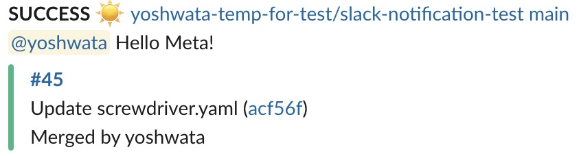

# Metadata

## Metadataとは？

Metadataは [ビルド](../about/appendix/domain#ビルド) に関する情報を保持する key/value ストアです。Metadataは [steps](../about/appendix/domain#ステップ) 内で組み込まれている [meta CLI](https://github.com/screwdriver-cd/meta-cli) を利用することで、全てのビルドで更新と取得が可能です。

## デフォルトMetadata

Screwdriver.cdはデフォルトでMetadataに以下のキーを設定しています。

| キー　               | 説明　                                                                                                                       |
| ------------------- | --------------------------------------------------------------------------------------------------------------------------- |
| build.buildId       | ビルドのID　                                                                                                                  |
| build.jobId         | ビルドと紐付いているジョブのID                                                                                                   |
| build.eventId       | ビルドと紐付いているイベントのID                                                                                                 |
| build.pipelineId    | ビルドと紐付いているパイプラインのID                                                                                              |
| build.sha           | ビルドが実行しているコミットのsha                                                                                                |
| build.jobName       | ジョブ名　                                                                                                                    |
| event.creator       | ビルドと紐付いているイベントの作成者                                                                                              |
| commit.author       | `avatar`, `name`, `url`, `username`を含むAuthor情報のオブジェクト                                                               |
| commit.committer    | `avatar`, `name`, `url`, `username`を含むCommitter情報のオブジェクト                                                            |
| commit.message      | コミットメッセージ                                                                                                             |
| commit.url          | コミットへのURL                                                                                                               |
| commit.changedFiles | カンマ区切りの変更ファイルリスト<br>**注意**: UIから新たにイベントを開始した場合はコミットでトリガーされたことにならないので、この値は空になります |
| sd.tag.name         | タグ名                                                                                                                       |
| sd.release.id       | リリースID　                                                                                                                  |
| sd.release.name     | リリース名                                                                                                                    |
| sd.release.author   | リリース                                                                                                                      |

## Metadataの操作

Screwdriver は meta store から情報を取得するためのシェルコマンド `meta get` と、meta store に情報を保存するためのシェルコマンド `meta set` を提供しています。

### 同一パイプライン

Screwdriverのビルドでは、同ビルドでセットされたMetadata、もしくは同イベントの以前のビルドでセットされたMetadataを取得することができます。

例: `build1` -> `build2` -> `build3`

`build2` のMetadataは、自身でセットしたMetadataと `build1` でセットしたMetadataを保持しています。

`build3` のMetadataは、 `build2` が持っていたMetadataを保持しています。 ( `build1` のMetadataも含む)

```bash
$ meta set example.coverage 99.95
$ meta get example.coverage
99.95
$ meta get example
{"coverage":99.95}
```

例:

```bash
$ meta set foo[2].bar[1] baz
$ meta get foo
[null,null,{"bar":[null,"baz"]}]
```

サンプルリポジトリ: <https://github.com/screwdriver-cd-test/workflow-metadata-example>

_注意_: `foo`がセットされていない場合に`meta get foo`を実行した場合、デフォルトで文字列の`null`を返します。

### リスタートの場合

親イベントのメタデータは、リスタートされたビルドおよび下流ビルドで使用することができます。

例: event1 に `build1` -> `build2` -> `build3` のビルドがある場合

`build3`が完了すると、`build1`、`build2`、`build3`のメタデータが`event1`で利用可能になります。つまり完了したそれぞれのビルドのメタデータが、そのビルドが現在実行されているイベントにマージされます。

`build1`がリスタートされると`event1`のメタデータにアクセスできるようになります。この`build1`のメタデータは、その後の下流ビルドでもアクセス可能になり、`build2`と`build3`も`event1`のメタデータを利用することができます。

#### 注意点

まだ一度も実行されていないビルド（例: virtual jobやfrozen build）のみを含む親イベントからビルドがリスタートされた場合、親イベントのメタデータは空であるため、リスタートされたビルドはメタデータを継承しません。

### 外部パイプライン

Screwdriverのビルドは外部トリガー元のジョブのMetadataにも `--external` フラグにトリガー元のジョブを指定することでアクセスすることができます。

例: `sd@123:publish` -> `build1` の時 `build1` のビルド内で:

```
$ meta get example --external sd@123:publish
{"coverage":99.95}
```

注意:

- `meta set` は外部パイプラインのジョブに対してはできません。
- もしビルドのトリガー元のジョブが `--external` で指定した外部パイプラインのジョブではなかった場合、meta はセットされません。
- `--external`で指定したパイプラインのジョブが、そのビルドをトリガーしていなかった場合は、最後に成功した外部ジョブの`meta`が取得されます。

### APIを使用する

`/v4/events`への`POST`リクエストのpayloadに設定することでも、イベントメタを設定することができます。

APIのエンドポイントについての詳細は、[APIのドキュメント](./api)を参照してください。

[イベントメタトリガーのサンプルリポジトリ](https://github.com/screwdriver-cd-test/event-meta-trigger-example)や、それに対応した[イベントメタのサンプルリポジトリ](https://github.com/screwdriver-cd-test/event-meta-example)も参考にしてください。

### プルリクエストコメント

> 注意：この機能は現在のところGithubプラグインでのみ使用可能です

Metadataを使用することで、ScrewdriverのビルドからGitのプルリクエストにコメントを書き込むことができます。コメントの内容はパイプラインのPRビルドから、metaのsummaryオブジェクトに書き込まれます。

プルリクエストにMetadataを書き出すには、`meta.summary`に必要な情報をセットするだけです。このデータはheadlessなGitのユーザからのコメントとして出てきます。

例として、カバレッジの説明を加えたい場合には、screwdriver.yamlは以下のようになります。

```yaml
jobs:
  main:
    steps:
      - comment: meta set meta.summary.coverage "Coverage increased by 15%"
```

以下の例のようにMarkdown記法で書くこともできます。

```yaml
jobs:
  main:
    steps:
      - comment: meta set meta.summary.markdown "this markdown comment is **bold** and *italic*"
```

これらの設定をすると、以下のようにGitにコメントがされます。


さらに`meta.splitComments`を設定することで、1つではなく複数のコメントを行うことができます。

```yaml
jobs:
  main:
    steps:
      - comment: meta set meta.splitComments "split"
```

この設定を行うと、以下のようにGitにコメントがされます。


_注意: ビルドを複数実行すると、Gitの同じコメントを編集します。_

### 追加のプルリクエストチェック

> 注意：この機能は現在のところGithubプラグインでのみ使用可能です

プルリクエストビルドのより詳細な状態を知るために追加のステータスチェックをプルリクエストに加えることができます。

プルリクエストに追加のチェックをするには、`meta.status.<check>`にJSON形式で必要な情報を設定するだけでできます。このデータはGitのプルリクエストのチェックとして出てきます。

設定できるフィールドは以下の通りです。

| Key              | Default                  | Description                                                        |
| ---------------- | ------------------------ | ------------------------------------------------------------------ |
| status (String)  | `SUCCESS`                | チェックのステータス 次から一つ選びます。 `SUCCESS`, `FAILURE`, `PENDING` |
| message (String) | `fieldName check failed` | チェックの説明　                                                      |
| url (String)     | ビルドのリンク             | チェックのリンクのURL                                                  |

例として、`findbugs`と`coverage`の2つの追加のチェックを加える場合、screwdriver.yamlは次のようになります。

```yaml
jobs:
  main:
    steps:
      - status: |
          meta set meta.status.findbugs '{"status":"FAILURE","message":"923 issues found. Previous count: 914 issues.","url":"http://findbugs.com"}'
          meta set meta.status.coverage '{"status":"SUCCESS","message":"Coverage is above 80%."}'
```

これらの設定は以下のようにGitのチェックになります。


### カバレッジとテスト結果

metadataを利用して、Screwdriverのビルドからビルドページにカバレッジの結果やテスト結果をそれらの生成物へのURLと一緒に取り込むことができます。ScrewdriverのUIはmetadata内の`tests.coverage`、 `tests.results`、 `tests.coverageUrl`、 `tests.resultsUrl`を読み込んで対応するものを表示させたり設定したりします。

screwdriver.yamlの例:

```yaml
jobs:
  main:
    steps:
      - set-coverage-and-test-results: |
          meta set tests.coverage 100 # カバレッジパーセンテージ数
          meta set tests.results 10/10 # 成功テスト数/全テスト数
          meta set tests.coverageUrl /test/coverageReport.html # ビルド成果物への相対パスで指定します
          meta set tests.resultsUrl /test/testReport.html # ビルド成果物への相対パスで指定します
```

> 注意: metadataはSonarQubeの結果を上書きします。
> metaの優先順位は meta.tests.saucelabs > meta.tests.sonarqube > meta.tests となります。

これらの設定により、ビルドページは次のようになります:


### イベントラベル

metaのキーに`label`を指定するとイベントにラベルを付与することができます。このキーは[ロールバック](./FAQ.html#ビルドのロールバックを行うには)するイベントの指定に役立ちます。

screwdriver.yamlの例:

```yaml
jobs:
  main:
    steps:
      - set-label: |
          meta set label VERSION_3.0 # 設定した値はイベントに紐づいてパイプラインページ上に表示されます
```

結果:


### Slack通知

metaを利用することで[通知](./configuration/settings.html#slack)メッセージをカスタマイズすることができます。metaのキーは通知ブラグインごとに異なります。

Slackのメンションやチャンネルリンクには特殊なフォーマット文字列が必要です。利用可能なオプションについては、[Slack ドキュメント](https://api.slack.com/reference/surfaces/formatting#advanced) を参照してください。

#### 基本

Slack通知をするscrewdriver.yamlの例:

```yaml
jobs:
  main:
    steps:
      - meta: |
          meta set notification.slack.message "<@yoshwata> Hello Meta!"
```

Result:


#### ジョブベースのSlackメッセージ

_注意_: ジョブベースのSlack通知のメタデータは基本的な通知メッセージを上書きします。

メタ変数の構造は、`notification.slack.<jobname>.message`です。
`<jobname>`をScrewdriver.cdのジョブ名に置き換えます。

特定のジョブをSlackメッセージで通知する例:

```yaml
jobs:
  main:
    steps:
      - meta: |
          meta set notification.slack.slack-notification-test.message "<@yoshwata> Hello Meta!"
```

Result:


#### ジョブベースのSlackチャンネル
*注意*: ジョブベースのSlackチャンネルのメタデータは基本的なSlack通知チャンネルを上書きするだけです。[チャンネル通知](./configuration/settings#slack)設定の代わりになるものではありません。

メタ変数の構造は、`notification.slack.<jobName>.channels`です。
`<jobname>`をScrewdriver.cdのジョブ名に置き換えます。

コンマ区切りの文字列にすることで、複数のチャンネルを設定することができます。

`component`ジョブで失敗した時に別のSlackチャンネルへ通知するscrewdriver.yamlの例:

```yaml
shared:
  image: docker.ouroath.com:4443/x/y/z

  settings:
    slack:
      channels: [ main_channel ]
      statuses: [ FAILURE ]
jobs:
  component:
  steps:
  - meta: |
      meta set notification.slack.component.channels "fail_channel, prod_channel"
```

上記の例では、Slackの失敗通知のメッセージは`main_channel`へ送られる代わりに`fail_channel`と、`prod_channel`へ送られます。パイプラインの他のすべてのジョブは、`main_channel`へ通知します。

#### ジョブベースで通知を最小化する設定

ジョブベースのSlackの `minimized` メタの設定はデフォルトのSlack minimized設定を上書きします。

メタ変数の構造は、 `notification.slack.<jobName>.minimized` です。 `<jobName>` をScrewdriverのジョブ名に置き換えてください。

例えば、 `component` ジョブがスケジューラーによってトリガーされた場合に、最小化したSlackメッセージを投稿します:

```yaml
shared:
  image: docker.ouroath.com:4443/x/y/z

  settings:
    slack:
      channels: [ main_channel ]
      statuses: [ FAILURE ]
      minimized: false
jobs:
  component:
    steps:
      - meta: |
          if [[ $SD_SCHEDULED_BUILD == true ]]; then
             meta set notification.slack.component.minimized true
          fi
```

上記の例では、スケジューラーによってトリガーされた `component` ジョブでのSlack通知は `minimized` 形式で投稿されます。

### ビルドにWarningを設定してマークする

`build.warning` を設定することで、ビルド/イベントを warning のステータスでマークできます。

screwdriver.yamlの例:

```yaml
jobs:
  main:
    steps:
      - warning: meta set build.warning true
```

結果:


warningのメッセージを追加することもできます。

screwdriver.yamlの例:

```yaml
jobs:
  main:
    steps:
      - setWarning: meta set build.warning.message "this is a warning message"
      - setAnotherWarning: meta set build.warning.anotherMessage "this is another warning message"
```

結果:


_注意_: マークされるのはSUCCESSのビルド/イベントのステータスの場合のみですが、warningメッセージはビルド/イベントのステータスに関わらずビルド詳細ページに表示されます。

### アトミックな処理のために[Lua](https://www.lua.org/)を使用

`meta`ツールはロックファイルを作成し、各処理毎に[flock](https://linux.die.net/man/2/flock)を管理します。これはビルドを並列に実行できるようにするためです。（例えば、`make -j 4`で起動されたMakefileなど）

アトミックな参照や書き込み処理に加えて、「更新」が必要な場合は、埋込み型の[Lua](https://www.lua.org/)インタプリタを使用してメタコマンドを呼び出すことができます。

使用例:

#### アトミックな数値のインクリメント

```bash
meta lua -E 'meta.set("myNum", (tonumber(meta.get("myNum")) or 0) + 1)'
```

| Lua code                                                                     | Description                                                                                      |
| ---------------------------------------------------------------------------  | -----------------------------------------------------------------------------------------------  |
| `meta.get("myNum")`                                                          | 前の値を取得                                                                                       |
| `tonumber(`<small>meta.get("myNum")</small>`)`                               | `tonumber`は数値の場合はその引数を返し、文字列の場合は解析し、解析不能な場合や数値や文字列でない場合は`nil`を返す |
| <small>tonumber(meta.get("myNum"))</small>` or 0`                            | `or 0`は非数値を`0`に変換して計算できるようにする                                                       |
| <small>(tonumber(meta.get("myNum")) or 0)</small>` + 1`                      | `+1`は前の値（この例では初期値は`0`）に1をインクリメントする                                              |
| `meta.set(`<small>"myNum", (tonumber(meta.get("myNum")) or 0) + 1</small>`)` | `meta.set`はインクリメントした値をセットする                                                           |

#### atomically insert some json into an array and return its index

よくあるユースケースは、（Dockerイメージのような）多くのものを並行してビルドし、その後の"publish"ステップで（Dockerレジストリ等へ）pushするために配列に問い合わせを行います。

```bash
meta lua insert.lua myArray '{"foo": "baz"}'
```

[Lua](https://linux.die.net/man/1/lua) CLIの慣習に従い、Luaコードではグローバルテーブル`arg`で引数を利用できるようになっています。
`-E`フラグを指定しない場合、`arg[0]`はファイルとして実行されます。

`insert.lua`ファイルの中身:

```lua
-- Ensure args are passed as expected
assert(#arg >= 2, string.format("usage: %s key json_value", arg[0]))

-- https://github.com/vadv/gopher-lua-libs is preloaded, so any of its modules may be required
local json = require("json")
local key = arg[1]

-- This converts the json string argument to a Lua table, error
local toInsert, err = json.decode(arg[2])

-- Report errors, if any
assert(not err, tostring(err))

-- Get the current array from meta using the key arg or, when nil, an empty table
local array = meta.get(key) or {}

-- table.insert without index does "append"
table.insert(array, toInsert)

-- meta.set to save the value after insertion - Lua values are passed and converted to json for storage under the hood.
meta.set(key, array)

-- print the index
-- NOTE: index for meta.(get/set) purposes is 0-based, so subtract 1 from the array size
print(#array - 1)
```
