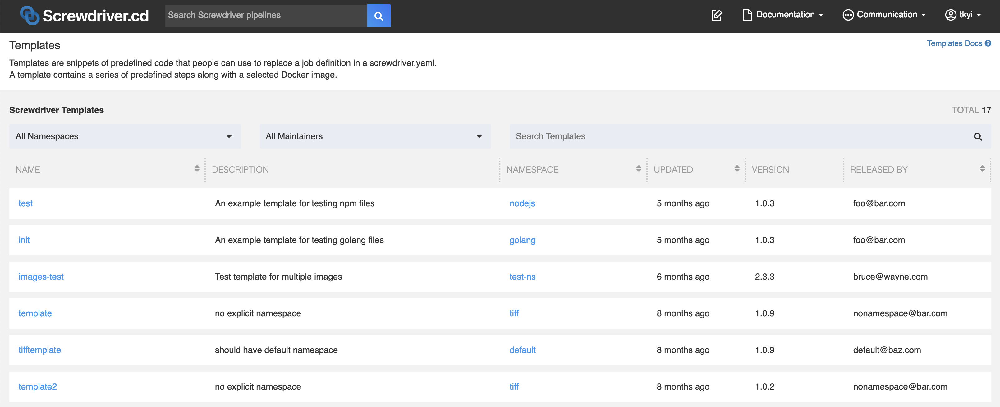

# テンプレート

テンプレートは、ユーザーが[screwdriver.yaml](./configuration)でジョブを設定する代わりに使用できる定義済みのコードのスニペットです。
テンプレートには、一連の定義済みのステップとDockerイメージが含まれます。

## テンプレートを検索する

既に作成済みのテンプレートを見つけるには、`GET` メソッドで `/templates` [API](./api)エンドポイントにアクセスしてください。またこちらのパス`<YOUR_UI_URL>/templates`にアクセスすることでテンプレートを確認できます。

テンプレートページの例:


## テンプレートを利用する

テンプレートを利用するためには、`screwdriver.yaml`に`template`を定義します。以下の例では、[nodejs/test template](https://cd.screwdriver.cd/templates/nodejs/test)を使用しています。

`screwdriver.yaml`の例:

```yaml
jobs:
    main:
        requires: [~pr, ~commit]
        template: nodejs/test@1.0.4
```

バージョンは[semver](https://semver.org/)互換です。例えば上記のテンプレートでは`nodejs/test@1`や`nodejs/test@1.0`と指定できます。

テンプレートにタグがある場合は、タグバージョンを使用してテンプレートのバージョンを参照することもできます。全てのバージョンとタグはテンプレート詳細ページの下部に表示されており、[テンプレートの例](https://cd.screwdriver.cd/templates/nodejs/test)では`latest`と`stable`のタグが登録されていることがわかります。

ほとんどのテンプレートは、最後に公開されたバージョンを`latest`としてタグ付けし、多くのテンプレートは自動テストや人手によるチェックによって`stable`タグに更新しています。これはフローティングタグであるため、ジョブで使用した場合にテンプレートが提供する振る舞いが突然変更される可能性があります。

テンプレートのバージョンが指定されていない場合は、最後に公開されたバージョンが使用されます。これは通常、`latest`タグを指定することと同義です。一般的には`latest`を暗黙的に使用するよりも、テンプレートのバージョンを明示する方が適切です。

テンプレートの予期しない変更を回避する最も信頼できる方法は、テンプレートの特定のバージョンを明示的に指定することです。例えば、`nodejs/test@1.0.4`は不変な特定のバージョンのテンプレートへの参照を表しています。`nodejs/test@1.0`などと記述すると、`nodejs/test@1.0.5`が利用可能となったときにそれを使用しますが、振る舞いが予期せず変更される可能性があります。

## バージョン/タグの意味

テンプレートのバージョンは様々な方法で参照でき、振る舞いを固定するか、テンプレート管理者による機能改善を自動的に取り込むかがユーザーのトレードオフとして現れます。上記の例は[nodejs/testテンプレート](https://cd.screwdriver.cd/templates/nodejs/test)の例を参照してください。

* `nodejs/test@latest` - これは後方互換性のない変更や、メジャーバージョンの変更などにも関わらず、最後に公開されたテンプレートのバージョンを使用します。`latest`タグは主にテンプレートの管理者のみが使用すべきであり、本番や重要なビルドには適していない可能性があります。
* `nodejs/test@stable` - これは管理者が一般的な使用に十分安定していると判断したバージョンのテンプレートを使用します。`stable`タグを利用しているユーザーに対して振る舞いの大幅な変更が現れる場合があります。`stable`タグの変更に後方互換性がない場合、テンプレート管理者はユーザーとコミュニケーションをとる必要があります。
* `nodejs/test@1` - これは2.0.0未満の最新バージョンの`nodejs/test`を使用します。本質的には指定されたメジャーバージョンを超えない`latest`タグということです。
* `nodejs/test@1.0` - これは1.1.0未満の最新バージョンの`nodejs/test`を使用します。本質的には指定されたマイナーバージョンを超えない`latest`タグということです。
* `nodejs/test@1.0.4` - これはパイプラインの振る舞いを固定する最も確実な方法であり、将来的なテンプレートの変更に対して影響を受けません。

#### 例

このような設定があったとします。
```yaml
jobs:
    main:
        requires: [~pr, ~commit]
        template: nodejs/test@stable
```

Screwdriverはテンプレートの設定を読み込み、`screwdriver.yaml`は以下のようになります。

```yaml
jobs:
    main:
        image: node:8
        requires: [~pr, ~commit]
        steps:
          - install: npm install
          - test: npm test
        environment:
            FOO: bar
        secrets:
              - NPM_TOKEN
```
## テンプレートのステップを上書き

ジョブは既存のステップをラップや置換をすることで、テンプレートのステップを上書きできます。

### ラップする

ラップとは定義済みのステップの前、もしくは後に実行するコマンドを追加することを指します。
テンプレートで定義済みのステップをラップするには、`pre` もしくは `post` をステップ名の前に追加します。

例:

```yaml
jobs:
    main:
        requires: [~pr, ~commit]
        template: nodejs/test@1.0.3
        steps:
            - preinstall: echo pre-install
            - postinstall: echo post-install
```

この例では、`echo pre-install` が テンプレートの
`install` ステップの前に、`echo post-install` が  `install`  ステップの後に実行されます。

### 置換

テンプレートで定義済みのステップを置換するには、定義されているステップと同じ名前のステップを追加します。

例:

```yaml
jobs:
    main:
        requires: [~pr, ~commit]
        template: nodejs/test@1.0.3
        steps:
            - install: echo skip installing
```

この例では、`echo skip installing` が `install` ステップで実行されます。

注意：[ロックされたステップ](#ロックされたテンプレートステップ)の置き換えはできません。

テンプレートで定義済みのイメージを置換することも出来ます。テンプレートのステップは、置換された後のイメージが持っていないコマンドや環境変数に依存しているかもしれないので、イメージの置換を行う際は注意してください。

#### 例

```yaml
jobs:
    main:
        requires: [~pr, ~commit]
        image: node:latest
        template: nodejs/test@1.0.3
```

### sharedステップをマージ

テンプレートのステップを上書きする場合、ジョブは `shared.steps` または `job.steps` のいずれかのステップ定義を使用し、 `jobs` セクションで定義した `steps` が優先されます。これはテンプレートを使用しない場合のステップ定義の優先順位と同じです。この挙動は[アノテーション](./configuration/annotations)の `screwdriver.cd/mergeSharedSteps: true` で変更することができます。テンプレートを使用している場合に `true` を設定すると、 `shared` セクションと `job` セクションのステップはマージされます。

#### 例
次の例では、`image`と`steps`のマージされた構成を定義し、それをmainとmain2のジョブが使用します。


```yaml
shared:
    image: node:8
    steps:
        - init: npm install
        - pretest: npm lint
        - test: npm test
jobs:
    main:
        requires: [~pr, ~commit]
        image: node:6
    main2:
        annotations:
            screwdriver.cd/mergeSharedSteps: true
        requires: [main]
        steps:
            - test: echo Skipping test
```

上記の例では、次のようになります。  

```yaml
jobs:
    main:
        requires: [~pr, ~commit]
        image: node:6
        steps:
             - init: npm install
             - pretest: npm lint
             - test: npm test
    main2:
        annotations:
             screwdriver.cd/mergeSharedSteps: true
        requires: [main]
        image: node:8
        steps:
             - pretest: npm lint
             - test: echo Skipping test
```

### 順序
設定でテンプレートを使用する場合、テンプレートで定義されたステップと自分の設定で定義されたステップを `order` フィールドで選択することができます。  
このフィールドは、ステップ名の順序付き配列として定義されます。  

`order`を使用する際の注意点:
- `order`は、`template`が使用されているときにのみ使用できます。
- 見つからないステップはスキップされます。
- ユーザー定義の `teardown-` ステップは常に残りのステップが終了した後に実行されます。
- このフィールドでは、ステップの暗黙のラッピング（pre/post）は機能しません。
- 重複するステップの定義を決定する際の優先順位は次のようになります： job > template
- Annotation `screwdriver.cd/mergeSharedSteps: true` を設定すると、優先順位は job > shared > template となります。

例 `sd-template.yaml`:  
```yaml
namespace: nodejs
name: publish
version: "2.0.1"
description: 'Publish an npm package'
maintainer: myname@foo.com
images:
  stable: node:8
  latest: node:12
config:
  image: stable
  steps:
    - install: npm install
    - publish: npm publish
    - coverage: coverage test.js
```

例 `screwdriver.yaml`:  
```yaml
jobs:
  main:
    requires: [~commit]
    image: stable
    template: nodejs/publish@2
    order: [clone, install, doesnotexist, test, publish, coverage]
    steps:
      - test: npm test
      - clone: git clone https://github.com/screwdriver-cd/toolbox.git ci
      - coverage: ./ci/coverage.sh
```

結果:  
```yaml
jobs:
  main:
    requires: [~commit]
    image: node:8
    steps:
      - clone: git clone https://github.com/screwdriver-cd/toolbox.git ci
      - install: npm install
      - test: npm test
      - publish: npm publish
      - coverage: ./ci/coverage.sh  #  このステップは、ジョブによって上書きされました
```
## テンプレートを作成する

テンプレートの作成と利用は、Screwdriverのパイプラインから実行する必要があります。

### テンプレート yaml を書く

テンプレートを作成するために、`sd-template.yaml` を含んだ新しいリポジトリを作成します。yamlには、テンプレートのネームスペース、名前、バージョン、説明、管理者のメールアドレス、使用するイメージと実行するステップの設定が必要です。ネームスペースが指定されていない場合、`default` のネームスペースが適用されます。オプションとして、`images`キーワードでサポートされてるイメージをラベル付きのリストで定義することもできます。基本的な例は[screwdriver-cd-test/template-example repo](https://github.com/screwdriver-cd-test/template-example)にあります。

`sd-template.yaml`の例:

```yaml
namespace: myNamespace
name: template_name
version: '1.3'
description: template for testing
maintainer: foo@bar.com
images:
    stable-image: node:12
    latest-image: node:14
config:
    image: stable-image
    steps:
        - install: npm install
        - test: npm test
    environment:
        FOO: bar
    secrets:
        - NPM_TOKEN
```

#### テンプレートのイメージ
`images`に指定することで、サポートしているイメージをラベルやエイリアス付きで設定することができます。

例:
```yaml
namespace: myNamespace
name: template_name
version: '1.3'
description: template for testing
maintainer: foo@bar.com
images:
    stable-image: node:12
    latest-image: node:8
```

以下のように、リストからエイリアスを使用することもできます。

```yaml
jobs:
    main:
        template: myNamespace/template_name@1.3.0
        image: stable-image
```

サンプルリポジトリ: <https://github.com/screwdriver-cd-test/template-images-example>

#### テンプレートのステップ

ステップ名に、[ラップする](#テンプレートを利用する)接頭語(`pre`や`post`)を使用しないでください。利用者がステップを変更したり補強する際に問題が発生します。例として、テンプレートが以下のステップを持っていたとします。

```yaml
config:
    image: node:12
    steps:
        - preinstall: echo Installing
        - install: npm install
        - test: npm test
```

そして、利用者が以下の追加のステップを利用しようとします。

```yaml
jobs:
    main:
        template: myNamespace/template_name@1.3.0
        steps:
          - preinstall: echo foo
```

この場合、利用者が`preinstall`を上書きしようとしているのか、`install`を補強しようとしているのかわからなくなります。

#### ロックされたテンプレートステップ
ステップに `locked` キーを追加することで、上書きできず、`order` を使用する際に必ず含まれるステップを指定することができます。  
このキーにはブール値（`true`/`false`、デフォルトは`false`）を指定します。  
このフラグは、このテンプレートを使用するすべてのテンプレートやジョブに適用されます。  
ロックされたステップを持つテンプレートを使用するすべてのテンプレートは、同じロックされたステップを持つことになります。  

```yaml
config:
    image: node:12
    steps:
        - preinstall: echo Installing
        - install: npm install
        - test:
            command: npm test
            locked: true 
```

### テンプレート合成
`sd-template.yaml`ファイルの`config`セクションでテンプレートを使用することもできます。

注意事項:
- `order`は、`template`が使用されている場合にのみ使用することができます。
- 見つからないステップはスキップされます。
- ユーザー定義の `teardown-` ステップは、常に残りのステップが終了した後に実行されます。
- このフィールドでは、ステップ（pre／post）の暗黙のラッピングは機能しません。
- 重複するステップの定義を決定する際の優先順位は、現在のテンプレート＞既存のテンプレートです。
- また、`sd-template.yaml`で`template`を使用すると、`images`フィールドもマージされます。

既存の例 `sd-template.yaml`:  
```yaml
namespace: nodejs
name: publish
version: "2.0.1"
description: 'Publish an npm package'
maintainer: myname@foo.com
images:
  stable: node:8
  latest: node:12
config:
  image: stable
  steps:
    - install: npm install
    - publish: npm publish
    - coverage: coverage test.js
```
例 `sd-template.yaml`:  
```yaml
namespace: d2lam
name: personal
version: "1.0.2"
description: 'Do some stuff'
maintainer: d2lam@foo.com
images:
  test: node:18
config:
  template: nodejs/publish@2
  image: stable
  order: [clone, install, doesnotexist, test, publish, coverage]
  steps:
    - test: npm test
    - clone: git clone https://github.com/screwdriver-cd/toolbox.git ci
    - coverage: ./ci/coverage.sh
```

結果:  
```yaml
namespace: d2lam
name: personal
version: "1.0.2"
description: 'Do some stuff'
maintainer: d2lam@foo.com
images:
  stable: node:8
  latest: node:12
  test: node:18
config:
  image: stable
  steps:
    - clone: git clone https://github.com/screwdriver-cd/toolbox.git ci
    - install: npm install
    - test: npm test
    - publish: npm publish
    - coverage: ./ci/coverage.sh  # このステップは、d2lam/personalテンプレートによって上書きされました
```

### テンプレートリポジトリ用の screwdriver.yaml を書く

#### テンプレートの検証

テンプレートをバリデートするために、`template-validate` という npm モジュールを  `main` ジョブで実行します。これは、ビルドに利用するイメージは Node.js と NPM が正しくインストールされている必要があるということです。テンプレートをパブリッシュするために、同様のモジュールに含まれている
`template-publish` を別のジョブで実行します。

デフォルトでは、`./sd-template.yaml` が読み込まれます。しかし、`SD_TEMPLATE_PATH` という環境変数を利用することで、任意のパスを指定することができます。  

また、<YOUR_UI_URL>/validator>にコピーペーストすることで、UIを通して`sd-template.yaml`と`screwdriver.yaml`を検証することができます。  

#### テンプレートのタグ付け

`screwdriver-template-main` という npm パッケージに含まれる `template-tag` スクリプトを実行することで、テンプレートの特定のバージョンに対してタグを指定することが可能です。この処理はタグ付けをしたいテンプレートを作成したパイプラインからのみ実行可能です。スクリプトの引数にはテンプレート名とタグを渡す必要があります。引数で特定のバージョンを指定してタグを付けることも可能です。その場合バージョンは正確なものである必要があります(`tag`のステップを参照)。バージョンを引数から省略した場合は最新のバージョンに対してタグ付けされます(`autotag`のステップを参照)。

タグを削除するには `template-remove-tag` を実行します。引数としてテンプレート名とタグを渡す必要があります。

`screwdriver.yaml`の例:

```yaml
shared:
    image: node:12
jobs:
    main:
        requires: [~pr, ~commit]
        steps:
            - install: npm install screwdriver-template-main
            - validate: ./node_modules/.bin/template-validate
        environment:
            SD_TEMPLATE_PATH: ./path/to/template.yaml
    publish:
        requires: [main]
        steps:
            - install: npm install screwdriver-template-main
            - publish: ./node_modules/.bin/template-publish
            - autotag: ./node_modules/.bin/template-tag --name myNamespace/template_name --tag latest
            - tag: ./node_modules/.bin/template-tag --name myNamespace/template_name --version 1.3.0 --tag stable
        environment:
            SD_TEMPLATE_PATH: ./path/to/template.yaml
    remove:
        steps:
            - install: npm install screwdriver-template-main
            - remove: ./node_modules/.bin/template-remove --name myNamespace/template_name
    remove_tag:
        steps:
            - install: npm install screwdriver-template-main
            - remove_tag: ./node_modules/.bin/template-remove-tag --name myNamespace/template_name --tag stable
```

Screwdriverのパイプラインをテンプレートリポジトリで作成し、テンプレートのバリデートとパブリッシュを行うためにビルドを開始します。

Screwdriverのテンプレートを更新するには、ご利用のSCMリポジトリに変更を加え、パイプラインのビルドを再度実行します。

## テンプレートをテストする

テンプレートをテストするために、[テンプレートテストのサンプル](https://github.com/screwdriver-cd-test/template-test-example/blob/master/screwdriver.yaml)のようにテンプレートを利用する別のパイプラインを作成することで、リモートテストを設定します。この例では、リモートトリガーを利用することで`publish_nodejs_template`が実行された後にパイプラインが実行されます。
_注意: イベント作成時にテンプレートが展開されるので、同じパイプラインでテンプレートをテストすることはできません。テンプレートの作成されたパイプライン内で使用しようとすると、古いバージョンのテンプレートが使用されます。_

## ビルドキャッシュを利用する

[ビルドキャッシュ](./configuration/build-cache)を利用するには、[store-cliコマンド](https://github.com/screwdriver-cd/store-cli)をステップ内で使用します。例えば、`node_modules/`フォルダをキャッシュする場合、`npm install`を実行するステップの前にキャッシュをダウンロードするステップを設定し、その後キャッシュをアップロードする別のステップを指定します。`teardown-`プレフィックスを使用して、キャッシュをアップロードするステップをteardownに移動することもできます。

```yaml
config:
    image: node:8
    steps:
        - getcache: store-cli get node_modules/ --type=cache --scope=event || echo "Failed to fetch Cache"
        - install: npm install
        - teardown-putcache: store-cli set node_modules/ --type=cache --scope=event || echo "Failed to publish Cache"
```

## テンプレートを削除する

### screwdriver-template-main npm package を使う
テンプレートを削除するために`template-remove`スクリプトを実行することができます。テンプレート名を引数に与える必要があります。

### UIを使う
または、テンプレートページのUIにあるゴミ箱アイコンをクリックすることで、テンプレートとそれに関連するすべてのタグおよびバージョンを削除できます。

_注意: 誰がテンプレートを削除する権限を持っているか判断するのに必要なため、事前にテンプレートのパイプラインを削除しないでください。_


