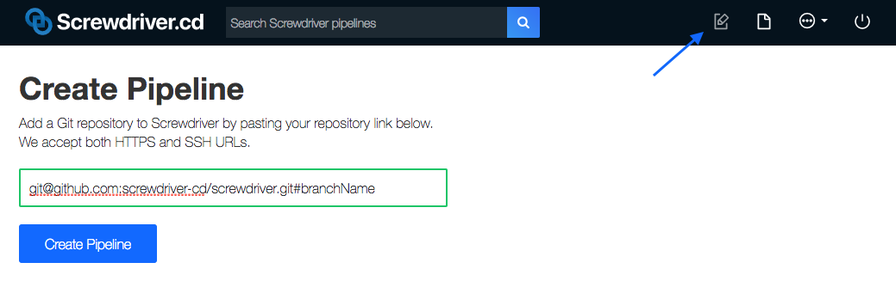
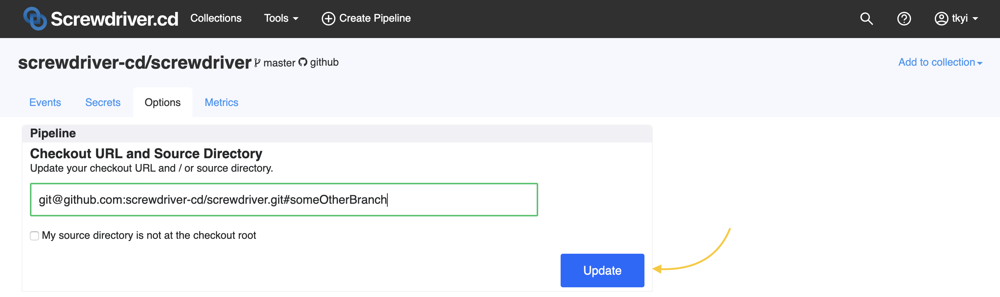
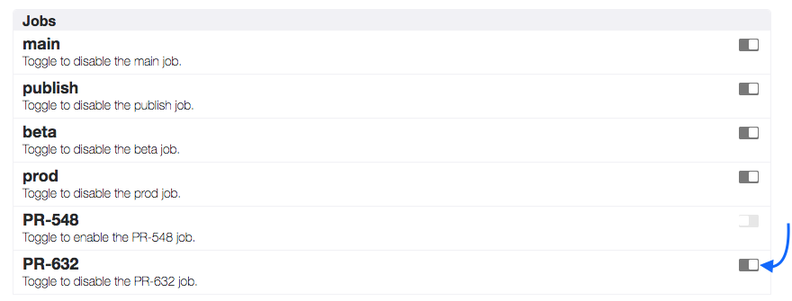
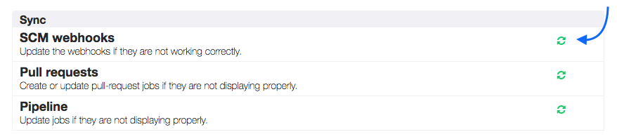
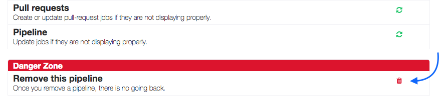
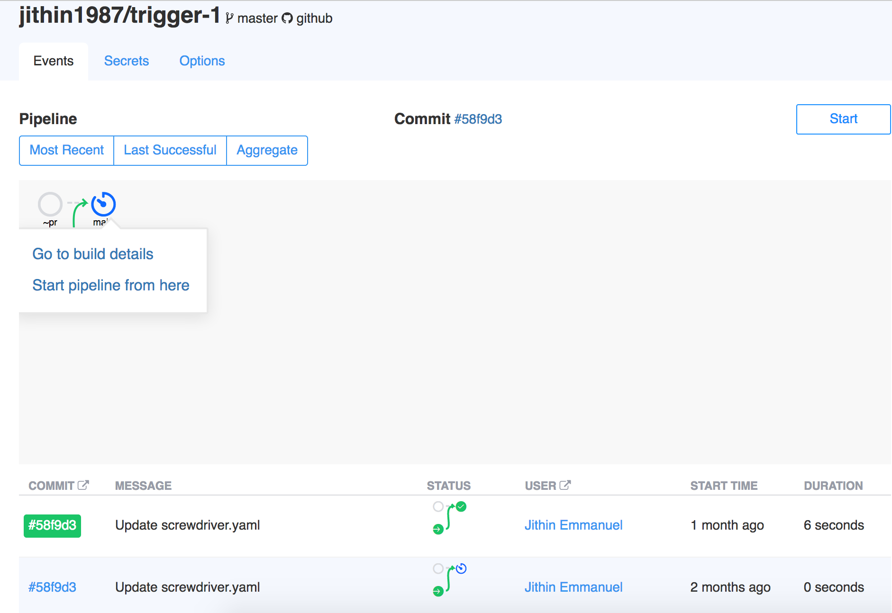
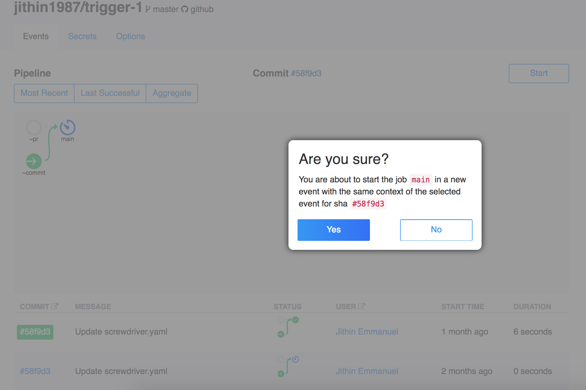

# Frequently Asked Questions

## How do I skip a build?

You might want to skip a build if you're only changing documentation.

 If you don't want Screwdriver to trigger a build when you're pushing to master, add `[ci skip]` or `[skip ci]` somewhere in the commit message. If you don't want Screwdriver to trigger a build when you merge a pull request, add `[ci skip]` or `[skip ci]` to the pull request title.

_Note: Doesn't apply to pull request builds: a commit message containing `[skip ci]` or `[ci skip]` will still trigger a pre-commit job (a PR job will always run)._

## How do I create a pipeline?

To create a pipeline, click the Create icon and paste a Git URL into the form. Followed by `#` and the branch name, if the branch is not `master`.

## How do I start a pipeline manually?

To start a build manually, click the Start button on your pipeline page. Starting a pipeline starts all jobs with `~commit` event trigger.

## How do I update a pipeline repo and branch?

If you want to update your pipeline repo and branch, modify the checkout URL in the Options tab on your pipeline page and click Update.

## How do I disable/enable a job temporarily?

To temporarily disable/enable a job to quickly stop the line, toggle the switch to disable/enable for a particular job under the Options tab on your pipeline page.

## How do I make sure my code is in sync with my pipeline?

If your pipeline looks out of sync after changes were made to it, to make sure it's in sync with your source code. On the Options tab in your pipeline page, click the Sync icon to update the out of sync elements. There are separate Sync icons for SCM webhooks, pull request builds, and pipeline jobs.

## How do I delete a pipeline permanently?

Individual pipelines may be removed by clicking the Delete icon on the Options tab in your pipeline page. This action is not undoable.

## How do I fix "Build failed to start" error message?

This is caused by a variety of reasons including cluster setup issue like hyperd down (if using executor vm) or a problem with your build image etc. Fixing this issue
requires different approaches based on what layer it's failing.

1. `/opt/sd/launch: not found` This issue affects Alpine based images because it uses musl instead of glibc. Workaround is to create the following symlink `mkdir /lib64 && ln -s /lib/ld-musl-x86_64.so.1 /lib64/ld-linux-x86-64.so.2` when creating your Docker image.
1. [A bug in hyperd](https://github.com/screwdriver-cd/screwdriver/issues/1081) sometimes causes images with `VOLUME` defined to fail to launch consistently in some certain nodes. One of these images is `gradle:jdk8`. The current workaround is to use other docker images, or to rebuild the gradle image using [this Dockerfile](https://github.com/keeganwitt/docker-gradle/blob/64a348e79cbe0bc8acb9da9062f75aca02bf3023/jdk8/Dockerfile) but excluding the `VOLUME` line.

## How do I rollback?

You can use one of two patterns to rollback: either rerunning a build in your pipeline or running a detached pipeline.

### How do I rerun a build?

To rerun a job's build from a past event, do the following steps.

1. Log in.
1. Click on the desired event from the event list, which loads the detailed event graph.
1. Then, click the job bubble you'd like to rerun. In the pop up, select “Start pipeline from here” to rerun that job using that event context.

### How do I run a detached pipeline?

To rollback, do the following steps. You'll most likely want to `meta set` an image name or version in your last job (in this example, job D) and `meta get` that name or version in your rollback job (in this example, detached). The detached job will have access to the metadata set in job D.

1. Log in.
1. Click on the desired event from the event list, which loads the detailed event graph.

1. Then, click the job bubble at the start of that detached pipeline. In the pop up, select “Start pipeline from here” to start the detached workflow with the desired event context.

1. Click Yes to rerun the pipeline from that job.

## How do I mark a build as UNSTABLE?

You can update a build with an `UNSTABLE` status by calling the [API](./api) in a build. You can [clone our example unstable build repository here](https://github.com/screwdriver-cd-test/unstable-build-example).

## What shell does Screwdriver use?

By default, step commands are evaluated with the Bourne shell (`/bin/sh`). You can specify a different shell (such as Bash) with the `USER_SHELL_BIN` [environment variable](./environment-variables#user-configurable).

## How do I speed up time to upload artifacts?
You can set the environment variable [`SD_ZIP_ARTIFACTS`](./environment-variables#user-configurable) to `true` which will zip artifacts before uploading, provided your cluster admin has set it up properly.

## How do I disable shallow cloning?
You can set the environment variable [`GIT_SHALLOW_CLONE`](./environment-variables#user-configurable) to `false` in order to disable shallow cloning.

By default Screwdriver will shallow clone source repositories to a depth of 50. Screwdriver will also enable the `--no-single-branch` flag by default.

If shallow cloning is left enabled and you wish to push back to your git repository, your image must contain a git version of 1.9 or later. Alternatively, you may use the version of git bundled with Screwdriver by invoking `sd-step exec core/git "GIT COMMAND"`.

## What are the minimum software requirements for a build image?

Screwdriver has no restriction on build container image. However the container should have at the minimum `curl` && `openssh` installed. And default user of the container should be either `root` or have sudo NOPASSWD enabled.

Also, if the `image` is Alpine-based, an extra workaround is required in the form of the following symlink. `mkdir -p /lib64 && ln -s /lib/ld-musl-x86_64.so.1 /lib64/ld-linux-x86-64.so.2`

## How do I integrate with Saucelabs?

Read about it on our blog post: https://blog.screwdriver.cd/post/161515128762/sauce-labs-testing-with-screwdriver
See the example repo: https://github.com/screwdriver-cd-test/saucelabs-example

## How do I run my pipeline when commits made from inside a build are pushed to my git repository?

Screwdriver uses `sd_buildbot` as default [git user](https://github.com/screwdriver-cd/screwdriver/blob/ec959e1590909259479fe34f2f26d91f227025aa/config/custom-environment-variables.yaml#L284). So when you do `git` commits from inside a build, the commit user will be `sd-buildbot`.

This has implications for webhook processing. In order to prevent headless users from running your pipeline indefinitely, Screwdriver cluster admins can configure Screwdriver webhook processor to ignore commits made by headless users. This is done by setting [IGNORE_COMMITS_BY](https://github.com/screwdriver-cd/screwdriver/blob/ec959e1590909259479fe34f2f26d91f227025aa/config/custom-environment-variables.yaml#L323-L325) environment variable. Default git user `sd-buildbot` is usually added to this list.

Users can override this behavior by using a different git user. For example `git config --global user.name my-buildbot`. With this, your `git` commits from a Screwdriver build will be associated with user `my-buildbot` and will run Screwdriver pipeline without getting ignored by webhook processor.
