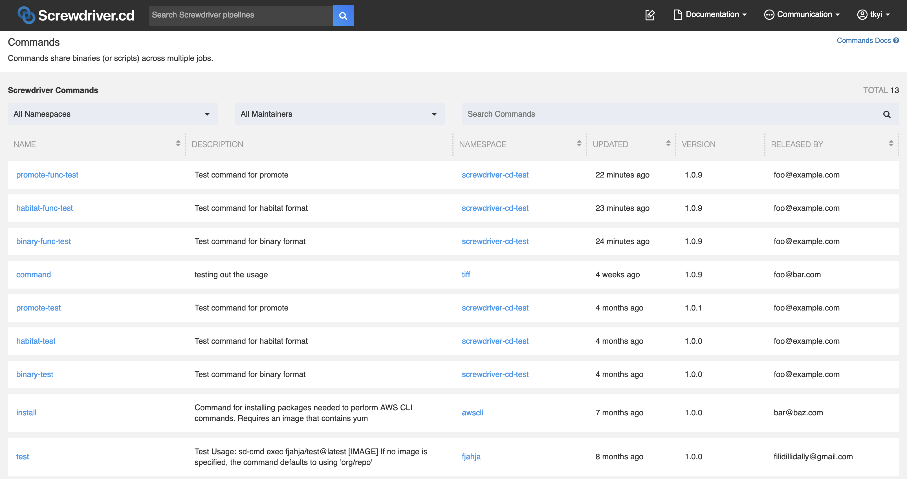
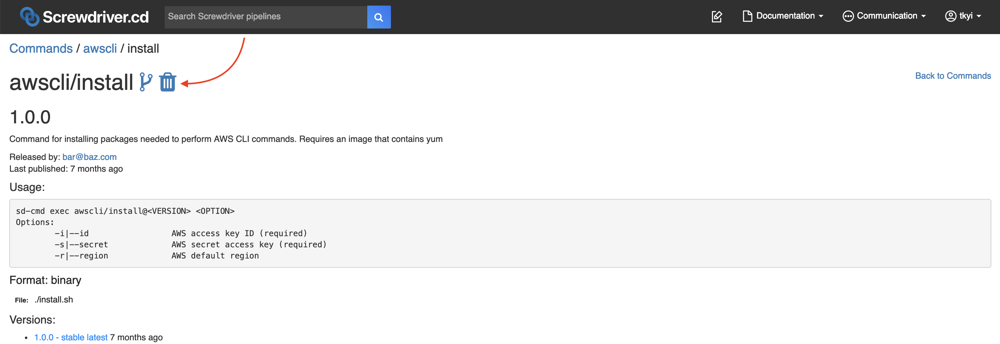

# Commands

Screwdriver commands are executables which can either be a group of [commands](https://en.wikipedia.org/wiki/Command_(computing)) in a script or a binary that people can use to replace a step definition in a [screwdriver.yaml](./configuration).

## Finding commands

To figure out which commands already exist, you can make a `GET` call to the `/commands` [API](./api) endpoint. You can also see commands in the UI at `<YOUR_UI_URL>/commands`.

Example commands page:


## Using a command

To use a command, define a `screwdriver.yaml` that uses the `sd-cmd` cli in a step with the format: `sd-cmd exec <namespace>/<name>@<version> <arguments>`.

__Input:__

- `namespace/name` - the fully-qualified command name
- `version` - a semver-compatible format or tag
- `arguments` - passed directly to the underlying format

__Output:__

All debug logs about the command lookup and execution are stored in `$SD_ARTIFACTS_DIR/.sd/commands/namespace/name/version/timestamp.log`

In this example, we are using the [awscli/install command](https://github.com/screwdriver-cd-test/command-example).

Example `screwdriver.yaml`:

```yaml
jobs:
    main:
        requires: [~pr, ~commit]
        image: node:6
        steps:
            - init: sd-cmd exec awscli/install@1.0 -i mySecretID -s secretAccessKey -r us-west-2
```

Screwdriver will download that binary or script from the Store, make it executable, and run it with the `-i mySecretID -s secretAccessKey -r us-west-2` arguments directly:
```
$ /opt/sd/commands/awscli/install/1.0.1/install.sh -i mySecretID -s secretAccessKey -r us-west-2
```

## Creating a command

Publishing and running commands must be done from a Screwdriver pipeline.

### Writing a command yaml

To create a command, create a repo with a `sd-command.yaml` file. The file should contain a namespace, name, version, description, maintainer email, format, and a config that depends on a format. Optionally, you can also set the usage field, which is used for documentation purposes in the UI. If not set, usage will default to `sd-cmd exec <namespace>/<name>@<version>`.

Binary `sd-command.yaml` example:
```yaml
namespace: foo # Namespace for the command
name: bar # Command name
version: '1.0' # Major and Minor version number (patch is automatic), must be a string
description: |
  Lorem ipsum dolor sit amet.
usage: |
  sd-cmd exec foo/bar@<VERSION> <OPTION> <TARGET>
  Options:
          --config              config file
          --debug               debug mode (default "false")
          --host                super host
          --log-level           set the logging level ("debug"|"info"|"warn"|"error"|"fatal") (default "info")
  Target:                       path to file
maintainer: foo@bar.com # Maintainer of the command
format: binary # Format the command is in (binary, habitat)
binary:
    file: ./foobar.sh # Relative path to script or binary file from sd-command.yaml file or absolute path to it.
```

Remote Habitat `sd-command.yaml` example:
```yaml
namespace: foo
name: bar
version: '1.0'
description: |
  Lorem ipsum dolor sit amet.
maintainer: foo@bar.com
format: habitat # Format the command is in (binary, habitat)
habitat:
    package: core/node8 # Package of the Habitat command
    mode: remote # Mode the Habitat command (remote, local)
    command: node # Executable of the Habitat command
```

Local Habitat `sd-command.yaml` example:
```yaml
namespace: foo
name: bar
version: '1.0'
description: |
  Lorem ipsum dolor sit amet.
maintainer: foo@bar.com
format: habitat # Format the command is in (binary, habitat)
habitat:
    package: core/node8 # Package of the Habitat command
    mode: local # Mode of the Habitat command (remote, local)
    file: ./foobar.hart # Relative path to the .hart file from sd-command.yaml file or absolute path to it.
    command: node # Executable of the Habitat command
```

#### Caveats
- Cannot do the following in a pull request: publish a command, create a tag, delete a tag or command
- A command can only be published by one pipeline

### Writing a screwdriver.yaml for your command repo

To validate your command, run the `sd-cmd validate` command. `-f` stands for file (default `sd-command.yaml`).

To publish your command, run the `sd-cmd publish` command in a separate job. `-f` stands for file (default `sd-command.yaml`). `-t` stands for tag (default `latest`).

To tag your command, run the `sd-cmd promote` command with the format: `sd-cmd promote <namespace>/<name> <version> <tag>`. You can set exact version or tag (e.g. 1.0.1, latest) at `<version>`.

Example `screwdriver.yaml`:
```yaml
shared:
    image: node:8
jobs:
    main:
        requires: [~pr, ~commit]
        steps:
            - validate: sd-cmd validate -f sd-command.yaml
    publish:
        requires: [main]
        steps:
            - publish: sd-cmd publish -f sd-command.yaml -t latest
    promote:
        requires: [publish]
        steps:
            - promote: sd-cmd promote foo/bar latest stable
```

## Removing a command

You can remove your command and all its associated tags and versions by clicking on the trash icon in the UI on the command page.

_Note: Do not delete your command pipeline beforehand, because it is required to determine who has permission to delete the command._



## More links
- [Design specifications](https://github.com/screwdriver-cd/screwdriver/blob/master/design/commands.md)*

_*May be out of date._
