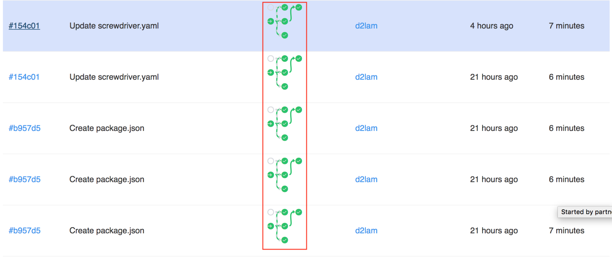
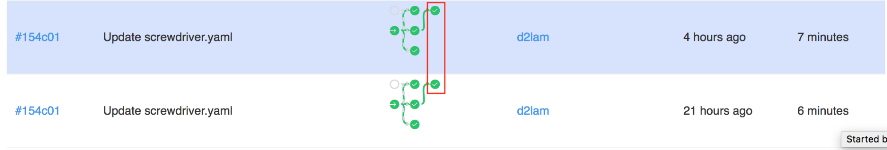

# Build Cache
Top-level setting that contains file paths from your build that you would like to cache. The cache is stored in a build's teardown bookend and restored in a build's setup bookend. You can limit access to the cache using the pipeline, event or job scope.

| Scope  | Access |
|---|---|
| pipeline  | All builds in the same pipeline   |
| event  | All builds in the same event  |
| job  | All builds for the same job  |

## Example

```yaml
cache:
   pipeline: [~/.gradle]
   event: [$SD_SOURCE_DIR/node_modules]
   job:
       usejobcache: [/tmp/test]

jobs:
    setnpmcache:
        image: node:6
        steps:
            - install: npm install
        requires: [~commit, ~pr]
    usenpmcache:
        image: node:6
        steps:
            - ls: ls
            - install: npm install
        requires: [setnpmcache]
    usegradlecache:
        image: java:7
        steps:
            - ls: ls ~/
            - install: git clone https://github.com/gradle-guides/gradle-site-plugin.git && cd gradle-site-plugin && ./gradlew build
        requires: [~commit, ~pr]
    usejobcache:
        image: node:6
        steps:
            - ls-tmp: ls /tmp
            - echo: echo hi > /tmp/test
        requires: [~commit, ~pr]
```

In the above example, the pipeline-scoped `.gradle` cache can be accessed under all builds in the pipeline to save time on `gradle install`. For event-scoped cache, we cache the `node_modules` folder under the event scope in the `setnpmcache` build so that the downstream `usenpmcache` build can save time on `npm install`. For job-scoped cache, we cache `/tmp/test` file so that it is available for any subsequent builds of the same job.

Example repo: https://github.com/screwdriver-cd-test/cache-example

## Notes
- If your cache is large and the cache bookend runs out of memory, you can set the `screwdriver.cd/ram` [annotation](./annotations) to `HIGH` to provide more memory to the build.
