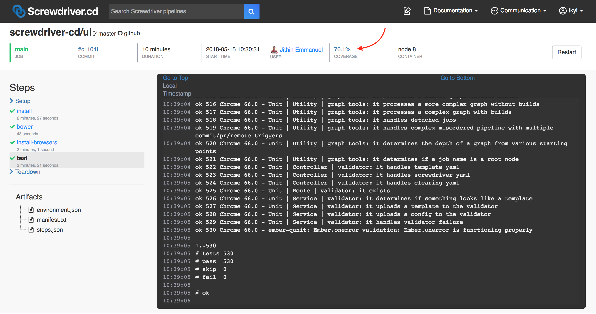

# Code Coverage

After they're done running, builds can display code coverage percentage in the build UI and upload code coverage data.



We currently support [SonarQube](https://github.com/screwdriver-cd/coverage-sonar) for coverage bookends. Check with your Screwdriver cluster admin to find what coverage plugins are supported to modify your build execution with.

## SonarQube

You can configure Sonar properties in your `sonar-project.properties` file or in your screwdriver.yaml as the `$SD_SONAR_OPTS` environment variable. The property `sonar.sources` is always required, and should be set to your source path.

### sonar-project.properties

To use SonarQube, add a `sonar-project.properties` file in the root of your source code and add configurations there.

Example `sonar-project.properties` file from our [Javascript example](https://github.com/screwdriver-cd-test/sonar-coverage-example-javascript):
```
sonar.sources=index.js
sonar.javascript.lcov.reportPaths=artifacts/coverage/lcov.info
```

The `reportPath` property depends on the language used. Check the [SonarQube documentation](https://docs.sonarqube.org/latest/instance-administration/plugin-version-matrix) to figure out the right syntax.

### $SD_SONAR_OPTS

Alternatively, you can add configurations to the environment variable `$SD_SONAR_OPTS`.

Example `screwdriver.yaml`:

```yaml
shared:
  environment:
    SD_SONAR_OPTS: '-Dsonar.sources=lib -Dsonar.javascript.lcov.reportPaths=artifacts/coverage/lcov.info'
jobs:
  main:
    requires: [~pr, ~commit]
    image: node:14
    steps:
      - install: npm install
      - test: npm test
```

#### Notes

- If you define the same property in both the `sonar-project.properties` file and `$SD_SONAR_OPTS`, `$SD_SONAR_OPTS` will override the properties file.
- Screwdriver sets the following properties for you: `sonar.host.url`, `sonar.login`, `sonar.projectKey`, `sonar.projectName`, `sonar.projectVersion`, `sonar.links.scm`, `sonar.links.ci`; **you must set `sonar.sources` yourself**.
- By default, coverage is not sent for private pipelines. If you want to send coverage, please set `SD_ALLOW_PRIVATE_COVERAGE_SEND` to `true`

### Use a self-hosted SonarQube

You can upload code coverage to a host that is not configured for the Screwdriver cluster by setting the Sonar host URL in the environment variable `$SD_SELF_SONAR_HOST`.  
If you use `$SD_SELF_SONAR_HOST`, you must set the admin's User Token for that host in the environment variable `$SD_SELF_SONAR_ADMIN_TOKEN`.

Example `screwdriver.yaml`:

```yaml
jobs:
  main:
    requires: [~pr, ~commit]
    image: node:14
    steps:
      - install: npm install
      - test: npm test
  environment:
    SD_SELF_SONAR_HOST: 'http://YOUR_SONAR_URL'
  secrets:
    - SD_SELF_SONAR_ADMIN_TOKEN
```

#### Notes

- If you upload code coverage to `$SD_SELF_SONAR_HOST`, the code coverage percentage displayed on the UI will be `N/A`.

#### Related links
- [SonarQube properties](https://docs.sonarqube.org/latest/analysis/analysis-parameters)
- [Java example](https://github.com/screwdriver-cd-test/sonar-coverage-example-java)
- [Javascript example](https://github.com/screwdriver-cd-test/sonar-coverage-example-javascript)
- [Examples from the SonarQube website](https://github.com/SonarSource/sonar-scanning-examples)
- [SonarQube docs](https://docs.sonarqube.org/latest/analysis/scan/sonarscanner/)
- [SonarQube environment variables](../environment-variables#coverage-sonar)

### GitHub pull request decoration
If your Screwdriver cluster supports Sonar Enterprise, you might have the ability to add [Pull Request decoration](https://docs.sonarqube.org/latest/analyzing-source-code/pull-request-analysis/) to Checks in GitHub. If this feature is supported, you can enable it by adding the Screwdriver Sonar PR Checks GitHub app to your repository. Check with your Screwdriver cluster admin for support details.
