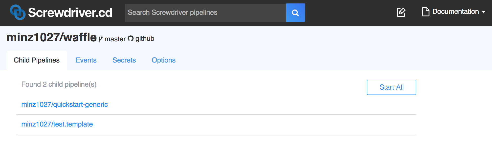
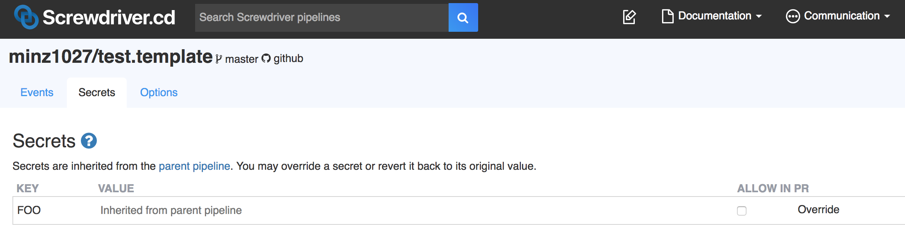

# External Config
External config allows a single parent pipeline to create and manage the build configuration of other "child" pipelines with a single `screwdriver.yaml`. The source code for each child pipeline will be taken from each child repository.

This feature allows easier management of multiple repositories with the same workflow.

## Configure external config in parent pipeline
In your parent repository's `screwdriver.yaml`, you can define child pipelines with the keyword `childPipelines`. Screwdriver will create or delete child pipelines on your behalf based on the listed `scmUrls`. Please make sure you have **admin** access in each child repository in order to manage child pipelines through this feature.

```yaml
childPipelines:
   scmUrls:
      - git@github.com:minz1027/test.template.git
      - git@github.com:minz1027/quickstart-generic.git#master

jobs:
    main:
        image: node:8
        steps:
            - install: npm install
            - publish: npm publish
```

## Parent and Child Relationship

| Pipeline      | Permissions   |
| ------------- |:-------------:|
| Parent     | All actions on its own pipeline plus create/delete/update/start child pipelines |
| Child      | All actions on its own pipeline except delete/update itself; also, secrets are inherited from the parent pipeline by default but can be overwritten |

Builds for child pipeline will have access to parent pipeline's repository at [`$SD_CONFIG_DIR`](../environment-variables#directories).

## User Interface
Parent pipeline UI:


Child pipeline UI:

