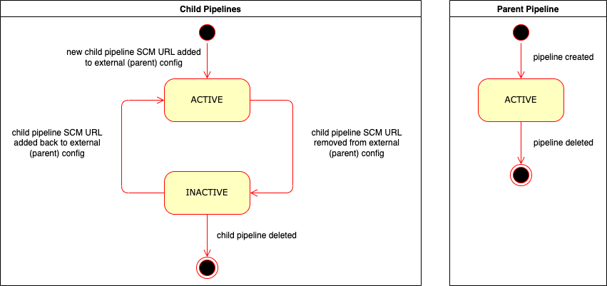
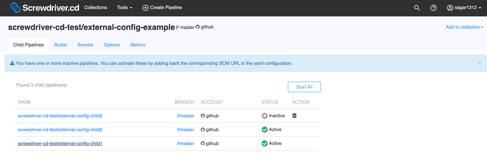
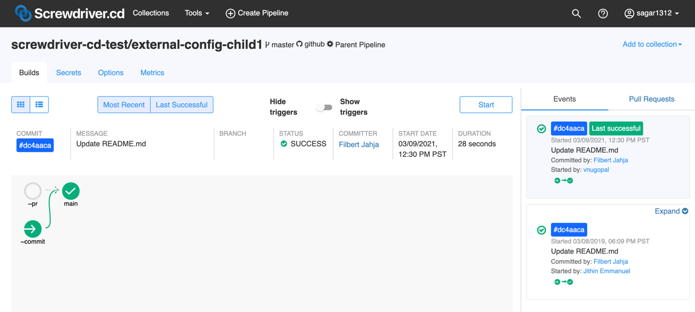
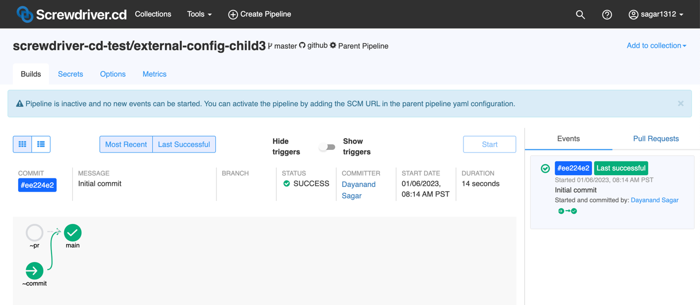
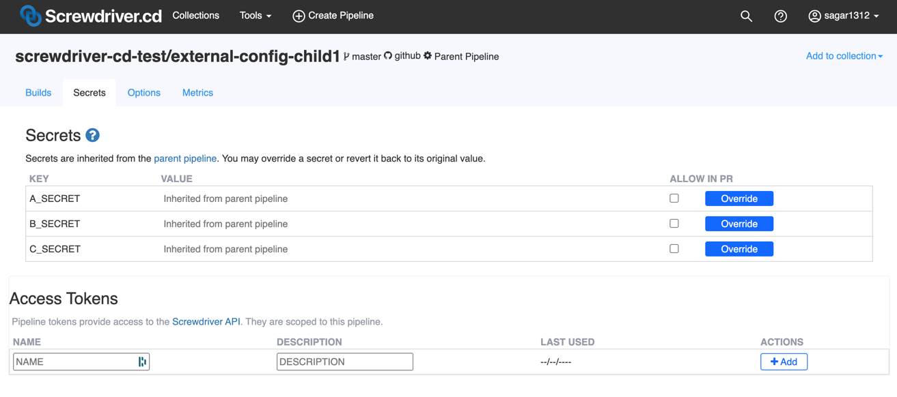

# External Config
External config allows a single parent pipeline to create and manage the build configuration of other "child" pipelines with a single `screwdriver.yaml`. The source code for each child pipeline will be taken from each child repository.

This feature allows easier management of multiple repositories with the same workflow.

> Please note that a repository can only be added as a child if there are no pipelines already configured for the repository.

## Configure external config in parent pipeline
In your parent repository's `screwdriver.yaml`, you can define child pipelines with the keyword `childPipelines`. Screwdriver will create or delete child pipelines on your behalf based on the listed `scmUrls`. Please make sure you have **admin** access in each child repository in order to manage child pipelines through this feature.

```yaml
childPipelines:
   scmUrls:
      - git@github.com:minz1027/test.template.git
      - git@github.com:minz1027/quickstart-generic.git#main
      # can have child pipeline with source dir not at checkout root by adding :<sourceDir> at the end of the scmUrl
      - git@github.com:minz1027/quickstart-generic.git#main:path/to/subdir
      # read-only SCM. Check with your cluster admin for availability
      - https://sd.gitlab.com/screwdriver-cd/data-schema.git

jobs:
    main:
        image: node:lts
        steps:
            - install: npm install
            - publish: npm publish
```

## Parent and Child Relationship

| Pipeline      | Permissions   |
| ------------- |:-------------:|
| Parent     | All actions on its own pipeline plus create/delete/update/start child pipelines |
| Child      | All actions on its own pipeline except delete/update itself; also, secrets are inherited from the parent pipeline by default but can be overwritten |

Builds for child pipeline will have access to parent pipeline's repository at [`$SD_CONFIG_DIR`](../environment-variables#directories).

## Manage Child Pipelines
When a child pipeline SCM URL is added to the parent pipeline `screwdriver.yaml`, child pipeline gets created with `ACTIVE` state.

When a child pipeline SCM URL is removed from the `screwdriver.yaml` of the parent pipeline, the child pipeline's state will be set to `INACTIVE`.
Parent pipeline admins can review and take necessary action on these inactive child pipelines by either:
* reactivating the pipeline by restoring the SCM URL in the `screwdriver.yaml` of the parent pipeline 
* explicitly deleting the pipeline from the UI/API



## User Interface
### Parent pipeline UI:


### Child pipeline UI:
#### An active child pipeline:


#### An inactive child pipeline:
Operations on inactive child pipeline are limited.
* New event/build cannot be created



#### Child pipeline inherits parent pipeline secrets:


Example repo: <https://github.com/screwdriver-cd-test/external-config-example>
