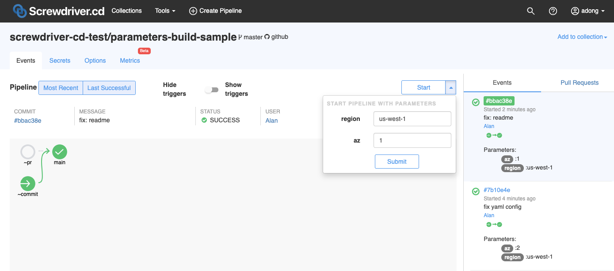
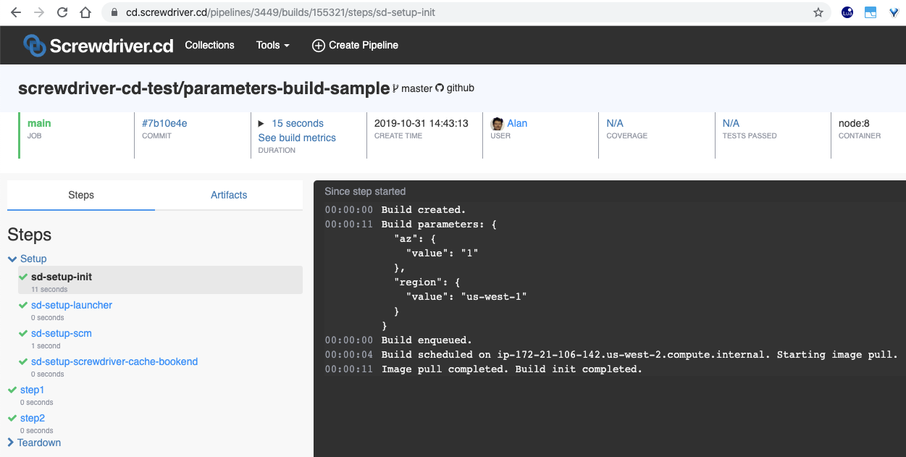
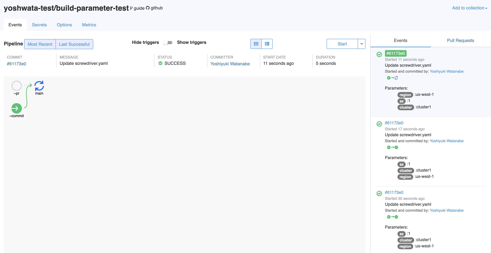

## Parameters Definition
There are 2 ways of defining parameters, see:

```yaml
paramters:
    nameA: "value1"
    nameB:
        value: "value2"
        description: "description of nameB"
```

**Parameters** is a dictionary which expects `key:value` pairs.

```yaml
parameters:
    nameA: "value1"
```

`key: string` (see example above) is a shorthand for writting as `key:value` (see example below).

```yaml
parameters:
    nameA:
    value: "value1"
    description: ""
```

These two examples above are equivalent.

## Example
You can see a full screwdriver.yaml example below:
```yaml
shared:
    image: node:8

parameters:
    region: "us-west-1"
    az:
        value: "1"
        description: "default availability zone"

jobs:
    main:
        requires: [~pr, ~commit]
        steps:
            - step1: 'echo "Region: $(meta get parameters.region.value)"'
            - step2: 'echo "AZ: $(meta get parameters.az.value)"'
```

You can also preview the parameters that are used during a build in the `Setup` -> `sd-setup-init` step.

Pipeline Preview Screenshot:







Please see [parameters-build-sample](https://github.com/screwdriver-cd-test/parameters-build-sample) as example.
