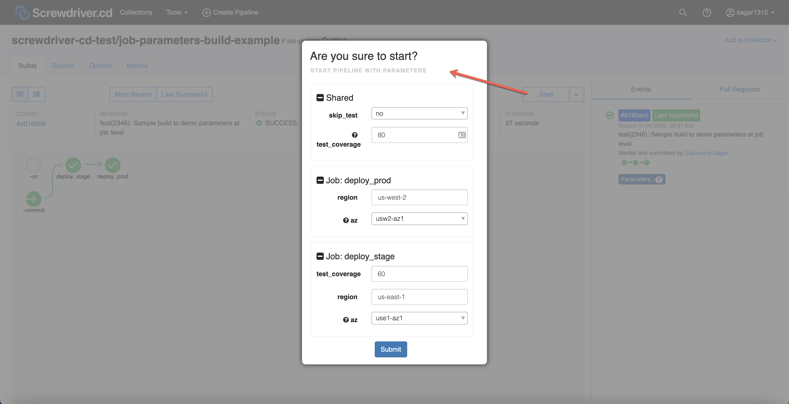
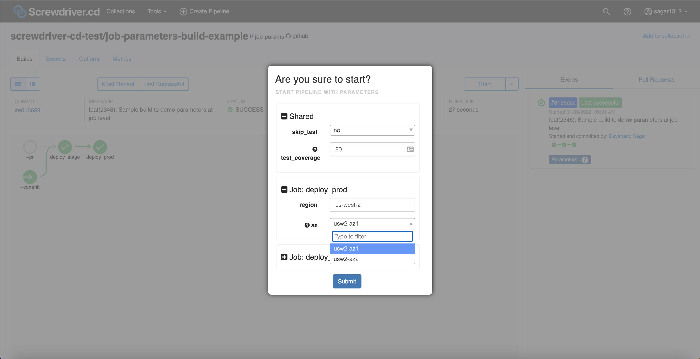
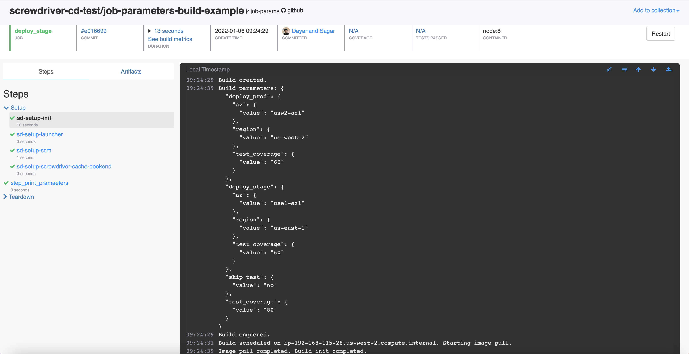
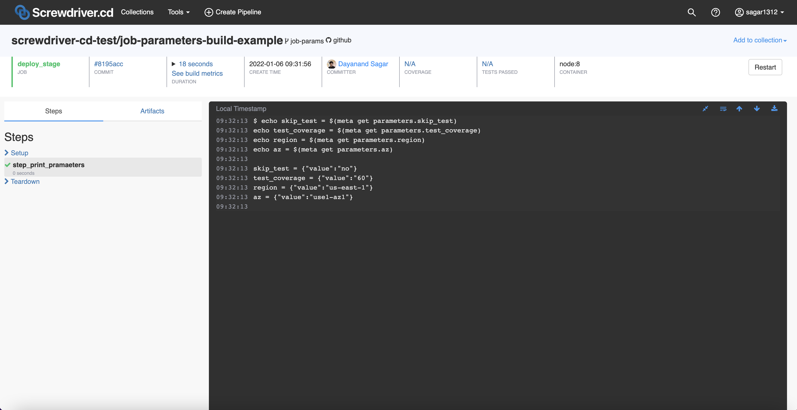
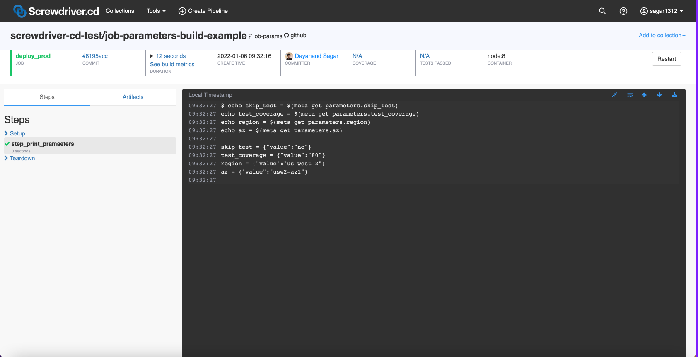

## Defining Parameters
There are 3 ways to define parameters, you can see them in the example below:

```yaml
parameters:
    nameA: "value1"
    nameB:
        value: "value2"
        description: "description of nameB"
    nameC: ["value1", "value2"]
```

**Parameters** is a dictionary which expects `key:value` pairs.

```yaml
parameters:
    nameA: "value1"
```

`key: string` (see example above) is a shorthand for writing as `key:value` (see example below).

```yaml
parameters:
    nameA:
        value: "value1"
        description: ""
```

These two examples above are equivalent.

You can also define parameters in an array for drop down options. The first value in the array is picked up as default, e.g `value1` is selected as default in the example below:

```yaml
parameters:
    nameA: ["value1", "value2"]
```
## Scope
Parameters can be defined at two scopes:
 - Pipeline
    - Parameters defined at pipeline level are available to all the jobs
 - Job
    - Parameters defined at job level are exclusively available to that job.
    - Parameters with the same name defined at different jobs do not conflict.
    - When a parameter with the same name is defined at both pipeline and job scopes, value at job scope supercedes the value at pipeline scope.
 

## Example
You can see a full screwdriver.yaml example below:
```yaml
shared:
  image: node:8

parameters:
  skip_test: ["no", "yes"]
  test_coverage:
    value: "80"
    description: "test coverage threshold percentage"

jobs:
  deploy_stage:
    requires: [~pr, ~commit]
    parameters:
      test_coverage: "60"
      region: "us-east-1"
      az:
        value: ["use1-az1", "use1-az2"]
        description: "availability zone"
    steps:
      - step_print_pramaeters: |
          echo skip_test = $(meta get parameters.skip_test)
          echo test_coverage = $(meta get parameters.test_coverage)
          echo region = $(meta get parameters.region)
          echo az = $(meta get parameters.az)

  deploy_prod:
    requires: deploy_stage
    parameters:
      region: "us-west-2"
      az:
        value: ["usw2-az1", "usw2-az2"]
        description: "availability zone"
    steps:
      - step_print_pramaeters: |
          echo skip_test = $(meta get parameters.skip_test)
          echo test_coverage = $(meta get parameters.test_coverage)
          echo region = $(meta get parameters.region)
          echo az = $(meta get parameters.az)
```

You can also preview the parameters that are used during a build in the `Setup` -> `sd-setup-init` step.

Pipeline Preview Screenshot:











## Sample Builds
- Please see [parameters-build-sample](https://github.com/screwdriver-cd-test/parameters-build-sample) for parameters defined at pipeline level only.
- Please see [job-parameters-build-example](https://github.com/screwdriver-cd-test/job-parameters-build-example) for parameters defined at both pipeline and job levels.
