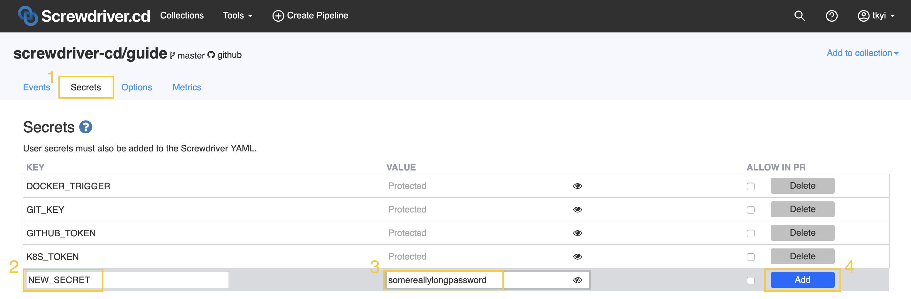

# Build Secrets
You've got secrets to share with your jobs, but these shouldn't be shared with everyone. Screwdriver provides a mechanism to insert secrets as environment variables. Since secrets are exposed as environment variables, they are easy to use inside builds.

## Security
The Screwdriver team takes security very seriously and encrypts all traffic between its various services. User secrets are stored encrypted in our datastore, and their values are only released to those builds that are authorized by the user.

We understand that you, the security-conscious pipeline admin, may not wish to put secrets into pull-request builds, as a malicious pull-requester could expose those secrets without your consent, but still need those secrets as part of the main build. Screwdriver provides an additional flag on secrets, `allowInPR` (default: false), that is required to be enabled for a secret to be exposed.

Secrets may only be added, modified, or removed by people that are listed as admins of the Git repository associated with a given pipeline. People with "push" privileges may also fetch a list of secrets, but not the secret values.

## Configuring a job to expose secrets
A list of allowed secrets are added to your pipeline configuration. Secret keys may only contain A-Z and underscore characters ( \_ ) and must start with a letter.

In the below example, an `NPM_TOKEN` secret is added to the `publish` job:

```yaml
publish:
    steps:
        - publish-npm: npm publish
    secrets:
        # Publishing to NPM
        - NPM_TOKEN
```

You may add secrets to any jobs you wish.

### Secrets in pull-requests
For your own security, we don't recommend exposing secrets to pull-request builds. Pull-request jobs can be created with modified `screwdriver.yaml` files including changes to the secrets configuration.

Pull-requests operate essentially as copies of the `main` job. The `main` job can be set up to use a secret, and does not expose that secret to pull-requests by default.

```yaml
main:
    steps:
        - my-step: maybeDoSomethingWithASecret.sh
    secrets:
        - MY_SECRET
```

When a secret is created via the UI, or API, enabling `allowInPR` will cause that secret to be available to pull-request builds, if those secrets are also configured to be exposed in the `main` job.

## User Interface
The easiest way to create a secret for your pipeline is via the Screwdriver UI.


### Creating Secrets
Click on the Options tab in the pipeline page, then  enter the key and value in the inputs in the grey box, and click the Add button. A checkbox is provided to allow you to enable `allowInPR`. You can also optionally toggle the eye icon in the Value box to see what you have entered.

### Updating Secrets
A secret's original value is never delivered to the UI, but values of secrets may be updated in the UI by adding a new value in the text field next to the appropriate key name and clicking the update button.

### Deleting secrets
Individual secrets may be removed by clicking the Delete button.
