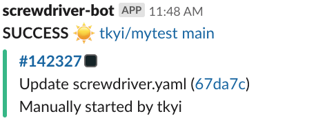
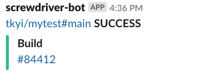

# Notifications
Configurable settings for any additional build plugins added to Screwdriver.cd.

The settings can be set in `shared`, to apply to all jobs, or in an individual job. A job-level setting will completely override the `shared` setting.

If you don't configure the build status, the notification will default to sending notifications on `FAILURE` only.

```
shared:
    settings:
        email: [test@email.com, test2@email.com]
        slack: 'mychannel'

jobs:
    main:
        requires: [~pr, ~commit]
        template: example/mytemplate@stable
```

```
jobs:
    main:
        requires: [~pr, ~commit]
        template: example/mytemplate@stable
        settings:
            email: [test@email.com, test2@email.com]
            slack: 'mychannel'
```

## Email
To enable emails to be sent as a result of build events, use the email setting.
You can configure a list of one or more email addresses to contact. You can also configure when to send an email, e.g. when the build status is `SUCCESS` and/or `FAILURE`.

#### Example
```
        settings:
            email:
                addresses: [test@email.com, test2@email.com]
                statuses: [SUCCESS, FAILURE]
```

## Slack
To enable Slack notifications to be sent as a result of build events, invite the `screwdriver-bot` Slack bot to your channel(s) and use the Slack setting in your Screwdriver yaml. Both public and private channels are supported. You can configure a list of one or more Slack channels to notify.

You can also configure when to send a Slack notification, e.g. when the build status is `SUCCESS` and/or `FAILURE`. If no `statuses` field is set, the build will only send notifications for build failures. For a list of statuses, see the [data-schema](https://github.com/screwdriver-cd/data-schema/blob/c2ea9b0372c6e62cb81e1f50602b751d0b10d547/models/build.js#L83-L96). You can receive `FIXED` notification which is not listed on [data-schema](https://github.com/screwdriver-cd/data-schema/blob/c2ea9b0372c6e62cb81e1f50602b751d0b10d547/models/build.js#L83-L96) when `FAILURE` is set in `statuses` field. `FIXED` is emitted when the build status changes from `FAILURE` to `SUCCESS`.

You may also choose whether to use the default notification format or a more compact one using the `minimized` setting.

To send data in steps as a notification, [notification meta](../metadata#notifications) is available. You can also customize the notification per job.

#### Multiple Rooms

The value of the `slack` setting can be an array of multiple channels.

```
        settings:
            slack: [mychannel, my-other-channel]
```

#### Notify on build statuses

This Slack setting will send Slack notifications to `mychannel` and `my-other-channel` on all build statuses:

```
        settings:
            slack:
                channels:
                     - 'mychannel'
                     - 'my-other-channel'
                statuses:
                     - SUCCESS
                     - FAILURE
                     - ABORTED
                     - QUEUED
                     - RUNNING
```

Example repo: <https://github.com/screwdriver-cd-test/slack-example>

#### Minimized notification

The default notification format includes the job's status, a corresponding emoji, and a link to the pipeline. The notification's attachment will include a link to the build, up to 150 characters of the commit message, a link to the commit, and a description of what triggered the event.

This Slack setting will use the default notification format:

```
        settings:
            slack:
                channels:
                    - 'mychannel'
                statuses:
                    - SUCCESS
```



However, if `minimized` is `true`, then the notification will use a format that consists of a link to the job, the job's status, and an attachment with a link to the build.

```
        settings:
            slack:
                channels:
                    - 'mychannel'
                statuses:
                    - SUCCESS
                minimized: true
```



#### Using Metadata

You can also use metadata to set Slack messages. This can be customized for each job. See [notifications section in the metadata page](../metadata#slack-notifications).

#### Notify separate channel for build failure

While there is no inherent support for this feature, this can be achieved by a combination of using [teardown steps](../configuration/jobconfiguration#teardown) and [slack metadata](../metadata#job-based-slack-channel) to check for job exit status.

```
jobs:
   main:
     steps:
       - teardown-notify: |
            if [ "$SD_STEP_EXIT_CODE" -gt "0" ]; then
               meta set notification.slack.${SD_JOB_NAME}.channels "my-error-channel"
            fi
```
