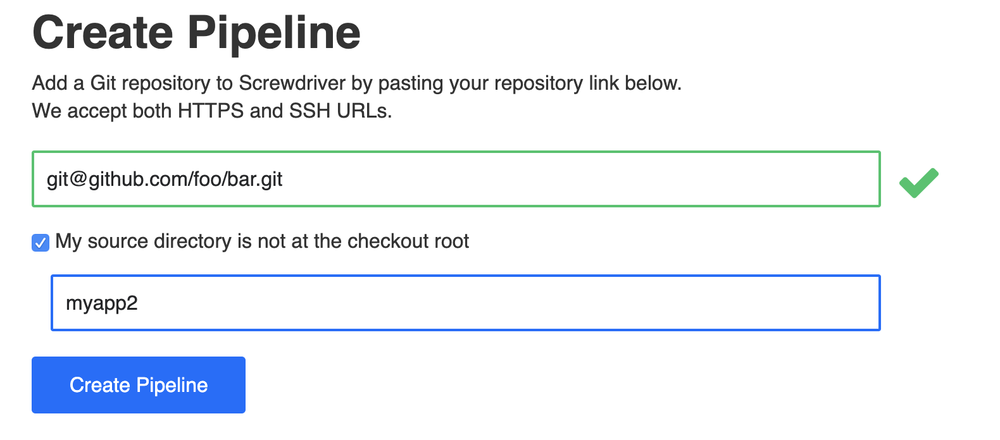
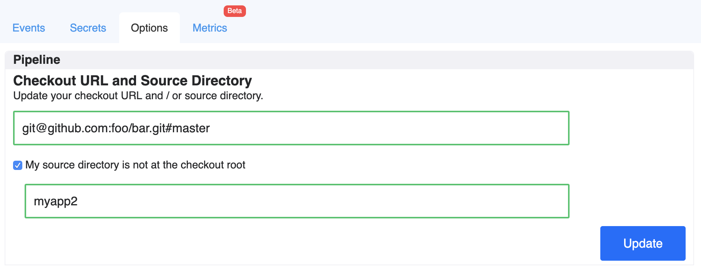

# Source Directory
Source directory can be used to specify a custom directory that a pipeline is based upon. You can specify it when you create the pipeline in Screwdriver UI or update your current pipeline to add the directory. This can be useful for running workflows based on subdirectories in a [monorepo](https://developer.atlassian.com/blog/2015/10/monorepos-in-git). With custom source directory, now you can create multiple pipelines on a single repository.

### Source Directory format
The directory path is relative to the root of the repository. You must have a `screwdriver.yaml` under your source directory.

#### Example

Given a repository with the file structure depicted below:

```
┌── README.md
├── screwdriver.yaml
├── myapp1/
│   └── ...
├── myapp2/
│   ├── app/
│   │   ├── main.js
│   │   ├── ...
│   │   └── package.json
│   └── screwdriver.yaml
│
...
```

##### Create pipeline with source directory


##### Update pipeline with source directory


In this example, jobs that `requires: [~commit, ~pr]` will be triggered if there are any changes to files under `myapp2`.

Example repo: <https://github.com/screwdriver-cd-test/source-dir-example>

### Caveats
- If you use [sourcePaths](sourcePaths) together with custom source directory, the scope of the `sourcePaths` is limited to your source directory. You can not listen on changes that are outside your source directory. ***Note*** the path for your `sourcePaths` is relative to the root of the repository, not your source directory.

  - For example, if you want to add sourcePaths to listen on changes to `main.js` and `screwdriver.yaml`, you should set:
```
sourcePaths: [myapp2/app/main.js, myapp2/screwdriver.yaml]
```
If you try to set `sourcePaths: [app/main.js]`, it will not work, as it is missing the source dir `myapp2` and you cannot set a relative source path. If you try to set `sourcePaths: [myapp1/test.js]`, it will not work, as it is outside the scope of your source directory, `myapp2`.

- The `screwdriver.yaml` must be located at root of your custom source directory.
