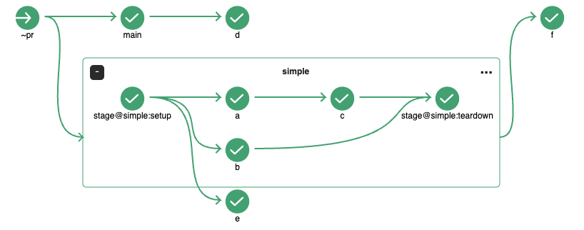

# Stages

Stages can be used to categorize one or more jobs that have steps with similar objectives. For instance, jobs `ci-deploy`, `ci-test`, and `ci-certify` can be grouped together under a stage named `integration`.

#### Example

```
jobs:
  ci-deploy:
    requires: []
  ci-test:
    requires: [ci-deploy]
  ci-certify:
    requires: [ci-test]
  triggered-by-stage:
    requires: [~stage@integration]

stages:
  integration:
    requires: [~commit]
    jobs: [ci-deploy, ci-test, ci-certify]
    description: "This stage will deploy the latest application to the CI environment and certify it after the tests have passed."
```

In the provided example, the `ci-deploy` job within the `integration` stage has an empty `requires` field, indicating that the job begins execution immediately upon stage activation, as demonstrated by the `commit` trigger. Conversely, the `triggered-by-stage` job, which is triggered by the `integration` stage, starts only after the completion of the last job or jobs within the stage. To configure a job that is triggered by the end of a stage, use the syntax `~stage@stageName`.

Based on the configuration, the screenshot below illustrates the expected layout of the workflow graph.


#### Setup and Teardown

<br>Each stage can be equipped with a **setup** job, which executes prior to any other jobs in the configuration, and a **teardown** job, which runs after all other jobs have finished. Users have the option to define custom setup and teardown jobs, as shown in the configuration below. The **teardown** job always runs in the stage, even if other jobs in the stage fail.

```
stages:
  integration:
    requires: [~commit]
    jobs: [ci-deploy, ci-test, ci-certify]
    description: "This stage will deploy the latest application to the CI environment and certify it after the tests have passed."
    setup:
      image: node:lts
      steps:
        - init: echo 'integration setup'
    teardown:
      image: node:lts
      steps:
        - init: echo 'integration teardown'
```

#### Stage in PR workflow

Stage is available in the `~pr` workflow. In the PR workflow, only the stage setup job, its child jobs, and the stage teardown job are triggered.  
Jobs other than the stage setup job does not trigger subsequent jobs.


Stage is executed like a normal build if `chainPR` is enabled.



#### Caveats

- Each job belongs to a single stage.
