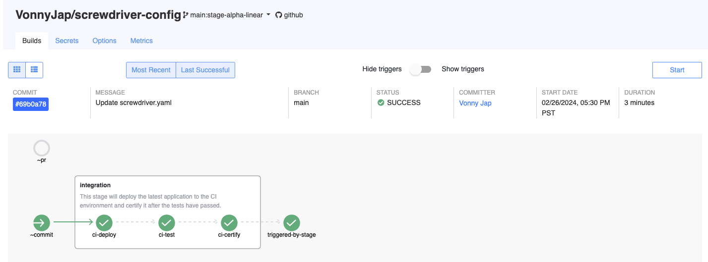

# Pipeline Stages

The configuration of stages is employed to categorize one or more jobs that execute steps to achieve a similar objective. For instance, jobs such as `ci-deploy`, `ci-test`, and `ci-certify` can be grouped together under a stage named integration.

#### Example

```
jobs:
  ci-deploy:
    requires: []
  ci-test:
    requires: [ci-deploy]
  ci-certify:
    requires: [ci-test]
  triggered-by-stage:
    requires: [~stage@integration]

stages:
  integration:
    requires: [~commit]
    jobs: [ci-deploy, ci-test, ci-certify]
    description: "This stage will deploy the latest application to the CI environment and certify it after the tests have passed."
```

<br>Based on the configuration, the screenshot below illustrates the expected layout of the workflow graph.


#### Setup and Teardown

<br>Each stage is equipped with a **setup** job, which executes prior to any other jobs in the configuration, and a **teardown** job, which runs after all other jobs have finished. If not explicitly specified, these two jobs will execute default predefined steps.

<br>In the example mentioned earlier, the `ci-deploy` job within the `integration` stage has an empty `requires` field. This means that the job will start running once the implicit setup job finishes. Conversely, the `triggered-by-stage` job, triggered by the `integration` stage, runs only after the implicit teardown job finishes.

<br>Users have the option to define custom setup and teardown jobs, as shown in the configuration below.

```
stages:
  integration:
    requires: [~commit]
    jobs: [ci-deploy, ci-test, ci-certify]
    description: "This stage will deploy the latest application to the CI environment and certify it after the tests have passed."
    setup:
      image: node:18
      steps:
        - init: echo 'integration setup'
    teardown:
      image: node:18
      steps:
        - init: echo 'integration teardown'
```

<br>

#### Limitations

- Within the supported [SCM events](http://localhost:4000/user-guide/configuration/workflow#workflow), only the `~commit` workflow is implemented.
