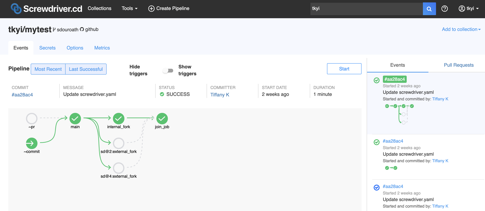

# Workflow
Workflow is the way that individual jobs are wired together to form a pipeline. This is done by using a `requires` keyword in your job definition with the list of jobs or events that should cause that job to run. Screwdriver defines four events for every pipeline that occur due to SCM events: `~pr`, `~commit`, `~tag` and `~release`.

|Keyword|Description|
|:--|:--|
| ~pr | Event occurs when a pull-request is opened, reopened, or modified. |
| ~commit | Event occurs when a commit is made against the pipeline's branch. When you start a pipeline manually, it runs all the jobs that have the `~commit` event trigger. |
| ~tag | Event occurs when a tag is created. Now, this trigger is only available for user using GitHub as scm. |
| ~release | Event occurs when released. Now, this trigger is only available for user using GitHub as scm. |

See the [tag and release trigger example repo](https://github.com/screwdriver-cd-test/tag-trigger-example) for reference.

## Defining Workflow Order
To denote workflow order, use the `requires` keyword under a job with the job names as an array. Job names may be prefixed with a tilde to indicate advanced logic.

#### Example
In the following example, the job, `main`, will start after any SCM pull-request, _or_ commit event. The job, `second`, will run after `main` is successful.

>Please note that a job started by a pull-request will not trigger its downstream jobs unless you use the chainPR annotation. For example, if `main` starts and succeeds as a result of a pull-request being opened, `second` will not start afterwards.

```
jobs:
    main:
        image: node:14
        requires: [~pr, ~commit]
        steps:
            - echo: echo hi

    second:
        image: node:14
        requires: [main]
        steps:
            - echo: echo bye
```

To specify a job to run when a pull request is opened or updated, use `requires: [~pr]`. For jobs that should start after code is merged or pushed to the main branch, use `requires: [~commit]`.

Example repo: <https://github.com/screwdriver-cd-test/workflow-sequential-example>


## Parallel and Join
You can run jobs in parallel by requiring the same job in two or more jobs. To join multiple parallel jobs at a single job you can use the `requires` syntax to require multiple jobs.

#### Join Example
In the following example, where `A` and `B` requires `main`. This will cause `A` and `B` to execute in parallel after `main` is successful. Also in this example, job `C` runs only after both `A` _and_ `B` are successful in the same triggering event.

```
shared:
    image: node:14

jobs:
    main:
        requires: [~pr, ~commit]
        steps:
            - echo: echo hi
    A:
        requires: [main]
        steps:
            - echo: echo in parallel
    B:
        requires: [main]
        steps:
            - echo: echo in parallel
    C:
        requires: [A, B]
        steps:
            - echo: echo join after A and B
```

Example repo: <https://github.com/screwdriver-cd-test/workflow-parallel-join-example>

### OR Workflow
Similar to Join, but job will start when any of its `requires` jobs are successful [_OR_]. This is achieved by adding a tilde (`~`) prefix to the jobs it requires.

#### Example
In the following example, the `last` job will trigger once after either `first` _OR_ `second` completes successfully.

```
shared:
    image: node:6
    steps:
        - greet: echo hello
jobs:
    main:
        requires: [~pr, ~commit]
    first:
        requires: [main]
    second:
        requires: [main]
    last:
        requires: [~first, ~second]
```

## Branch filtering
Branch filtering lets you listen to events happening beyond the pipeline's specified branch. To trigger jobs in your pipeline after a commit is made on a specific branch, you can use `requires: [~commit:branchName]`. To trigger jobs in your pipeline after a pull request is made against a specific branch, you can use `requires: [~pr:branchName]`. Branches may also be specified by using a ([JavaScript flavor](https://developer.mozilla.org/en-US/docs/Web/JavaScript/Guide/Regular_Expressions)) regular expression (e.g. `~commit:/^feature-/`), although note that regex flags are not supported.

### Example
In the following example, when a commit is made on branch `staging`, both `staging-commit` job and `all-commit` job are triggered. Also, when a commit is made on branch `default`, both `main` job and `all-commit` job are triggered. When a pull request is opened against branch `staging`, `staging-pr` job is triggered.

```
shared:
    image: node:8

jobs:
    main:
        requires: [~commit]
        steps:
            - echo: echo commit
    staging-commit:
        requires: [~commit:staging]
        steps:
            - echo: echo staging
    all-commit:
        requires: [~commit:/./]
        # /./ matches any branch name and is used here for illustration only
        # Don't use that regexp in any actual workflow.
        steps:
            - echo: echo all
    staging-pr:
        requires: [~pr:staging]
        steps:
            - echo: echo staging pr
```

_Note: A PR against a branch will follow the workflow pattern indicated by that branch’s screwdriver.yaml._

See the [branch filtering example repo](https://github.com/screwdriver-cd-test/branch-filtering-example) for reference. To see how branch filtering works with pull requests, see our [example pull request](https://github.com/screwdriver-cd-test/branch-filtering-example/pull/2).

## Tag/Release filtering
You can use Tag/Release filtering to limit the listening for `~tag`/`~release` events to a specific tag or release name. To trigger a job in your pipeline after a tag with a specific name has been created, you can use `requires: [~tag:tagName]`. To trigger a job in your pipeline after a release with a specific name has been pushed, you can use `requires: [~release:releaseName]`. `tagName` and `releaseName` may also be specified by using a ([JavaScript flavor](https://developer.mozilla.org/en-US/docs/Web/JavaScript/Guide/Regular_Expressions)) regular expression (e.g. ~release:/^feature-/), although note that regex flags are not supported.

### Example
In the following example, when `stable` release is pushed, `all-tag-and-release` and `stable-release` are triggered. When `v1.0` tag is created, `all-tag-and-release` and `v1-tag` are triggered. When `v2.0` tag is created, `all-tag-and-release` is triggered.

```
shared:
    image: node:12

jobs:
    all-tag-and-release:
        requires: [~tag, ~release]
        steps:
            - echo: echo all
    v1-tag:
        requires: [~tag:/^v1\.*/]
        steps:
            - echo: echo v1 tag
    stable-release:
        requires: [~release:stable]
        steps:
            - echo: echo stable release
```

## Remote Triggers
To trigger a job in your pipeline after a job in another pipeline is finished, you can use remote requires. The format is `~sd@pipelineID:jobName`. `~pr`, `~commit`, and jobs with `~sd@pipelineID:jobName` format follow _OR_ logic.

#### Example
In the following example, this pipeline will start the `main` job after any pull-request, commit, _or_ successful completion of the `publish` job in pipeline 456.

```
jobs:
    main:
        image: node:14
        requires: [~pr, ~commit, ~sd@456:publish]
        steps:
            - echo: echo hi
```

Example repo: <https://github.com/screwdriver-cd-test/workflow-remote-requires-example>

## Remote Join
You can also have remote join jobs. Please double check with your cluster admin whether it is supported. 

#### Example
In the following example, this pipeline 3 will start the `join_job` job after successful completion of: internal_fork, external_fork in pipeline 2, _and_ external_fork in pipeline 4.



Pipeline 3 screwdriver.yaml:

```
shared:
  image: node:12
  steps:
    - echo: echo hi
jobs:
  main:
    requires: [~commit, ~pr]
  internal_fork:
    requires: [main]
  join_job:
    requires: [internal_fork, sd@2:external_fork, sd@4:external_fork]
```

Pipeline 2 screwdriver.yaml:

```
shared:
  image: node:12
  steps:
    - echo: echo hi
jobs:
  external_fork:
    requires: [~sd@3:main]
```

Pipeline 4 screwdriver.yaml:

```
shared:
  image: node:12
  steps:
    - echo: echo hi
jobs:
  external_fork:
    requires: [~sd@3:main]
```

#### Caveats

- In the downstream remote job (e.g.: for instance, in pipeline 2 or pipeline 4 examples above), we currently do not support `AND` syntax (e.g.: `requires: [sd@3:main]` or `requires: [sd@3:main, sd@1:main]`) for external triggers in the start nodes; you must use `OR` syntax for these nodes (e.g.: `requires: [~sd@3:main]` or `requires: [~sd@3:main, ~sd@1:main]`)
- This feature is only guaranteed one external dependency level deep
- This feature currently does not work with PR chain
- The event list on the right side of the UI might not show the complete mini-graph for the event

## Blocked By
To have your job blocked by another job, you can use `blockedBy`. It has the same format as `requires`, except it does not accept values like `~commit` or `~pr`.

Note:
- Since everything is using OR syntax, you need a tilde (`~`) before each of your job names. We do not support AND logic for blockedBy.
- By default, to prevent race conditions, a job is always blocked by itself. That means the same job cannot have 2 instances of builds running at the same time.
- This feature is only available if your cluster admin configured to use `executor-queue`. Please double check with your cluster admin whether it is supported.
- This feature does not apply to PR jobs.

#### Example
In the following example, `job2` is blocked by `job1` or `sd@456:publish`. If `job1` or `sd@456:publish` is running and `job2` is triggered, `job2` will be put back into the queue. Screwdriver will check the queue periodically to see if `job2` is no longer blocked and will run it as soon as that is true. _Note: `blockedBy` only blocks the job that the configuration is under; the following configuration won't block `job1` if `job2` is running._

```
shared:
    image: node:14
jobs:
    job1:
        requires: [~commit, ~pr]
        steps:
            - echo: echo hello
    job2:
        blockedBy: [~job1, ~sd@456:publish]
        steps:
            - echo: echo bye
```

Example repo: <https://github.com/screwdriver-cd-test/workflow-blockedby-example>

## Freeze Windows
You can freeze your jobs and prevent them from running during specific time windows using `freezeWindows`. The setting takes a cron expression or a list of them as the value. Timezone is in UTC.

Before the job is started, it will check if the start time falls under any of the provided cron windows, and freezes the job if so. The job will be unfrozen and run as soon as the current cron window ends.

Note:
- Different from [build_periodically](./annotations#job-level-annotations), `freezeWindows` should not use hashed time therefore *the symbol `H` for hash is disabled.*
- The combinations of day of week and day of month are usually invalid. Therefore only *one out of day of week and day of month can be specified*. The other field should be set to "?".
- By default, if multiple builds are triggered during the freeze window, they will be collapsed into one build which will run at the end of the freeze window with the latest commit inside the freeze window. You can turn this feature off by setting the `screwdriver.cd/collapseBuilds` [annotation](./annotations) to `false`.

#### Example
In the following example, `job1` will be frozen during the month of March, `job2` will be frozen on weekends, and `job3` will be frozen from 10:00 PM to 10:59 AM.

```
shared:
    image: node:14

jobs:
  job1:
    freezeWindows: ['* * ? 3 *']
    requires: [~commit]
    steps:
      - build: echo "build"
  job2:
    freezeWindows: ['* * ? * 0,6,7']
    requires: [job1]
    steps:
      - build: echo "build"
  job3:
    freezeWindows: ['* 0-10,22-23 ? * *']
    requires: [job2]
    steps:
      - build: echo "build"
```

## Detached Jobs and Pipelines
It is possible to define workflows that do not have any external trigger. These workflows are "detached" from the normal flow of the pipeline. Some example use cases of this would be to define a rollback flow for your pipeline that could be manually triggered. Invoking a detached pipeline involves the same steps as doing a [rollback](../FAQ#how-do-i-rollback).

### Example
In the following example `detached` job is detached.

```
shared:
    image: node:8

jobs:
    detached:
        steps:
            - echo: echo im-a-detached-job
```

Example repo: <https://github.com/screwdriver-cd-test/workflow-detached-example>

## Subscribed SCM Notifications
You can subscribe to external repositories so builds are triggered in your pipeline whenever there are changes in those external repositories. You can configure your pipeline to subscribe to webhook notifications for events such as `~pr`, `~commit`, `~tag` and `~release`. Each job needs to be independently configured to respond to the subscribed event(s).

### Example
In the following example, we can add repositories to subscribe to in the `scmUrls` sections of the `subscribe` object. Then we need to specify the events to subscribe to, which are `~commit` and `~pr` in this example. Note that webhooks are automatically registered to the repositories at the time of pipeline creation.

```
shared:
    image: node:8

subscribe: 
    scmUrls:
        - git@github.com:supra08/functional-workflow.git: ['~commit', '~pr']
```

Now to configure specific jobs to respond to subscribed events:

```
jobs:
    A:
        steps:
            - echo: echo test
        requires: [~pr, ~commit, ~subscribe]
```

Here the `~subscribe` event tells the job to respond to external notifications. 
