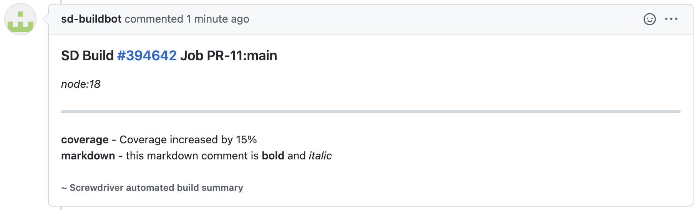

# Metadata

## What is Metadata?

Metadata is a structured key/value storage of relevant information about a [build](../../about/appendix/domain#build). It can be updated or retrieved throughout the build by using the built-in [meta CLI](https://github.com/screwdriver-cd/meta-cli) in the [steps](../../about/appendix/domain#step).

## Default Metadata

By default, Screwdriver sets the following keys in metadata:

| Key | Description |
| --- | ----------- |
| build.buildId | ID of this build |
| build.jobId | ID of the job that this build belongs to |
| build.eventId | ID of the event that this build belongs to |
| build.pipelineId | ID of the pipeline that this build belongs to |
| build.sha | The commit sha that this build ran |
| build.jobName | The name of the job |
| commit.author | The author info object with the following fields: `avatar`, `name`, `url` and `username` |
| commit.committer | The committer info object with the following fields: `avatar`, `name`, `url` and `username` |
| commit.message | The commit message |
| commit.url | The url to the commit |
| commit.changedFiles | List of changed files separated by comma. **Note**: If you start a fresh event via UI, this value will be empty since it's not triggered by a commit. |
| sd.tag.name | The name of the tag |
| sd.release.id | ID of the release |
| sd.release.name | The name of the release |
| sd.release.author | The author name of the release |

## Manipulating Metadata

Screwdriver provides the shell command `meta get` to extract information from the meta store and `meta set` to save information to the meta store.

### Same pipeline

Screwdriver builds can retrieve metadata set by itself or by previous builds within the same event.

Example: `build1` -> `build2` -> `build3`

`build2`'s metadata will consist of metadata set by itself and `build1`

`build3`'s metadata will consist of metadata from `build2` (which also includes metadata from `build1`)

```bash
$ meta set example.coverage 99.95
$ meta get example.coverage
99.95
$ meta get example
{"coverage":99.95}
```

Example:
```bash
$ meta set foo[2].bar[1] baz
$ meta get foo
[null,null,{"bar":[null,"baz"]}]
```

Example repo: <https://github.com/screwdriver-cd-test/workflow-metadata-example>

Notes:
- If `foo` is not set and you try to `meta get foo`, it will return a string with value `null` by default.

### External pipeline

Screwdriver build can also access metadata from an external triggering job by adding the `--external` flag followed by the triggering job.

Example: `sd@123:publish` -> `build1`. Then inside `build1`:
```
$ meta get example --external sd@123:publish
{"coverage":99.95}
```

Notes:
- `meta set` is not allowed for external builds.
- If the `--external` pipeline job did not trigger the build, then `meta` from the last successful build for the external job will be fetched.

### Using the API

You can also prepopulate event meta by configuring the payload of the `POST` request to `/v4/events`.

See the [API docs](./api) for more information on API endpoints.
See the [event meta trigger example repo](https://github.com/screwdriver-cd-test/event-meta-trigger-example) and corresponding [event meta example repo](https://github.com/screwdriver-cd-test/event-meta-example) for reference.

### Pull Request Comments

> Note: This feature is only available in Github plugin at the moment.

You can write comments to pull requests in Git from a Screwdriver build through using metadata. The contents of the comments should be written to the meta summary object from your pipeline's PR build.

To write out metadata to a pull request, you just need to set `meta.summary` with desired information. This data will show up as a comment in Git by a headless Git user.

For example, to add a coverage description, your screwdriver.yaml should look something like below:

```yaml
jobs:
  main:
    steps:
      - comment: meta set meta.summary.coverage "Coverage increased by 15%"
```

You can also write things in markdown syntax as shown in the following example:
```yaml
jobs:
  main:
    steps:
      - comment: meta set meta.summary.markdown "this markdown comment is **bold** and *italic*"
```
These settings will result in a Git comment that looks like:



_Note: Screwdriver will try to edit the same comment in Git if multiple builds are run on it._

### Additional Pull Request Checks

> Note: This feature is only available in Github plugin at the moment.

You can also add additional status checks to pull requests to provide more granular information about the pull request build.

To additional checks to a pull request, you just need to set `meta.status.<check>` with desired information in JSON string format. This data will show up as a Git check on the pull request.

The fields you can set:

| Key | Description |
| --- | ----------- |
| status (String) | Status of the check, can be one of: (`SUCCESS`, `FAILURE`) |
| message (String) | Description for the check |
| url (String) | Url for the check to link to (default: build link)

For example, to add two additional checks for `findbugs` and `coverage`, your screwdriver.yaml should look something like below:

```yaml
jobs:
  main:
    steps:
      - status: |
          meta set meta.status.findbugs '{"status":"FAILURE","message":"923 issues found. Previous count: 914 issues.","url":"http://findbugs.com"}'
          meta set meta.status.coverage '{"status":"SUCCESS","message":"Coverage is above 80%."}'
```

These settings will result in Git checks that look like:


### Coverage and Test Results

You can populate coverage results and test results, along with their url to build artifact on build page from a Screwdriver build through using metadata. Screwdriver UI will read from `tests.coverage`, `tests.results`, `tests.coverageUrl` and `tests.resultsUrl` in metadata and display/set them accordingly.

Example screwdriver.yaml should look something like below:

```yaml
jobs:
  main:
    steps:
      - set-coverage-and-test-results: |
          meta set tests.coverage 100 # this should be the coverage percentage number
          meta set tests.results 10/10 # this should be `pass_tests_number/total_tests_number`
          meta set tests.coverageUrl /test/coverageReport.html # this should be a relative path to a build artifact
          meta set tests.resultsUrl /test/testReport.html # this should be a relative path to a build artifact
```

> Note: metadata will override SonarQube results

These settings will result in build page that looks like:


### Event Labels

You can label your events using the `label` key from meta. This key can be useful when trying to determine which event to [rollback](./FAQ.html#how-do-i-rollback).

Example screwdriver.yaml:
```yaml
jobs:
  main:
    steps:
      - set-label: |
          meta set label VERSION_3.0 # this will show up in your pipeline events page
```

Result:


### Slack Notifications

You can customize [notification](./configuration/settings.html#slack) messages with meta. Meta keys are different for each notification plugin.

#### Basic
Example screwdriver.yaml notifying with Slack:
```yaml
jobs:
  main:
    steps:
      - meta: |
          meta set notification.slack.message "<@yoshwata> Hello Meta!"
```

Result:


#### Job-based Slack message
*Note*: Job-based Slack notification meta data will overwrite the basic notification message.

Structure of meta variable is `notification.slack.<jobname>.message`, replacing `<jobname>` with the name of the Screwdriver job.

Example screwdriver.yaml notifying with specific Slack message for job `slack-notification-test`:
```yaml
jobs:
  main:
    steps:
      - meta: |
          meta set notification.slack.slack-notification-test.message "<@yoshwata> Hello Meta!"
```

Result:


#### Job-based Slack Channel
*Note*: Job-based Slack channel meta will only overwrite the basic Slack notification channel. It is not a replacement for setting a [notification channel](./configuration/settings#slack).

Structure of meta variable is `notification.slack.<jobName>.channels`, replacing `<jobname>` with the name of the Screwdriver job.

The setting is a comma-separated string that allows setting multiple channels.

Example screwdriver.yaml notifying different Slack channels upon job failure for the `component` job:
```yaml
shared:
    image: docker.ouroath.com:4443/x/y/z
    
    settings:
        slack:
            channels: [ main_channel ]
            statuses: [ FAILURE ]

jobs:
   component:
    steps:
      - meta: |
          meta set notification.slack.component.channels "fail_channel, prod_channel"
```
In the above example a Slack notification failure message will be send to channels `fail_channel` and `prod_channel` instead of `main_channel`. All other jobs in this pipeline would still post to `main_channel`.

#### Job-based minimized setting
Job-based Slack `minimized` meta setting will overwrite the default Slack minimized setting.

Structure of meta variable is `notification.slack.<jobName>.minimized`, replacing `<jobName>` with the name of the Screwdriver job.

Example screwdriver.yaml sending a minimized Slack message in case the `component` job was triggered by the scheduler:

```yaml
shared:
    image: docker.ouroath.com:4443/x/y/z
    
    settings:
        slack:
            channels: [ main_channel ]
            statuses: [ FAILURE ]
            minimized: false

jobs:
   component:
    steps:
      - meta: |
          if [[ $SD_SCHEDULED_BUILD == true ]]; then
             meta set notification.slack.component.minimized true
          fi
```
In the above example a Slack notification message will be send in `minimized` format for the `component` job if it was triggered by the scheduler.

### Using [Lua](https://www.lua.org/) for atomic updates

the `meta` tool creates a lock file, and holds a [flock](https://linux.die.net/man/2/flock) around each of its
operations so that it may be executed by parallel operations in your build (for instance a Makefile invoked with
`make -j 4`)

In addition to atomic get and set operations, should "update" be required, the meta commands may be invoked by an
embedded [Lua](https://www.lua.org/) interpreter.

Example use cases:

#### atomically increment a number

```bash
meta lua -E 'meta.set("myNum", (tonumber(meta.get("myNum")) or 0) + 1)'
```

| Lua code | explanation |
| ---  | ---  |
| `meta.get("myNum")` | gets the previous value |
| `tonumber(`<small>meta.get("myNum")</small>`)` | `tonumber` returns its arg if number, parses if string, and returns `nil` when unparseable or not a number or string. |
| <small>tonumber(meta.get("myNum"))</small>` or 0` | `or 0` Converts non-numbers to `0` so that arithmetic can be applied |
| <small>(tonumber(meta.get("myNum")) or 0)</small>` + 1` | `+ 1` of course this increments the previous value (normalized to `0`) |
| `meta.set(`<small>"myNum", (tonumber(meta.get("myNum")) or 0) + 1</small>`)` | `meta.set` sets the value to the incremented value |

#### atomically insert some json into an array and return its index

One motivational use case is a job, which builds many things (like docker images) in parallel, and then in a later
"publish" step, interrogates the array to do the pushes (to docker registry, e.g.).

```bash
meta lua insert.lua myArray '{"foo": "baz"}'
```

Explanation: Following the convention of the [lua](https://linux.die.net/man/1/lua) CLI, arguments are made available to
Lua code in the global table `arg`. Without the `-E` flag, `arg[0]` will be run as a file.

File `insert.lua`:

```lua
-- Ensure args are passed as expected
assert(#arg >= 2, string.format("usage: %s key json_value", arg[0]))

-- https://github.com/vadv/gopher-lua-libs is preloaded, so any of its modules may be required
local json = require("json")
local key = arg[1]

-- This converts the json string argument to a Lua table, error
local toInsert, err = json.decode(arg[2])

-- Report errors, if any
assert(not err, tostring(err))

-- Get the current array from meta using the key arg or, when nil, an empty table
local array = meta.get(key) or {}

-- table.insert without index does "append"
table.insert(array, toInsert)

-- meta.set to save the value after insertion - Lua values are passed and converted to json for storage under the hood.
meta.set(key, array)

-- print the index
-- NOTE: index for meta.(get/set) purposes is 0-based, so subtract 1 from the array size
print(#array - 1)
```