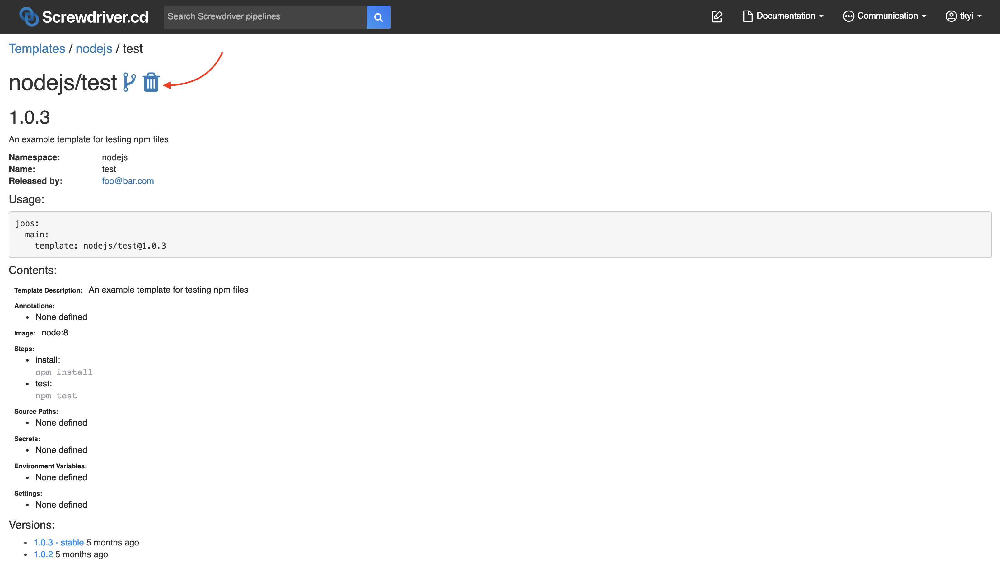

# Templates

Templates are snippets of predefined code that people can use to replace a job definition in a [screwdriver.yaml](./configuration). A template contains a series of predefined steps along with a selected Docker image.

## Finding templates

To figure out which templates already exist, you can make a `GET` call to the `/templates` [API](./api) endpoint. You can also see templates in the UI at `<YOUR_UI_URL>/templates`.

Example templates page:


## Using a template

To use a template, define a `screwdriver.yaml` with a `template` key. In this example, we are using the [nodejs/test template](https://cd.screwdriver.cd/templates/nodejs/test).

Example `screwdriver.yaml`:

```yaml
jobs:
    main:
        requires: [~pr, ~commit]
        template: nodejs/test@1.0.4
```

Version is [semver](https://semver.org/) compatible. For example you can refer above template with `nodejs/test@1` or `nodejs/test@1.0`

You can also refer to a template version with a tag name if the template has one. All the versions and tags of a template are displayed at the bottom of a template's description, such as for [the example template](https://cd.screwdriver.cd/templates/nodejs/test), which has the tags `latest` and `stable`.

Most templates will tag the most recent version as `latest`, and many templates use either automated testing or manual curation to identify some version as `stable`. These are floating tags, so using them in a job means its template-provided steps may suddenly change.

If no template version is specified, the most recently published will be used. This is usually synonymous with specifying the `latest` tag. It is generally better to explicitly state a template version than to implictly use `latest`.

The most reliable way to avoid unexpected template changes is to refer to a specific version of the template. For instance, `nodejs/test@1.0.4` is an immutable reference to a particular list of steps. Using a reference such as `nodejs/test@1.0` means that a job will automatically use `nodejs/test@1.0.5` when it becomes available, but that comes with risk of an unexpected change in behavior.

## Version/Tag Semantics

Template versions can be referenced in a variety of ways that express users' trade-off between an unchanging set of steps and automatically using improvements that a template's maintainers have added. As above, these examples reference [nodejs/test template](https://cd.screwdriver.cd/templates/nodejs/test).

* `nodejs/test@latest` - this will use the most recently published version of the template, which may include backwards-incompatible changes, major version changes, etc. The `latest` tag should primarily be used by a template's maintainers and may be unsuitable for production or similarly important builds.
* `nodejs/test@stable` - this will use a version of the template that its maintainers have designated as sufficiently stable for general usage. It may represent a significant change in capability from older uses of the `stable` tag. Template maintainers should communicate to users when changes to the `stable` tag are not backwards compatible.
* `nodejs/test@1` - this will use the most recent version of `nodejs/test` that is less than 2.0.0. This is essentially the `latest` tag without crossing a major version boundary.
* `nodejs/test@1.0` - this will use the most recent version of `nodejs/test` than is less than 1.1.0. This is essentially the `latest` tag without crossing a minor version boundary.
* `nodejs/test@1.0.4` - this is the most predictable way to specify a pipeline's behavior and is not affected by future changes to the template.

#### Example

For this configuration:
```yaml
jobs:
    main:
        requires: [~pr, ~commit]
        template: nodejs/test@stable
```


Screwdriver takes the template configuration and plugs it in, so that the `screwdriver.yaml` becomes:

```yaml
jobs:
    main:
        image: node:8
        requires: [~pr, ~commit]
        steps:
          - install: npm install
          - test: npm test
        environment:
            FOO: bar
        secrets:
              - NPM_TOKEN
```
## Overriding Template Steps

A job can override Template steps by wrapping or replacing existing steps.

### Wrap
Wrapping is when you add commands to run before and/or after an existing step. To wrap a step from a template, add a `pre` or `post` in front of the step name.

Example:
```yaml
jobs:
    main:
        requires: [~pr, ~commit]
        template: nodejs/test@1.0.3
        steps:
            - preinstall: echo pre-install
            - postinstall: echo post-install
```

This will run the command `echo pre-install` before the template's `install` step, and `echo post-install` after the template's `install` step.

### Replace
To replace a step from a template, add your command with the same template's step name.

Example:
```yaml
jobs:
    main:
        requires: [~pr, ~commit]
        template: nodejs/test@1.0.3
        steps:
            - install: echo skip installing
```

This will run the command `echo skip installing` for the `install` step.

Note: You cannot replace a [locked step](#template-locked-steps).

You can also replace the image defined in the template. Some template steps might rely on commands or environment invariants that your image may not have, so be careful when replacing.

Example:
```yaml
jobs:
    main:
        requires: [~pr, ~commit]
        image: node:latest
        template: nodejs/test@1.0.3
```

### Merging with shared steps

When overriding Template steps, a job can get the step definitions from either `shared.steps` or `job.steps` with precedence for `steps` defined in `job` section. This follows the same order of precedence for step definitions without using a template. Users can change this behavior using [annotation](./configuration/annotations) `screwdriver.cd/mergeSharedSteps: true`. When `true` steps in `shared` and `job` sections are merged when a Template is used.


#### Example

```yaml
shared:
  annotations:
    screwdriver.cd/mergeSharedSteps: true
  steps:
     - premotd: echo build
jobs:
    main:
        template: python/package_rpm@latest
        requires: [~pr, ~commit]
        steps:
         - preinit_os: echo replace

```

#### Example
The following example defines a merged shared configuration for `image` and `steps`, which is used by the main and main2 jobs.

```yaml
shared:
    image: node:8
    steps:
        - init: npm install
        - pretest: npm lint
        - test: npm test

jobs:
    main:
        requires: [~pr, ~commit]
        image: node:6
    main2:
        annotations:
            screwdriver.cd/mergeSharedSteps: true
        requires: [main]
        steps:
            - test: echo Skipping test
```

The above example would be equivalent to:

```yaml
jobs:
    main:
        requires: [~pr, ~commit]
        image: node:6
        steps:
             - init: npm install
             - pretest: npm lint
             - test: npm test
    main2:
        annotations:
             screwdriver.cd/mergeSharedSteps: true
        requires: [main]
        image: node:8
        steps:
             - pretest: npm lint
             - test: echo Skipping test

```

### Order
When using a template in your configuration, you can pick and choose steps defined by the template and your own configuration with the `order` field. This field is defined as an ordered array of step names.

Caveats when using `order`:
- `order` can only be used when `template` is used.
- Steps that cannot be found will be skipped.
- User-defined `teardown-` steps will always be run after the rest of the steps are done.
- Implicit wrapping of steps(pre/post) will not work with this field.
- The priority in determining duplicate step definitions goes like this: job > template
- When the annotation `screwdriver.cd/mergeSharedSteps: true`, priority will be: job > shared > template

Example `sd-template.yaml`:
```yaml
namespace: nodejs
name: publish
version: "2.0.1"
description: 'Publish an npm package'
maintainer: myname@foo.com
images:
  stable: node:8
  latest: node:12
config:
  image: stable
  steps:
    - install: npm install
    - publish: npm publish
    - coverage: coverage test.js
```

Example `screwdriver.yaml`:
```yaml
jobs:
  main:
    requires: [~commit]
    image: stable
    template: nodejs/publish@2
    order: [clone, install, doesnotexist, test, publish, coverage]
    steps:
      - test: npm test
      - clone: git clone https://github.com/screwdriver-cd/toolbox.git ci
      - coverage: ./ci/coverage.sh
```

Result:
```yaml
jobs:
  main:
    requires: [~commit]
    image: node:8
    steps:
      - clone: git clone https://github.com/screwdriver-cd/toolbox.git ci
      - install: npm install
      - test: npm test
      - publish: npm publish
      - coverage: ./ci/coverage.sh  # This step was overwritten by the job
```

## Creating a template

Publishing and running templates must be done from a Screwdriver pipeline.

### Writing a template yaml

To create a template, create a new repo with a `sd-template.yaml` file. The file should contain a namespace, name, version, description, maintainer email, and a config with an image and steps. If no namespace is specified, a 'default' namespace will be applied. An optional `images` keyword can be defined to list supported images with a descriptive label. Basic example can be found in our [screwdriver-cd-test/template-example repo](https://github.com/screwdriver-cd-test/template-example).

Example `sd-template.yaml`:

```yaml
namespace: myNamespace
name: template_name
version: '1.3'
description: template for testing
maintainer: foo@bar.com
images:
    stable-image: node:12
    latest-image: node:14
config:
    image: stable-image
    steps:
        - install: npm install
        - test: npm test
    environment:
        FOO: bar
    secrets:
        - NPM_TOKEN
```

#### Template images
We recommend using the `images` feature, which can be configured to list supported images with a descriptive label or alias.

For example:
```yaml
namespace: myNamespace
name: template_name
version: '1.3'
description: template for testing
maintainer: foo@bar.com
images:
    stable-image: node:12
    latest-image: node:8
```

Users can pick an alias from the list and use it like so:
```yaml
jobs:
    main:
        template: myNamespace/template_name@1.3.0
        image: stable-image
```

Example repo: <https://github.com/screwdriver-cd-test/template-images-example>

#### Template Steps
Avoid using any [wrapping](#using-a-template) prefixes (`pre` or `post`) in your step names, as it can lead to problems when users try to modify or enhance your steps. For example, if a template has these steps:

```yaml
config:
    image: node:12
    steps:
        - preinstall: echo Installing
        - install: npm install
        - test: npm test
```

And a user consumes that template with some additional steps:
```yaml
jobs:
    main:
        template: myNamespace/template_name@1.3.0
        steps:
          - preinstall: echo foo
```
It becomes unclear whether the user was trying to override `preinstall` or wrap `install`.

#### Template Locked Steps
You can specify steps that cannot be overwritten and must be included when using `order` by adding a `locked` key to your steps. It expects a boolean value (`true`/`false`; default is `false`).
This flag applies to any template or job that uses this template. All templates using a template with a `locked` step will also have the same locked step.

```yaml
config:
    image: node:12
    steps:
        - preinstall: echo Installing
        - install: npm install
        - test:
            command: npm test
            locked: true
```

#### Template parameters
You can define [parameters](./configuration/parameters) that can be used in the steps.  

Example `sd-template.yaml`:
```yaml
namespace: myNamespace
name: favorites
version: '2.0.1'
description: template for testing parameters
maintainer: foo@bar.com
config:
  image: node:12
  parameters:
    music:
      value: [ "country", "hip hop" ]
      description: "favorite music"
    color: [ "black", "white" ]
    sports:
      value: [ "baseball", "basketball" ]
  steps:
    - step_print_template_parameters: |
        echo music = $(meta get parameters.music)
        echo color = $(meta get parameters.color)
        echo sports = $(meta get parameters.sports)
```
Example repo: <https://github.com/screwdriver-cd-test/template-parameters-example>

These parameters are inherited by all the jobs using the template.

Example `screwdriver.yaml`:
```yaml
jobs:
  # Inherits parameters "music", "color" and "sports" from the template.
  main1:
    requires: [~pr, ~commit]
    template: favorites/myNamespace@2
  # Inherits parameters "music", "color" and "sports" from the template.
  main2:
    requires: [main1]
    template: favorites/myNamespace@2
```
is equivalent to 
```yaml
jobs:
  main1:
    requires: [~pr, ~commit]
    parameters:
      music:
        value: [ "country", "hip hop" ]
        description: "favorite music"
      color: [ "black", "white" ]
      sports:
        value: [ "baseball", "basketball" ]
    steps:
      - step_print_template_parameters: |
          echo music = $(meta get parameters.music)
          echo color = $(meta get parameters.color)
          echo sports = $(meta get parameters.sports)
  main2:
    requires: [main1]
    parameters:
      music:
        value: [ "country", "hip hop" ]
        description: "favorite music"
      color: [ "black", "white" ]
      sports:
        value: [ "baseball", "basketball" ]
    steps:
      - step_print_template_parameters: |
          echo music = $(meta get parameters.music)
          echo color = $(meta get parameters.color)
          echo sports = $(meta get parameters.sports)
```

Users can override the parameter definition at `pipeline` scope or/and at `job` scope with `job` scope taking precedence over `pipeline scope`. 

Example `screwdriver.yaml`
```yaml
# Overrides the parameter "music" from the template (favorites/myNamespace) used by the jobs at pipeline scope which get applied to all the jobs, unless the job overrides it.
parameters:
  music: [jazz, rock]

jobs:
  # Inherits parameters "color" and "sports" from the template.
  # Since the parameter "music" from the template is overridden at the pipeline scope, it is not is not inherited at job scope.
  default_template_params:
    requires: [~pr, ~commit]
    template: favorites/myNamespace@2

  # Inherits parameter "sports" from the template.
  # Since the parameter "music" from the template is overridden at the pipeline scope, it is not is not inherited at job scope.
  # Overrides the parameter "color" from the template.
  override_template_params:
    requires: default_template_params
    template: favorites/myNamespace@2
    parameters:
      color: [ red, blue ]
```

Example repo: <https://github.com/screwdriver-cd-test/job-with-template-parameters-build-example>

#### Caveats
- Cannot do the following in a pull request: publish a template, create a tag, delete a tag or template
- A template can only be published by one pipeline

### Template Composition
You can also use a template in the `config` section of an `sd-template.yaml` file.

Caveats:
- `order` can only be used when `template` is used.
- Steps that cannot be found will be skipped.
- User-defined `teardown-` steps will always be run after the rest of the steps are done.
- Implicit wrapping of steps(pre/post) will not work with this field.
- The priority in determining duplicate step definitions goes like this: current template > preexisting template
- If you use a `template` in an `sd-template.yaml`, the `images` field will also be merged.

Example preexisting `sd-template.yaml`:
```yaml
namespace: nodejs
name: publish
version: "2.0.1"
description: 'Publish an npm package'
maintainer: myname@foo.com
images:
  stable: node:8
  latest: node:12
config:
  image: stable
  steps:
    - install: npm install
    - publish: npm publish
    - coverage: coverage test.js
```

Example `sd-template.yaml`:
```yaml
namespace: d2lam
name: personal
version: "1.0.2"
description: 'Do some stuff'
maintainer: d2lam@foo.com
images:
  test: node:18
config:
  template: nodejs/publish@2
  image: stable
  order: [clone, install, doesnotexist, test, publish, coverage]
  steps:
    - test: npm test
    - clone: git clone https://github.com/screwdriver-cd/toolbox.git ci
    - coverage: ./ci/coverage.sh
```

Result:
```yaml
namespace: d2lam
name: personal
version: "1.0.2"
description: 'Do some stuff'
maintainer: d2lam@foo.com
images:
  stable: node:8
  latest: node:12
  test: node:18
config:
  image: stable
  steps:
    - clone: git clone https://github.com/screwdriver-cd/toolbox.git ci
    - install: npm install
    - test: npm test
    - publish: npm publish
    - coverage: ./ci/coverage.sh  # This step was overwritten by the d2lam/personal template
```


### Writing a screwdriver yaml for your template repo

#### Validating templates

To validate your template, run the `template-validate` script from the `screwdriver-template-main` npm module in your `main` job to validate your template. This means the build image must have NodeJS and NPM properly installed to use it. To publish your template, run the `template-publish` script from the same module in a separate job.

By default, the file at `./sd-template.yaml` will be read. However, a user can specify a custom path using the env variable: `SD_TEMPLATE_PATH`.

You can also validate your `sd-template.yaml` and `screwdriver.yaml` through the UI by copy pasting it at `<YOUR_UI_URL>/validator`.

#### Tagging templates
You can optionally tag a specific template version by running the `template-tag` script from the `screwdriver-template-main` npm package. This must be done by the same pipeline that your template is created by. You will need to provide arguments to the script: template name and tag. You can optionally specify a version; the version needs to be an exact version (see `tag` step). If the version is omitted, the most recent version will be tagged (see `autotag` step).

To remove a template tag, run the `template-remove-tag` script. You will need to provide the template name and tag as arguments.

Example `screwdriver.yaml`:

```yaml
shared:
    image: node:12
jobs:
    main:
        requires: [~pr, ~commit]
        steps:
            - install: npm install screwdriver-template-main
            - validate: ./node_modules/.bin/template-validate
        environment:
            SD_TEMPLATE_PATH: ./path/to/template.yaml
    publish:
        requires: [main]
        steps:
            - install: npm install screwdriver-template-main
            - publish: ./node_modules/.bin/template-publish
            - autotag: ./node_modules/.bin/template-tag --name myNamespace/template_name --tag latest
            - tag: ./node_modules/.bin/template-tag --name myNamespace/template_name --version 1.3.0 --tag stable
        environment:
            SD_TEMPLATE_PATH: ./path/to/template.yaml
    remove:
        steps:
            - install: npm install screwdriver-template-main
            - remove: ./node_modules/.bin/template-remove --name myNamespace/template_name
    remove_tag:
        steps:
            - install: npm install screwdriver-template-main
            - remove_tag: ./node_modules/.bin/template-remove-tag --name myNamespace/template_name --tag stable
```

Create a Screwdriver pipeline with your template repo and start the build to validate and publish it.

To update a Screwdriver template, make changes in your SCM repository and rerun the pipeline build.

## Testing a template

In order to test your template, set up a remote test for your template by creating another pipeline which uses your template, as seen in the [template-test-example](https://github.com/screwdriver-cd-test/template-test-example/blob/master/screwdriver.yaml). This example pipeline runs after the `publish_nodejs_template` is done by using the remote triggers feature.
_Note: You cannot test your template in the same pipeline, as template step expansion is done at event creation time. Therefore, the pipeline would use an older version of your template if you try to use it in the pipeline where you create it._

## Using the build cache

To use the [build cache feature](./configuration/build-cache), the [store-cli command](https://github.com/screwdriver-cd/store-cli) can be invoked in a step. For instance, if you are caching your `node_modules/` folder, you can specify a step before the `npm install` command that downloads the cache and another step afterwards that uploads the cache. You can also move the uploading cache step to a teardown with the `teardown-` prefix.

```yaml
config:
    image: node:8
    steps:
        - getcache: store-cli get node_modules/ --type=cache --scope=event || echo "Failed to fetch Cache"
        - install: npm install
        - teardown-putcache: store-cli set node_modules/ --type=cache --scope=event || echo "Failed to publish Cache"
```

## Removing a template

### Using screwdriver-template-main npm package
To remove your template, you can run the `template-remove` script. You will need to provide the template name as an argument.

### Using the UI
Or, you can remove your template and all its associated tags and versions by clicking on the trash icon in the UI on the template page.

_Note: Do not delete your template pipeline beforehand, because it is required to determine who has permission to delete the template._


