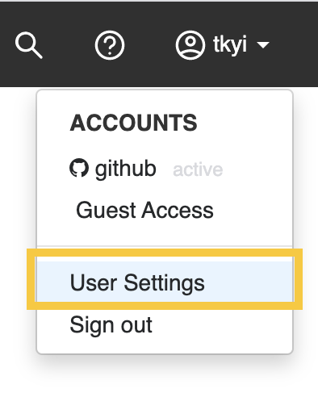
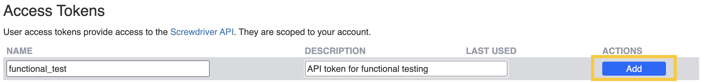
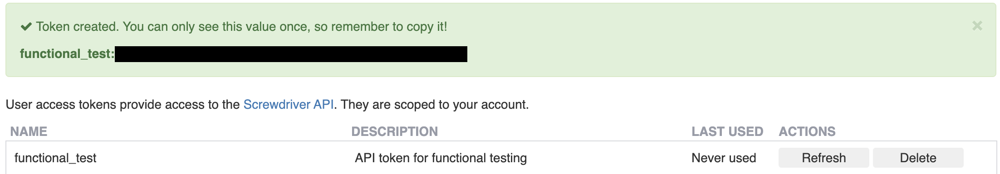
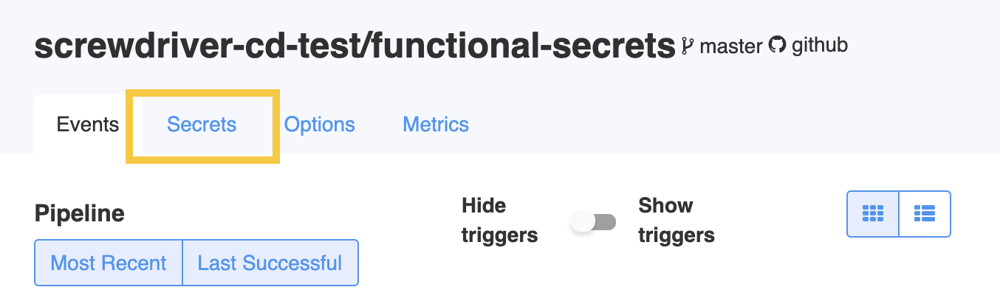

# Access Tokens
There are different access tokens users can use to make calls to the Screwdriver API varying levels of scope: build, pipeline, and user.

To authenticate with your newly created token, make a GET request to `https://${API_URL}/v4/auth/token?api_token=${YOUR_TOKEN_VALUE}`. This returns a JSON object with a token field. The value of this field will be a JSON Web Token, which you can use in an Authorization header to make further requests to the Screwdriver API. This JWT will be valid for 12 hours, after which you must re-authenticate. See the [API documentation](./api) for more details.

## User Access Token
User access tokens are tied to a specific user.
To generate a user access token:

1. In the upper-right corner of any page, click your username; then click User Settings.

2. Give your token a name and description.

3. Click Add to generate a token.

4. Copy the token to your clipboard. For security reasons, after you navigate off the page, you will not be able to see the token again.

### Options
After a token is created, you will have the option to generate fresh token with the Refresh button or Delete it.

## Pipeline Access Token
Pipeline access tokens are tied to a Screwdriver pipeline.
To generate a pipeline access token:

1. In a Screwdriver pipeline page, click the Secrets tab under the pipeline name.

2. Under Access Tokens, give your token a name and description.

3. Click Add to generate a token.

4. Copy the token to your clipboard. For security reasons, after you navigate off the page, you will not be able to see the token again.

## Build Access Token
Build access tokens are tied to a specific build.
To get a build access token:

1. During a Screwdriver build, the build-scoped access token generated during a build is accessed through the [environment variable](./environment-variables) `$SD_TOKEN`.